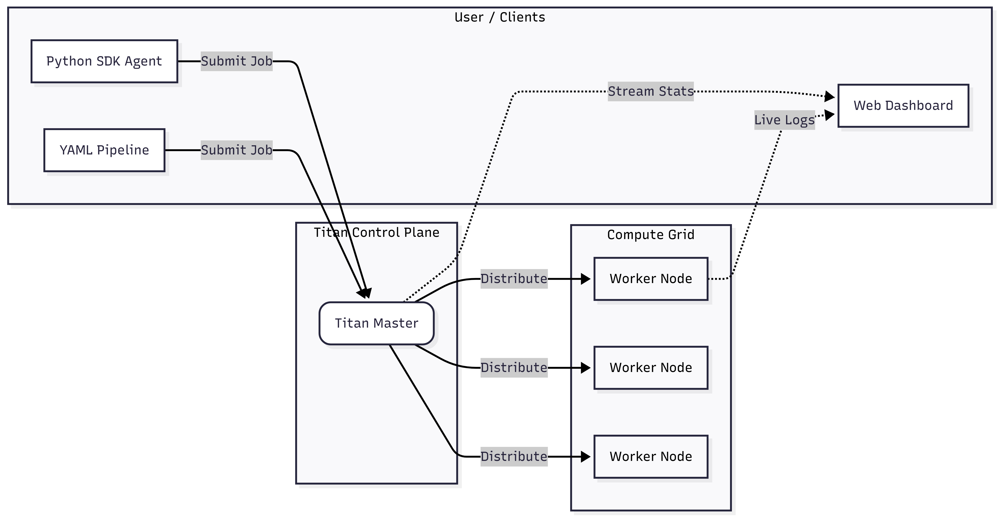

# 🛰️ Titan: The Hybrid Distributed Runtime

**Self-Hosting, Self-Healing Execution Substrate for DAGs, Agents, and Services.**

Titan is a zero-dependency distributed runtime built from first principles to solve the **"Physical Execution"** problem. It bridges the gap between static orchestrators (Airflow), dynamic AI agents, and long-running micro-services.

**Titan handles the heavy lifting of distributed systems:**
*  **Parallelism:** Executing massive fan-out workloads across the cluster with non-blocking task distribution.
*  **Locality:** Enforcing strict data-to-node affinity.
*  **Elasticity:** Reactive auto-scaling with autonomous "Inception" events.
*  **Resilience:** Zero-loss state recovery via the integrated TitanStore AOF.
*  **Capability:** Hardware-aware routing (Strict GPU vs. CPU matching).

### 📖 [Explore the Full Documentation and Quickstart](https://ramn51.github.io/titan-orchestrator/getting-started/)

  

---

## 📈 The Capability Spectrum

Titan scales with your complexity, from a simple script runner to an autonomous agent host:

1. **Level 1: Distributed Cron (The Scheduler)**
   * Distributed `crontab` for Python/Shell scripts. Run tasks in sequence or parallel across a cluster.
2. **Level 2: Service Orchestrator (The Platform)**
   * Self-hosted Micro-PaaS (like Nomad or PM2). Deploy APIs and keep them alive with auto-restarts on crash.
3. **Level 3: Agentic Execution Runtime (Autonomous Mode)**
   * Infrastructure-aware substrate where software agents programmatically spawn compute tasks based on LLM decisions.

---

## 🧠 One Runtime, Two Patterns

| Feature | Static Workflows (DevOps) | Runtime-Defined (Agentic) |
| :--- | :--- | :--- |
| **Requirement** | YAML Definition + Java Binary | Titan Python SDK |
| **Definition** | Deterministic DAGs defined beforehand | Graphs constructed at runtime |
| **Use Case** | Nightly ETL, Backups, Reporting | AI Agents, Self-Healing Loops |

---

## 🛠️ Key Features

### 1. Universal Workload Support
Orchestrate ephemeral scripts, long-running services, and hybrid DAGs (e.g., Python script → Java Service → Shell cleanup) in a single zero-dependency binary.

### 2. Smart Resource Governance
* **Permanent vs. Ephemeral Nodes:** Protect core infrastructure while allowing burst workers to decommission automatically after 45s of idle time.
* **Capability Routing:** Tag workers with skills (e.g., `GPU`). Titan ensures hardware-heavy tasks land only on capable nodes.

### 3. High-Performance Internals
* **TITAN_PROTO:** Custom binary TCP wire format for <50ms latency without JSON overhead.
* **Inception Scaling:** Saturated workers can autonomously spawn "child" worker processes to handle traffic spikes.
* **Least-Connection Routing:** Master intelligently routes jobs to the node with the lowest active thread load.

### 4. Self-Healing Resilience
* **Zombie Process Reaping:** Workers automatically clean up orphaned PIDs from previous crashes upon startup.
* **TitanStore (AOF):** Built-in Redis-like persistence. If the Master dies, it replays the Append-Only File to reconstruct the cluster state perfectly.

---

## 🎬 Demos in Action

### 1. Control Plane: Dynamic DAG Execution
*Watch Titan resolve dependencies and execute a multi-stage workflow where the path is decided at runtime.*

https://github.com/user-attachments/assets/5731c0b8-d392-4890-a3c5-f7e9cf611d65

### 2. Elasticity: Reactive Auto-Scaling
*Watch the cluster detect load, spawn a new Worker process automatically, and distribute tasks.*

https://github.com/user-attachments/assets/3f7d41df-654a-45d9-a49e-85978fad9172

  
<b>🎬 View More Scenarios (GPU Routing, Fanout, Full Scale Cycle)</b>

   
  
  **GPU Affinity Routing**
  <video src="https://github.com/user-attachments/assets/9a1abc1c-d01f-4998-8c74-30409113ec85" controls="controls" style="max-width: 100%;"></video>

  **Parallel Execution (Fanout)**
  <video src="https://github.com/user-attachments/assets/812fd793-eab4-499e-9364-f1d3ccbbcc59" controls="controls" style="max-width: 100%;"></video>

  **Full Load Cycle (Scale Up & Descale)**
  <video src="https://github.com/user-attachments/assets/49afd1c6-bed3-444b-8d12-adff07832d8b" controls="controls" style="max-width: 100%;"></video>

---

## ⚖️ License & Attribution

Titan Orchestrator is licensed under the Apache License 2.0.
© 2026 **Ram Narayanan A S**. Open for contributions.

*Engineered from first principles to deconstruct the fundamental primitives of distributed orchestration.*