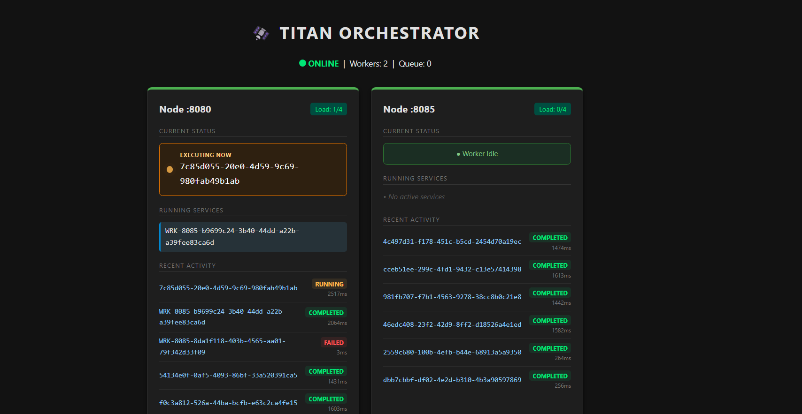

# 🛰️ Titan: The Hybrid Distributed Runtime

**Titan** is a lightweight distributed orchestrator built to bridge the gap between **Static Job Schedulers** (like Airflow) and **Dynamic Agent Runtimes**.

Designed for small-to-medium scale environments, it acts as a **Self-Hosting, Self-Healing Micro-PaaS**. It synthesizes the core primitives of orchestration—resolving dependencies, managing worker lifecycles, and handling resource governance—into a single, zero-dependency binary.

> *Built from scratch in Java (Core Engine) and Python (SDK). No external databases. No frameworks. Just raw TCP sockets and systems engineering.*

<p align="center">
  
</p>

---
## Capability Spectrum

Titan is designed to grow with your system's complexity:

1. **Level 1: Distributed Cron (The "Scheduler")**

    - _Simple:_ Run a Python script on a remote machine every hour. In a specified Sequence or distributed and parallel.

    - **Mental Model:** Distributed `crontab` or lightweight Airflow.

2. **Level 2: Service Orchestrator (The "Platform")**

    - _Intermediate:_ Deploy long-running API servers and keep them alive (restart on crash).

    - **Mental Model:** A self-hosted PM2 or HashiCorp Nomad.

3. **Level 3: Agentic AI Runtime (The "Auto Pilot")**

    - _Advanced:_ Use the SDK to build self-modifying execution graphs where AI Agents spawn their own infrastructure to solve problems.

    - **Mental Model:** Infrastructure-aware LangChain.
---

## Philosophy: One Runtime, Two Patterns

Titan recognizes that Modern Infrastructure requires two distinct ways of working. You choose the interface that matches your role.
### 1. Static Workflows (The "DevOps" Path)

* **Requirement:** Just the Titan Binary (Java) + A YAML definition.
* **Definition:** Deterministic DAGs defined *before* execution.
* **Use Case:** Nightly ETL, Database Backups, Periodic Reports.
* **Workflow:** Define your infrastructure in a declarative `pipeline.yaml` and submit it.

### 2. Dynamic Agentic Workflows (The "AI" Path)

* **Requirement:** The **Titan Python SDK**.
* **Definition:** The execution graph is constructed *at runtime* based on logic or LLM decisions.
* **Use Case:** AI Agents, Self-Healing Loops, Recursive Web Scraping.
* **Workflow:** Programmatically construct graphs where the "Next Step" depends on the "Previous Output" (e.g., *Run  Error  Generate Fix  Retry*).

---

## Key Features

### 1. Universal Workload Support

Titan orchestrates a diverse mix of primitives within a single dependency graph:

* **Ephemeral Scripts:** Fire-and-forget Python or Shell scripts.
* **Long-Running Services:** Titan acts as a hosting solution (like PM2), keeping Web Servers and APIs alive.
* **Hybrid DAGs:** A single workflow can chain a Python script  into a Java Service  into a Shell cleanup task.

> **Note on Isolation:** Titan currently uses **Process-Level Isolation** (managing PIDs and workspaces directly on the Host OS). Full Container Isolation (Docker integration) is planned for v2.0.


### 2. Advanced Resource Governance

- **Infrastructure Protection (Permanent vs. Ephemeral):** Titan distinguishes between Permanent and Non-Permanent nodes.

    - **Permanent Nodes:** (e.g., The Root Worker, or a specialized GPU box). These are marked as `isPermanent=true` and are **immune** to auto-scaling shutdown logic.

    - **Ephemeral Nodes:** Auto-scaled workers spawned during high load. These are automatically decommissioned when idle for >45s.

- **Capability-Based Routing:** Titan supports heterogeneous clusters. You can tag workers with specific skills (e.g., `GPU`, `HIGH_MEM`, `GENERAL`). The scheduler enforces strict matching, ensuring `requirement: GPU` tasks _only_ land on nodes with that hardware capability.


### 3. High-Performance Engineering

* **Custom Binary Protocol:** Uses `TITAN_PROTO`, a fragmentation-safe TCP wire format (Header + Body) designed for less than 50ms latency without JSON overhead.
* **Smart Task Affinity:** Implements "Parent-Child Locality." If a Worker spawns a sub-task, the scheduler attempts to place it on the same node to leverage local caching. Useful for cases where training and other tasks of a model needs to happen on a specific node.
* **Reactive Auto-Scaling:** The scheduler monitors worker load. If the cluster is saturated, it triggers **"Inception"** events where workers spawn *new* child workers to handle burst traffic.
* **Least-Connection Routing:** Jobs are intelligently routed to the worker with the lowest active load.
  
> **Note on Concurrency:** To ensure stability on smaller nodes, the default Worker concurrency is currently **capped at 4 slots** per instance. To utilize more cores on a large server, simply spawn multiple Worker instances on different ports (e.g., 8081, 8082)

### 4. Enterprise Resilience (Self-Healing)

* **Automated Resource Governance:** Workers maintain a persistent PID registry. On startup, they automatically detect and terminate **"Zombie" processes** left over from previous crashes.
* **Graceful Termination:** Supports controlled shutdown signals, ensuring nodes finish critical housekeeping before going offline.
* **Workspace Hydration:** Automatically packages, zips, transfers, and executes code in isolated sandboxes.

---

---
## Demos in Action

### 1. Control Plane: Dynamic DAG Execution
*Watch Titan resolve dependencies and execute a multi-stage workflow where the path is decided at runtime.*

https://github.com/user-attachments/assets/5731c0b8-d392-4890-a3c5-f7e9cf611d65


### 2. Elasticity: Reactive Auto-Scaling
*Watch the cluster detect load, spawn a new Worker process automatically, and distribute tasks.*

https://github.com/user-attachments/assets/3f7d41df-654a-45d9-a49e-85978fad9172


---
### Detailed Scenarios (Click to Expand)
<details>
  <summary><b>🎬 Scenario: GPU Affinity Routing</b> (Smart Scheduling)</summary>
  <br>
  <i>Shows tasks tagged with "GPU" bypassing general nodes to land on specific hardware.</i>
  <br><br>
<video src="https://github.com/user-attachments/assets/9a1abc1c-d01f-4998-8c74-30409113ec85" controls="controls" style="max-width: 100%;">
  </video>
</details>

<details>
  <summary><b>🎬 Scenario: Parallel Execution (Fanout)</b></summary>
  <br>
  <i>Submitting a "Fanout" DAG to demonstrate non-blocking parallel execution across multiple workers.</i>
  <br><br>
  <video src="https://github.com/user-attachments/assets/812fd793-eab4-499e-9364-f1d3ccbbcc59" controls="controls" style="max-width: 100%;">
  </video>

</details>

<details>
  <summary><b>🎬 Scenario: Basic Agent Deployment</b> (Hello World)</summary>
  <br>
  <i>Deploying a simple Python agent via YAML configuration to a general node.</i>
  <br><br>
  <video src="https://github.com/user-attachments/assets/94b10933-cd97-4e99-b034-4896804123fd" controls="controls" style="max-width: 100%;">
  </video>

</details>

<details>
  <summary><b>🎬 Scenario: Full Load Cycle (Scale Up & Descale)</b></summary>
  <br>
  <i>(Long Duration) A complete stress test showing the cluster scaling up under pressure and automatically decommissioning ephemeral nodes when the queue empties.</i>
  <br><br>
<video src="https://github.com/user-attachments/assets/3f7d41df-654a-45d9-a49e-85978fad9172" controls="controls" style="max-width: 100%;">
  </video>

<video src="https://github.com/user-attachments/assets/49afd1c6-bed3-444b-8d12-adff07832d8b" controls="controls" style="max-width: 100%;">
  </video>
</details>


---

## The Data Plane (File System)

Titan strictly separates "Source Artifacts" from "Runtime State" to ensure reproducibility.

| Directory | Role | Description |
| :--- | :--- | :--- |
| **`perm_files/`** | **Artifact Registry** | The "Source of Truth." Place your scripts (`.py`, `.sh`) and binaries (`.jar`) here.<br><br>*Note: SDK/YAML submissions automatically stage files here, but you can also manually drop files in.* |
| **`titan_workspace/`** | **Execution Sandbox** | The runtime staging area.<br><br>• **`jobs/{id}/`**: Contains execution logs (`.log`) and isolated script copies for specific jobs.<br>• **`shared/`**: A "Data Bus" directory allowing dependent DAG tasks to share intermediate files. |
---

## Getting Started

### Prerequisites

* **Java 17+** (Required for Core Engine)
* **Python 3.10+** (Required for SDK/CLI)
* **Maven** (For building the project)

### Option 0: Run via IntelliJ (Recommended for Dev)

If you are developing Titan, simply open the project in IntelliJ IDEA and run the Main classes directly:

1. **Master:** Run `titan.TitanScheduler`
2. **Worker:** Run `titan.TitanWorker` (Defaults to Port 8080, Capability: GENERAL, Permanent: False)
3. **CLI:** Run `client.TitanCli`

### Option 1: Build & Run (Production Simulation)

#### 1. Build the Engine

Titan is built as a single "Uber-JAR".

```bash
# Build the project
mvn clean package

# Setup the artifacts (perm_files comes with the repo)
cp target/titan-orchestrator-1.0-SNAPSHOT.jar perm_files/Worker.jar

```

#### 2. Start the Cluster

**Terminal 1: The Master (Scheduler)**

```bash
# Starts the Master Scheduler on Port 9090
java -cp perm_files/Worker.jar titan.TitanMaster

```

**Terminal 2: The Worker (Infrastructure)**

```bash
# Starts a Worker Node. 
# DEFAULT: Connects to localhost:9090 on Port 8080
java -jar perm_files/Worker.jar

# CUSTOM: To run on a different port or connect to a remote master:
# Usage: java -jar Worker.jar <MyPort> <MasterIP> <MasterPort>
java -jar perm_files/Worker.jar 8081 192.168.1.50 9090

```

#### 3. Install the Client

```bash
cd titan_sdk && pip install -e .

```

---

##  Operator Manual (CLI)

The Titan CLI connects to the cluster for real-time management.

**Connect:**

```bash
java -cp perm_files/Worker.jar client.TitanCli

```

**Supported Commands:**

| Command                              | Description                                                                                 |
|--------------------------------------|---------------------------------------------------------------------------------------------|
| `stats`                              | View cluster health, active nodes, and job queues.                                          |
| `run <file>`                         | Immediately execute a script from `perm_files`.                                             |
| `deploy <file> [port]`               | Deploy a single file or service. Supports capability requirements. Ex: deploy train.py 0 GPU |
| `deploy Worker.jar <port> [capability]` | Manually spawn a new Worker node on a specific port with its capability (GPU or GENERAL)    |
| `stop <service_id>`                  | Gracefully stop a running service or job.                                                   |
| `shutdown <host> <port>`             | Remotely decommission a specific worker node.                                               |
| `dag <dag_string>`                   | Submit a raw DAG string (Advanced users).                                                   |
| `upload <local_path>`                | Upload a file to server storage (perm_files)                                                |

CLI looks like this:

```
==========================================
    [INFO] TITAN DISTRIBUTED ORCHESTRATOR    
==========================================
Connected to: localhost:9090
Commands: stats, json, submit <skill> <data>, dag <raw_dag>, exit

titan> stats
--- TITAN SYSTEM MONITOR ---
Active Workers:    3
Execution Queue:   0 jobs
Blocked (DAG):     1 jobs
-------------------------------
Worker Status:
 • [8080] Load: 2/4 (50%)    | Skills: [GENERAL]
    └── ⚙️ Service ID: DAG-JOB_SPAWN
    └── ⚙️ Service ID: DAG-step-4-server
 • [8081] Load: 0/4 (0%)     | Skills: [GENERAL]
```

---


##  Developer Manual (Two Modes)

### Mode 1: Static Pipelines (YAML)

*Best for: Scheduled tasks and known dependencies.*

**`daily_etl.yaml`**

```yaml
name: "Nightly-Data-Pipeline"
jobs:
  - id: "EXTRACT"
    script: "scripts/pull_data.py"
  
  - id: "TRANSFORM"
    script: "scripts/clean_data.py"
    dependencies: ["EXTRACT"]
    
  - id: "DEPLOY_API"
    type: "SERVICE"  # Long running task
    script: "scripts/server.py"
    port: 8080
    dependencies: ["TRANSFORM"]

```
You need to have the yaml file in the root of the project that you want to deploy/run. The scripts and other files can be in any subfolders.
Refer the examples folder to know the structure. Entrypoints server as the main path to execute them. Upload of asset is handled by titan_cli.py file internally.

To run an example try   ``python titan_sdk/titan_cli.py deploy titan_test_suite/examples/yaml_based_static_tests/dag_structure_test``.
**This runs the example inside titan_test_suite that will serve as base reference to use**

**If you want to run a workflow but you want only the task to run on a GPU node**
**gpu_run.yaml**
```yaml
name: "GPU_Validation_Project"
project: true  # This Zips the folder

jobs:
  - id: "Data_Step"
    type: "run"
    file: "preprocess.py"
    requirement: "GENERAL" # Runs on cheap nodes
    priority: 1

  - id: "Training_Step"
    type: "run"
    file: "train_model.py"
    depends_on: ["Data_Step"]
    requirement: "GPU"     # Routed ONLY to workers with GPU capability
    priority: 10
```

**The test_suite has all the different examples of trying out**

### Mode 1.5: Programmatic & Dynamic Logic (Python SDK)

*Best for: Conditional logic, Self-Healing loops, and Dynamic Infrastructure.*

#### Scenario A:  The "Logic Switch" (Dynamic DAGs)
*Decide which DAG to run based on real-time cluster stats or data properties.*
*Infrastructure that adapts to traffic load.

> **Scenario:** If traffic > 80%, run a cheap "Quick Scan". If low, run a distributed "Deep Analysis."

[Link to Code](examples/dynamic_switch.py)

```python
# Full code: examples/dynamic_switch.py

if traffic_load > 80:
    print(f" High Traffic. Switching to 'FAST' pipeline.")
    client.submit_job(fast_job)
else:
    print(f" Normal Traffic. Running 'DEEP' analysis.")
    client.submit_dag("DEEP_PIPELINE", deep_dag)
```

<p align="center">
  
</p>

### Mode 2: Agentic Workflows (Python SDK)

*Best for: AI Agents, Self-Healing loops, and Dynamic logic.*

**The "Self-Healing" Loop**

```python
# Full code: examples/agentic_healer.py

# The Core Loop
logs = client.fetch_logs(job_id)

if "Segfault" in logs:
    print(f" CRITICAL ERROR in {job_id}. Deploying Patch...")
    
    # Programmatically create a new job to fix the issue
    fix_job = TitanJob(id=f"{job_id}_fix", filename="scripts/safe_mode.py")
    client.submit_job(fix_job)

```

<p align="center">
  
</p>

---

##  SDK Reference (Python)

The `TitanClient` is your primary gateway for programmatic control.

### 1. Core Classes

#### `TitanClient`
The main entry point for connecting to the cluster.

```python
from titan import TitanClient

# Initialize
client = TitanClient(host="localhost", port=9090)
```

|**Method**| **Description**                                                                            |
|---|--------------------------------------------------------------------------------------------|
|`client.submit_job(job: TitanJob)`| Dispatches a single job to the cluster.                                                    |
|`client.submit_dag(name: str, jobs: list)`| Submits a list of linked `TitanJob` objects as a single DAG.                               |
|`client.fetch_logs(job_id: str)`| Retrieves the stdout/stderr logs for a specific job ID.                                    |
|`client.upload_project_folder(path, name)`| Zips and uploads a local folder to the Master's artifact registry in perm_files directory. |
|`client.upload_file(filepath)`| Uploads a single file to the Master's artifact registry in perm_files dir.                 |

#### `TitanJob`

Represents a unit of work.
```python
from titan_sdk import TitanJob

job = TitanJob(
    job_id="train_v1",
    filename="scripts/train.py",
    requirement="GPU",     # Optional: "GPU" or "GENERAL"
    priority=10,           # Optional: Higher numbers schedule first
    parents=["data_prep"], # Optional: List of parent Job IDs
    is_archive=False       # Set True if deploying a ZIP/Service
)
```

#### 2. defining DAGs Programmatically

You can build dependency graphs using the SDK's API instead of YAML.
Python

```python
from titan_sdk import TitanClient, TitanJob

client = TitanClient()

# Step 1: Define the Jobs
# "Extract" has no parents (Root node)
task_a = TitanJob(
    job_id="extract_data",
    filename="etl/extract.py",
    priority=5
)

# "Train" depends on "Extract"
task_b = TitanJob(
    job_id="train_model",
    filename="ml/train.py",
    requirement="GPU",
    parents=["extract_data"] # <--- Defines the dependency
)

# Step 2: Submit them as a list
client.submit_dag("nightly_pipeline", [task_a, task_b])
print("DAG Submitted!")
```


##  Dashboard

Titan includes a lightweight Python Flask dashboard to visualize cluster health.




* **Real-time Stats:** Current active thread usage of every worker for assessing load (For now its threads, will use CPU/RAM usage in future).
* **Log Streaming:** Watch stdout/stderr from distributed jobs in real-time via UDP aggregation.
* **Job History:** Visual timeline of all executions.

**On Click of Job link (Blue link)**


```bash
# Start the Dashboard
python3 ./perm_files/server_dashboard.py
# Running on http://localhost:5000

```

---

##  Architecture

The system follows a **Leader-Follower** topology with a decoupled control plane.

**This is the L2 architectural Diagram:**

<p align="center">
  
</p>

> Network Topology: Titan currently assumes a flat network address space (LAN/VPN). While it can run on Cloud VMs (EC2/GCP), it requires direct TCP connectivity between nodes. NAT Traversal and Public/Private IP translation are planned for v2.0.

### The Protocol (`TITAN_PROTO`)

Communication happens over raw TCP sockets using a fixed-header framing strategy to ensure integrity:

```text
[ HEADER (8 Bytes) ]
| Version (1B) | OpCode (1B) | Flags (1B) | Spare (1B) | Payload Length (4B) |

[ BODY ]
| Binary Payload (Variable) ... |

```

### Deep Dive: Internal Mechanics

#### 1. The Scheduler (Master)

* **Inverted Worker Registration:** Unlike traditional systems that scan for nodes, Titan uses a **Push-Based Discovery** model. Workers initiate the connection to the Master, allowing dynamic scaling behind NATs or firewalls without static IP configuration.
* **The "ClockWatcher":** Instead of inefficient polling, Titan uses a dedicated thread monitoring a `DelayQueue` to handle future tasks. This ensures `O(log n)` scheduling efficiency thereby consuming zero CPU cycles until the precise millisecond a job is ready.
* **Reconciliation Loop:** A background `ScalerExecutor` runs every 15 seconds to compare the `ActiveJobQueue` against `WorkerCapacity`. If the delta is too high, it triggers the Auto-Scaler. 
> The Reconciliation Loop separates workers into pools (e.g., GENERAL vs. GPU). It calculates saturation per pool to ensure scaling only happens when the relevant resource type is exhausted.

#### 2. The Failure Detector (Heartbeats)

* **Active Keep-Alive:** The Master maintains a dedicated `HeartBeatExecutor`. It tracks the "Last Seen" timestamp of every worker. If a worker goes silent for >30s, it is marked **DEAD**, and its active jobs are immediately re-queued to healthy nodes (Resilience).

---

## Repository Guide

To help you navigate the codebase:

```text
titan_test_suite/
├── examples/               <--  START HERE (User Manual)
│   ├── yaml_based_static_tests/  # Reference YAML pipelines (ETL etc)
│   └── agents/                   # Advanced Python scripts (Self-Healing AI)
    └── dynamic_dag_custom/       # Dynamic DAG examples (logical flow based ones)
│
└── pytests/                <--  INTERNAL (Engine Validation)
    ├── complex_dag_test.py       # Stress tests for the Scheduler
    └── ...                       # Raw integration checks used during development
    
```

---

## Testing Strategy

> **⚠️ Note to Contributors:** Titan is a research prototype built to explore the "Hard Parts" of Distributed Systems. As such, the test coverage focuses on integration rather than unit purity.

- **Java Tests (`src/test/java`):** These are essentially **Integration Tests** designed during the initial Proof-of-Concept phase to validate the core loop. Some of these may be outdated or flaky due to the rapid pace of architectural changes.

- **Python Validation:** The primary method for validating system stability currently lies in the `titan_test_suite` folder. Scripts like `complex_dag_test.py` and the YAML examples perform end-to-end black-box testing of the cluster.

- **Future Plan:** A comprehensive Engine Test Suite and proper Unit Tests are planned for the near future to improve stability.


**Found a bug?** Please log an issue! Since this is a custom-built distributed system, edge cases are expected.

---

## Limitations & Design Constraints

Titan is a research runtime designed to explore the **primitives of orchestration** (Scheduling, IPC, State Management) without the complexity of existing frameworks. As such, certain "Production" features are explicitly out of scope for V1:

1.  **Security (Open TCP):**
    * The current implementation uses raw, unencrypted TCP sockets.
    * *Constraint:* Do not run Titan on public networks (WAN) without a VPN or SSH Tunnel. Use strictly within a trusted VPC/LAN.

2.  **Single Point of Failure (SPOF):**
    * The Master node is currently a singleton. If the Master process dies, the cluster state is lost (Workers keep running but cannot receive new instructions).
    * *Mitigation:* High Availability (HA) via Raft Consensus is planned for the v2.0 Roadmap.

3.  **Network Topology:**
    * Titan assumes a flat address space (all nodes can ping each other via IP). It does not currently handle NAT Traversal or complex Subnet routing.
    
4.  **Scaling Boundary (Process vs. Infrastructure):**
    * Titan implements **Application-Level Scaling** (spawning new JVM worker processes on existing hardware).
    * **Infrastructure Provisioning** is currently delegated to external tools.
    * *Roadmap Item:* A "Cluster Autoscaler Interface" (Webhooks) is planned for v2.0, allowing Titan to trigger external APIs (e.g., Azure VM Scale Sets) when the cluster runs out of capacity.

---

## Roadmap

* **Security & Auth (Planned):** Implement **mTLS (Mutual TLS)** for encrypted, authenticated communication between Master and Workers.
* **Distributed Consensus:** Implement Raft/Paxos for Leader Election (Removing Master SPOF).
* **Crash Recovery:** Implement Write-Ahead-Logging (WAL) for persistent state recovery after master failure.
* **Containerization:** Support for Docker/Firecracker execution drivers for true filesystem isolation.

---

## License

DistributedTaskOrchestrator is licensed under the Apache License 2.0.
See the [LICENSE](LICENSE) file for details.

**Created and Maintained by Ram Narayanan A S**
© 2025 Titan Orchestrator. Open for contributions.

*Engineered from first principles to deconstruct the fundamental primitives of distributed orchestration.*

