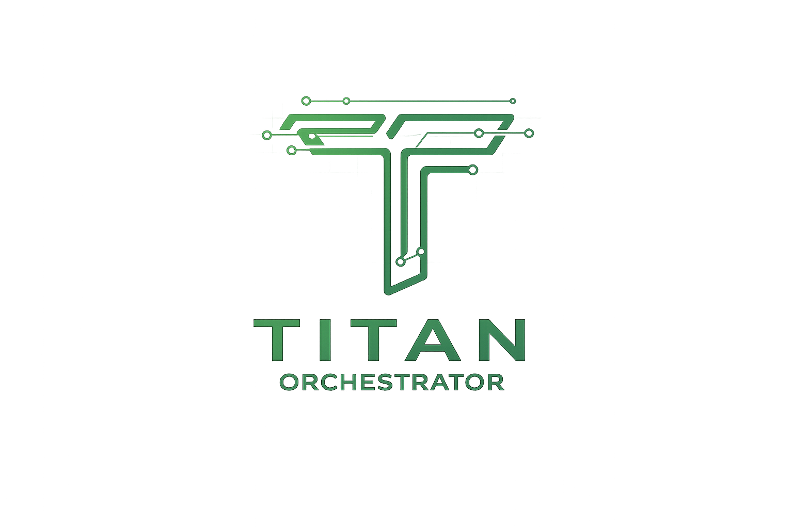

<p align="center">
  
</p>

<p align="center">
  <a href="https://ramn51.github.io/titan-orchestrator/"></a>
  <a href="https://opensource.org/licenses/Apache-2.0"></a>
  
  
</p>

<p align="center">
  <b>A self-hosted distributed runtime for DAGs, services, and agentic workflows — shipped as a single zero-dependency JAR.</b>
</p>

<p align="center">
  <a href="https://ramn51.github.io/titan-orchestrator/getting-started/"><b>5-Minute Quickstart</b></a> ·
  <a href="https://ramn51.github.io/titan-orchestrator/"><b>Full Documentation</b></a> ·
  <a href="https://ramn51.github.io/titan-orchestrator/comparison/"><b>How Titan Compares</b></a> ·
  <a href="https://ramn51.github.io/titan-orchestrator/architecture/design/"><b>Architecture</b></a>
</p>

---

Titan is a distributed execution runtime built from first principles. Define jobs in YAML or Python, and Titan handles capability routing, dependency execution, and crash recovery across your cluster — from a nightly ETL pipeline to a multi-agent LLM workflow.

It covers three capability tiers in one binary:

| Tier | What you run |
|---|---|
| **T1 — Distributed Task Scheduler** | Batch jobs, static DAGs, GPU/CPU-routed workloads, delayed execution |
| **T2 — Service Orchestrator** | Long-running APIs and daemons with auto-restart and port management |
| **T3 — Agentic Runtime** | Self-mutating DAGs, LLM-driven agents, multi-agent pipelines with HITL gates |

> **v1.0 research status.** Single-Master topology (Raft on the v2 roadmap), process-level isolation (Docker on v2), no mTLS yet. Built to be understood, not to replace Kubernetes or Temporal in production today.

---

## Dashboard

Titan ships with a built-in Python Flask dashboard. Three views:

### Orchestrator — Cluster health and worker load


Real-time view of every connected worker — capability tag (GENERAL / GPU / HIGH_MEM), active job count, running services, and recent activity. Includes a **+ Launch Worker** button to spin up new nodes from the browser.

### DAG Pipelines — Live dependency graph


Every pipeline submitted to the cluster — via CLI, SDK, YAML, or the visual Constructor — is automatically rendered as a live dependency graph. Node colours update in real-time as jobs move through `PENDING → RUNNING → COMPLETED / FAILED`. Click any node to stream stdout/stderr live.

### DAG Constructor — Visual pipeline builder


Browser-based drag-and-drop DAG editor. Add task and service nodes, draw dependency edges, configure script, capability, priority, and HITL gates per node — then deploy directly to the cluster in one click. Auto-generates equivalent Python SDK and YAML as you build.

### Agent Runs — Multi-stage agent timeline


Groups all DAG stages that share an `agent_run_id` into a single timeline row. When an agent runs iteratively (PLAN → ITER → EVAL → SYNTH), each stage is a separate DAG submission — Agent Runs reconstructs the full lifecycle so you don't have to hunt through individual entries.

---

## Four Ways to Define a Pipeline

| Method | Best for |
|---|---|
| **YAML file** | Repeatable, version-controlled pipelines. Commit to git and re-run any time. |
| **Python SDK** | Programmatic pipelines where shape is determined at runtime — agent loops, dynamic fan-out. |
| **Visual Constructor** | Building pipelines without writing code. Drag nodes, draw edges, deploy in one click. |
| **MCP (natural language)** | Controlling Titan from Claude Desktop or Cursor. Describe what you want — the agent writes the scripts and submits the DAG on your behalf. |

All four paths produce the same result: a tracked DAG in the visualizer with per-job logs, status, and workspace files.

---

## Demos

### Visual DAG Constructor
*Build a pipeline by dragging nodes and drawing edges — deploy to the cluster with one click.*

https://github.com/user-attachments/assets/4f63abbc-e5e9-435e-83cb-bafe6eb9883e

### Human-in-the-Loop (HITL) Gate
*A DAG pauses at a checkpoint and waits for a human Approve/Reject before downstream jobs resume.*

https://github.com/user-attachments/assets/bbdb6772-a9ee-4094-85b4-0516a0543c62

### HITL on a Complex Graph
*HITL gate mid-execution on a multi-branch pipeline — shows how the visualizer reflects the paused state.*

https://github.com/user-attachments/assets/724e3f3d-1d75-407e-a0c2-cd43f2939ad5

### Agentic AI Workflow
*A multi-stage agent loop — each stage is a separate DAG submission, grouped into one timeline in Agent Runs.*

https://github.com/user-attachments/assets/d6c40a50-9afc-45f6-abfc-b50c94324363

<details>
  <summary><b>More: Dynamic DAG Execution, Reactive Scaling, GPU Routing, Fanout</b></summary>
  <br>

  **Control Plane: Dynamic DAG Execution**

  https://github.com/user-attachments/assets/5731c0b8-d392-4890-a3c5-f7e9cf611d65

  **Reactive Worker Scaling**

  https://github.com/user-attachments/assets/3f7d41df-654a-45d9-a49e-85978fad9172

  **GPU Affinity Routing**

  https://github.com/user-attachments/assets/9a1abc1c-d01f-4998-8c74-30409113ec85

  **Parallel Execution (Fanout)**

  https://github.com/user-attachments/assets/812fd793-eab4-499e-9364-f1d3ccbbcc59

  **Full Load Cycle (Scale Up & Descale)**

  https://github.com/user-attachments/assets/49afd1c6-bed3-444b-8d12-adff07832d8b

</details>

---

## Quick Start

```bash
# 1. Build the engine
mvn clean package -DskipTests

# 2. Start the cluster (Master + 2 workers + TitanStore + dashboard)
./titan-dev.sh up

# 3. Open the dashboard
open http://localhost:5000
```

Submit your first job:

```python
from titan_sdk.titan_sdk import TitanClient, TitanJob

client = TitanClient()
client.submit_dag("hello-world", [
    TitanJob(job_id="hello", script_content="print('hello from Titan')")
])
```

Full walkthrough: **[5-Minute Quickstart](https://ramn51.github.io/titan-orchestrator/getting-started/)**

---

## Architecture

<p align="center">
  
</p>

Three components:

- **Control Plane (Master)** — DAG scheduling, dependency resolution, capability routing, AOF-backed state recovery
- **Workers** — Capability-tagged execution nodes that self-register on startup and re-register after restart
- **TitanStore (optional)** — AOF-backed KV store for crash recovery and cross-job shared agent state. No external database required.

The wire protocol (TITAN_PROTO) is a custom fixed-header binary format over raw TCP — no JSON on the dispatch path.

**[Architecture Deep Dive](https://ramn51.github.io/titan-orchestrator/architecture/design/)**

---

## MCP — Control Titan from Claude Desktop

Titan ships a built-in MCP server. Connect Claude Desktop or Cursor and control your cluster in natural language:

> *"Research three approaches to distributed ML scheduling. Analyze gaps, methodology, and open problems in parallel. Synthesize into a report."*

Titan executes the parallel jobs, fans results into a synthesis job, and returns the output — all from a single prompt. No terminal, no code.

**[MCP Setup and Use Cases](https://ramn51.github.io/titan-orchestrator/mcp/overview/)**

---

## Key Features

**Execution**
- Static DAGs via YAML or Python SDK
- Dynamic DAG mutation at runtime — tasks can spawn new tasks mid-execution
- Long-running services alongside batch jobs in one runtime

**Routing**
- Capability-based routing — tag workers `GPU`, `HIGH_MEM`, or custom; jobs wait for a matching node
- Affinity routing — pin jobs to specific workers by tag
- Least-connection dispatch across available workers

**Resilience**
- AOF crash recovery — Master replays state on restart, resumes in-flight DAGs
- Worker re-registration — cluster recovers through a Master restart without manual intervention
- Callback retry with exponential backoff

**Observability**
- Live DAG visualizer with per-node status
- Real-time log streaming from any job
- Agent Runs timeline for multi-stage agent workflows

**Human-in-the-Loop**
- Native HITL gates — pause a DAG at any checkpoint, Approve/Reject from the dashboard
- Configurable timeout (default 48 hours)
- Automatic gate injection via SDK

---

## Cloud Deployment

Titan runs locally out of the box. When you're ready to move to the cloud, `package_cloud.sh` builds two deployment bundles:

```bash
./package_cloud.sh
# → titan-master-bundle.zip   (~2.3 MB)  — everything needed on the Master VM
# → titan-worker-bundle.zip   (~120 KB)  — Worker.jar + titan_sdk for remote workers
```

- **[Multi-VM Setup](https://ramn51.github.io/titan-orchestrator/deployment/cloud/)** — permanent cluster on GCP / AWS / Azure
- **[Remote GPU via SSH Tunnel](https://ramn51.github.io/titan-orchestrator/deployment/remote-gpu-worker/)** — keep your local machine as Master, tunnel a RunPod or cloud VM as a worker with no open ports

---

## Examples

| Example | What it shows |
|---|---|
| [Build Your First Agent](https://ramn51.github.io/titan-orchestrator/examples/quickstart-agent/) | Writer → Critic loop — simplest agentic pattern in ~60 lines |
| [Human-in-the-Loop Pipeline](https://ramn51.github.io/titan-orchestrator/examples/hitl/) | ML pipeline that pauses for human Approve/Reject before training |
| [Multi-Agent Research Pipeline](https://ramn51.github.io/titan-orchestrator/examples/research-pipeline/) | Parallel agents + HITL gate + synthesis fan-in |
| [Static YAML Pipelines](https://ramn51.github.io/titan-orchestrator/examples/yaml/) | Diamond patterns, GPU routing, parallel fan-out |
| [LangChain Integration](https://ramn51.github.io/titan-orchestrator/integrations/langchain/) | Wrap the Titan SDK as LangChain tools — no MCP needed |

---

## Contributing

Titan is an experimental runtime built from first principles by a single developer. Bug reports, edge case findings, and contributions are encouraged.

[Report an Issue](https://github.com/ramn51/titan-orchestrator/issues) · [How to Contribute](https://ramn51.github.io/titan-orchestrator/contributing/)

---

## License

Licensed under the [Apache License 2.0](LICENSE).
© 2026 Ram Narayanan A S.
