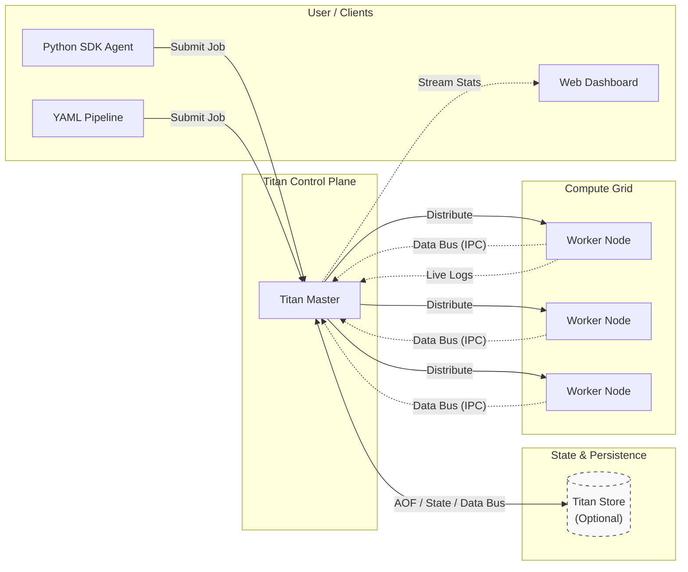

# 🏛️ Architecture & System Design

Titan follows a **Leader-Follower** topology with a decoupled control plane. It is engineered from first principles to deconstruct the fundamental primitives of distributed orchestration without relying on heavy external frameworks.

**This is the L1 Diagram with highest level of abstraction.**

There will be a single Master, Master is the single point of contact for the user, worker and the titan store.

- Users can submit jobs either as a YAML or a Python script through TitanSDK.

- Scheduler routes to the Worker node (either based on load or capability as per definition). 

- Workers are spawned independently and gets registered to the Scheduler. Scheduler will not have predefined information about the workers. (gets updated only on registration).

- Scheduler uses TitanStore to trace the state of the system and for recovery replay. Tasks will communicate through Scheduler to use the Titan Store. 

- Titan Store is accessed only by Scheduler instance and is single point of communication.

> Scheduler for now is SPOF (Single point of failure).



## Deep Dive L2 Diagram


> **Network Topology:** Titan currently assumes a flat network address space (LAN/VPC). While it can run on Cloud VMs (EC2/GCP), it requires direct TCP connectivity between nodes. 

---

## 1. The Protocol (`TITAN_PROTO`)

Titan does not rely on HTTP/REST or heavy gRPC layers. Communication happens over raw TCP sockets using a fixed-header framing strategy to ensure integrity and prevent packet fragmentation. 

```text
[ HEADER (8 Bytes) ]
| Version (1B) | OpCode (1B) | Flags (1B) | Spare (1B) | Payload Length (4B) |

[ BODY ]
| Binary Payload (Variable) ... |
```

This ensures lightning-fast IPC (Inter-Process Communication) with very less latency and zero JSON-serialization overhead for the core execution loops.


## 2. Internal Mechanics: 

The Master NodeThe Master acts as the Scheduler and Control Plane. It utilizes specialized threads to manage the cluster efficiently.

- **Inverted Worker Registration (Push-Based Discovery)**

    Unlike traditional systems that scan for nodes, Titan uses a Push-Based Discovery model. Workers initiate the connection to the Master, allowing dynamic scaling behind NATs or firewalls without static IP configuration.

    
- **Queue Segregation (Waiting vs. Active)**

    To process complex DAGs efficiently, Titan separates tasks by readiness. Jobs with unresolved parent dependencies are never placed in the active loop; instead, they sit in a blocked Waiting Queue. Once a parent task succeeds, a state-transition event instantly unlocks the dependent children, moving them into the ActiveJobQueue for immediate execution.

- **Smart Dispatching: Capability & Affinity Routing**

    When popping a job from the ActiveJobQueue, the Master executes a two-phase routing algorithm before dispatching the payload:

    > **Capability-Based Routing:** The scheduler checks the job's requirement tag (e.g., GPU, HIGH_MEM) and strictly matches it against the registered hardware tags of the current worker pool. A GPU task will bypass idle GENERAL nodes until a capable node is free.

    > **Affinity-Based Routing:** If a task requires strict data locality (flagged with affinity: true), the Master queries TitanStore to find the exact physical node that executed the parent task. The child task is then routed exclusively to that node to leverage local filesystem caches and avoid network data transfers.

- **The "ClockWatcher"**

    Instead of inefficient polling, Titan uses a dedicated thread monitoring a DelayQueue to handle future tasks. This ensures $O(\log n)$ scheduling efficiency, consuming zero CPU cycles until the precise millisecond a job is ready.

- **Reconciliation Loop**

    A background ScalerExecutor runs every 15 seconds to compare the ActiveJobQueue against WorkerCapacity. If the delta is too high, it triggers the Auto-Scaler. It calculates saturation per capability pool (e.g., GENERAL vs. GPU) to ensure scaling only happens when a specific resource type is exhausted.
    
- **The Failure Detector (Heartbeats)**

    The Master maintains a dedicated HeartBeatExecutor. It tracks the "Last Seen" timestamp of every worker. If a worker goes silent for >30s, it is marked DEAD, and its active jobs are immediately re-queued to healthy nodes to guarantee execution resilience.

- **Dead Letter Queue (DLQ) & Poison Pills**

    If a task repeatedly crashes a worker or fails beyond its maximum retry threshold (e.g., due to a syntax error or a missing system library), it is safely removed from the execution loop to prevent infinite crash-looping. The Master quarantines these "poison pill" tasks in a Dead Letter Queue (DLQ), preserving their logs and state for operator inspection without stalling the rest of the cluster.

---

## 3. State Persistence & Data Bus (TitanStore)

To eliminate the Master as a single point of failure and provide a unified state layer, Titan implements a custom in-memory data store backed by Redis primitives (RedisJava).

**Append-Only File (AOF):** 

Every critical system transition (e.g., Node Locked, Job Dispatched, Worker Registered) is written to a persistent log on disk.

**Crash Recovery:** 

If the Master process is killed abruptly, it does not lose the cluster state. Upon restart, it reads the AOF, reconstructs the ActiveJobQueue, and resumes the DAG exactly where it left off.

**Distributed Data Passing:** 

Tasks can write intermediate results or metadata to the store, allowing downstream tasks to fetch them seamlessly across completely different physical nodes.

**Dynamic State Tracking:** 

Individual tasks can update their own custom progress metrics, flags, or statuses during execution. This allows the Python SDK or the UI Dashboard to query the real-time progress of a remote script while it is still running.


## 4. The Data Plane (File System)

Titan strictly separates "Source Artifacts" from "Runtime State" to ensure reproducibility.


| Directory                           | Role | Description |
|:------------------------------------| :--- | :--- |
| **`TitanStore (Redis) (Optional)`** | **Global State** | In-memory data structure store backed by an AOF. Stores job statuses, DAG locks, Task  and worker heartbeats. Can be used by tasks as a store as well. |
| **`perm_files/`**                   | **Artifact Registry** | The "Source of Truth." Place your scripts (`.py`, `.sh`) and binaries (`.jar`) here.<br><br>*Note: SDK/YAML submissions automatically stage files here, but you can also manually drop files in.* |
| **`titan_workspace/`**              | **Execution Sandbox** | The runtime staging area.<br><br>• **`jobs/{id}/`**: Contains execution logs (`.log`) and isolated script copies for specific jobs.<br>• **`shared/`**: A "Data Bus" directory allowing dependent DAG tasks to share intermediate files. |


---


## 5. Orchestration Flows
Titan handles both delegated and autonomous orchestration.

### **Flow A: Delegated Orchestration (Dagster + Titan)**

Dagster holds the logical execution graph and delegates physical execution to Titan via a synchronous polling loop.


### **Flow B: Autonomous Orchestration (Native Titan)**
The Python SDK submits the entire DAG in one atomic binary payload. The Titan Master handles the complete state machine (Wait -> Unlock -> Dispatch) internally.


## 6. Limitations & Design Constraints

Titan is a research runtime designed to explore the **primitives of orchestration** (Scheduling, IPC, State Management) without the complexity of existing frameworks. As such, certain "Production" features are explicitly out of scope for V1:

### Current Constraints


1. **Security (Open TCP):**

    * The current implementation uses raw, unencrypted TCP sockets.
    * *Constraint:* Do not run Titan on public networks (WAN) without a VPN or SSH Tunnel. Use strictly within a trusted VPC/LAN.
2. **State Loss (Solved in v1.5):** 

* The Master node now utilizes TitanStore (RedisJava) for state persistence. If the Master process dies, the cluster state is fully recovered from the AOF upon restart.
3. **Process Failover:**

    * While data is safe, the Master is currently a singleton process. If it crashes, workers cannot receive new instructions until it reboots. High Availability (HA) via Raft Consensus (Leader Election) is planned for the v2.0 Roadmap to achieve true zero-downtime failover.

4. **Network Topology:**

    * Titan assumes a flat address space (all nodes can ping each other via IP). It does not currently handle NAT Traversal or complex Subnet routing.

5. **Scaling Boundary (Process vs. Infrastructure):**

    * Titan implements **Application-Level Scaling** (spawning new JVM worker processes on existing hardware).
    * **Infrastructure Provisioning** is currently delegated to external tools.
    * *Roadmap Item:* A "Cluster Autoscaler Interface" (Webhooks) is planned for v2.0, allowing Titan to trigger external APIs (e.g., Azure VM Scale Sets) when the cluster runs out of capacity.

## 7. Roadmap to v2.0
**Security & Auth:** Implement mTLS (Mutual TLS) for encrypted, authenticated communication.

**Distributed Consensus:** Implement Raft/Paxos for Leader Election (Removing Master SPOF).

**Containerization:** Support for Docker execution drivers for true filesystem isolation (currently uses Process-Level isolation).

**Cluster Autoscaler Webhooks:** Allow Titan to trigger external APIs (e.g., Azure VM Scale Sets) to provision bare metal automatically.

**Human-in-the-loop Webhooks:** Allow Titan to trigger a HIL hooks to proceed in the DAG further, this should pause the DAG and its execution states and resume based on approval.