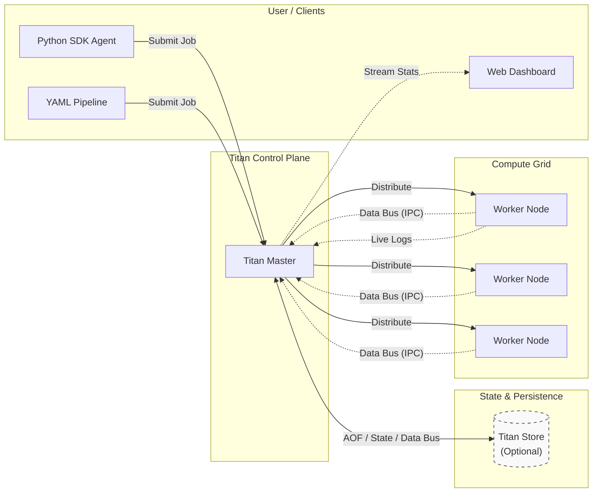
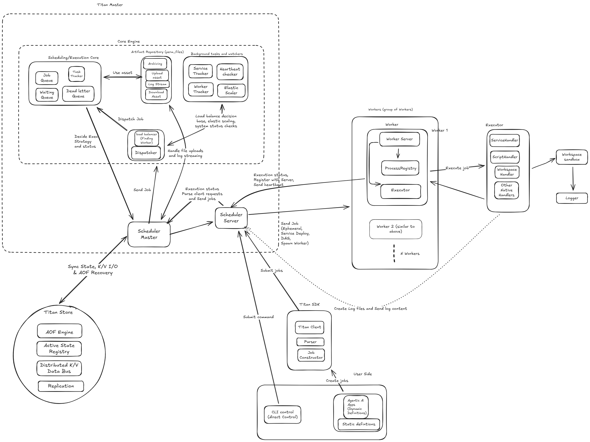
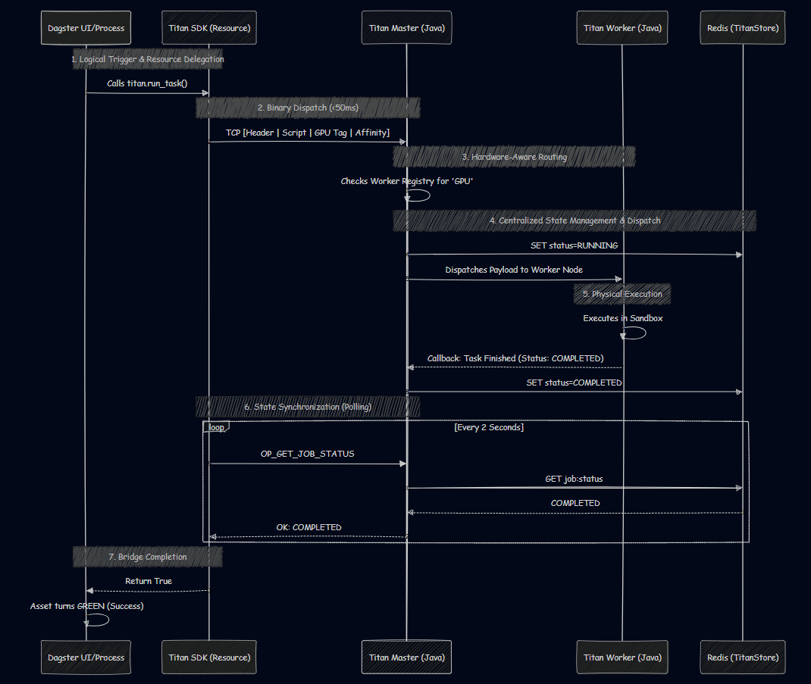
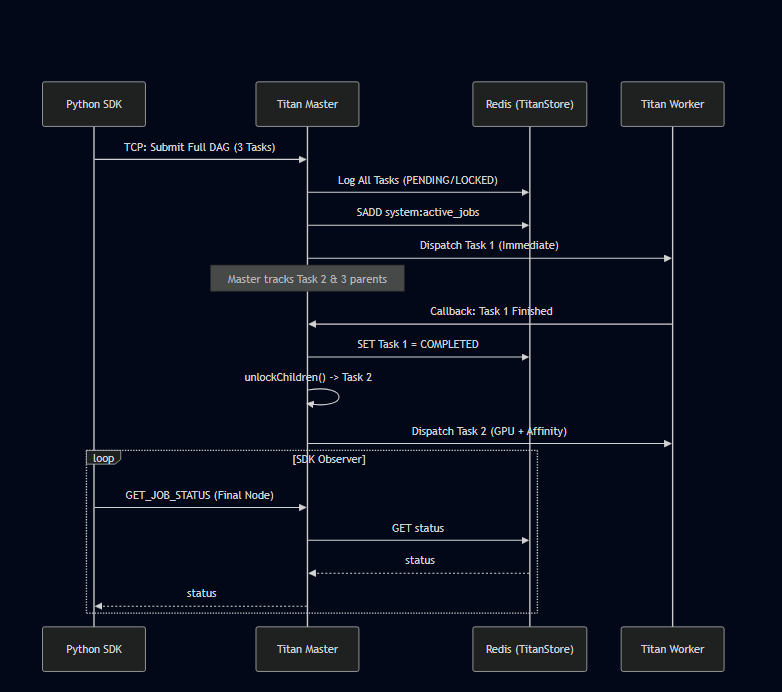

# 🏛️ Architecture & System Design

Titan follows a **Leader-Follower** topology with a decoupled control plane. It is engineered from first principles to deconstruct the fundamental primitives of distributed orchestration without relying on heavy external frameworks.

The diagram below shows the highest-level view. A single Master acts as the sole control plane: it accepts job submissions from clients, routes tasks to worker nodes based on load and capability, and uses TitanStore for state persistence and crash recovery. Workers register themselves to the Master on startup — the Master holds no static worker configuration.

> **Note:** The Master is currently a Single Point of Failure (SPOF). Raft-based leader election is on the v2 roadmap.


```mermaid
flowchart LR
    subgraph Clients["User / Clients"]
        direction TB
        SDK["Python SDK Agent"]
        YAML["YAML Pipeline"]
        Dash["Web Dashboard"]
    end

    subgraph ControlPlane["Titan Control Plane"]
        Master["Titan Master"]
    end

    subgraph DataLayer["State & Persistence"]
        Store[("Titan Store<br>(Optional)")]
    end

    subgraph Grid["Compute Grid"]
        direction TB
        W1["Worker Node"]
        W2["Worker Node"]
        W3["Worker Node"]
    end

    SDK -- "Submit Job" --> Master
    YAML -- "Submit Job" --> Master

    Master -- "Distribute" --> W1
    Master -- "Distribute" --> W2
    Master -- "Distribute" --> W3
    
    W1 -. "Data Bus (IPC)" .-> Master
    W2 -. "Data Bus (IPC)" .-> Master
    W3 -. "Data Bus (IPC)" .-> Master

    Master -. "Stream Stats" .-> Dash
    W1 -. "Live Logs" .-> Master

    Master <-->|"AOF / State / Data Bus"| Store

    classDef optional fill:#f9f9f9,stroke:#333,stroke-dasharray: 5 5;
    class Store optional;
```

## Deep Dive L2 Diagram



> **Network Topology:** Titan currently assumes a flat network address space (LAN/VPC). While it can run on Cloud VMs (EC2/GCP), it requires direct TCP connectivity between nodes. 

---

## 1. The Protocol (`TITAN_PROTO`)

Titan does not rely on HTTP/REST or heavy gRPC layers. Communication happens over raw TCP sockets using a fixed-header framing strategy to ensure integrity and prevent packet fragmentation. 

```text
[ HEADER (8 Bytes) ]
| Version (1B) | OpCode (1B) | Flags (1B) | Spare (1B) | Payload Length (4B) |

[ BODY ]
| Binary Payload (Variable) ... |
```

This ensures low-latency IPC (Inter-Process Communication) with zero JSON-serialization overhead for the core execution loops.


## 2. Internal Mechanics: 

The Master Node: The Master acts as the Scheduler and Control Plane. It utilizes specialized threads to manage the cluster efficiently.

- **Inverted Worker Registration (Push-Based Discovery)**

    Unlike traditional systems that scan for nodes, Titan uses a Push-Based Discovery model. Workers initiate the connection to the Master, allowing dynamic scaling behind NATs or firewalls without static IP configuration.

    
- **Queue Segregation (Waiting vs. Active)**

    To process complex DAGs efficiently, Titan separates tasks by readiness. Jobs with unresolved parent dependencies are never placed in the active loop; instead, they sit in a blocked Waiting Queue. Once a parent task succeeds, a state-transition event instantly unlocks the dependent children, moving them into the ActiveJobQueue for immediate execution.

- **Smart Dispatching: Capability & Affinity Routing**

    When popping a job from the ActiveJobQueue, the Master executes a two-phase routing algorithm before dispatching the payload:

    > **Capability-Based Routing:** The scheduler checks the job's requirement tag (e.g., GPU, HIGH_MEM) and strictly matches it against the registered hardware tags of the current worker pool. A GPU task will bypass idle GENERAL nodes until a capable node is free.

    > **Affinity-Based Routing:** If a task requires strict data locality (flagged with affinity: true), the Master queries TitanStore to find the exact physical node that executed the parent task. The child task is then routed exclusively to that node to leverage local filesystem caches and avoid network data transfers.

- **The "ClockWatcher"**

    Instead of inefficient polling, Titan uses a dedicated thread monitoring a DelayQueue to handle future tasks. This ensures $O(\log n)$ scheduling efficiency, consuming zero CPU cycles until the precise millisecond a job is ready.

- **The Span Log (Execution Record)**

    Every dispatch creates a `TaskExecution` span carrying when the job became eligible, when it started and ended, the worker, the attempt number, the declared priority and the parent IDs. Spans are held in a bounded in-memory ring (`titan.metrics.spans.max`, 5000) and appended asynchronously to day-partitioned JSONL on the sampler thread, never the dispatch thread. This is what separates queue wait from execution time per job, and what allows the dependency graph to be reconstructed after the `Job` objects are gone.

- **Sampled Series (Control-Plane Telemetry)**

    A metrics sampler runs once a second writing into bounded ring buffers with three resolutions — 1s, 10s and 100s — rolled by a factor of 10, with a per-series roll mode (`MAX` for levels such as queue depth, `SUM` for counters such as throughput). This gives a time axis for cluster state at fixed memory cost, with no external metrics store.

- **Dispatch Loop Instrumentation**

    The dispatch loop is **serialized**: while one iteration runs, nothing else in the cluster is dispatched, so the loop's duration is the scheduler's throughput ceiling. Each iteration is timestamped at five phase boundaries — capability routing, worker selection, span and bookkeeping writes, store writes, and the network hand-off to the worker — so the total can be attributed rather than merely observed. Only timestamps are taken; the loop's order and blocking behaviour are unchanged.

- **Reconciliation Loop**

    A background ScalerExecutor runs every 15 seconds to compare the ActiveJobQueue against WorkerCapacity. If the delta is too high, it triggers the Auto-Scaler. It calculates saturation per capability pool (e.g., GENERAL vs. GPU) to ensure scaling only happens when a specific resource type is exhausted.
    
---

## 3. State Persistence & Data Bus (TitanStore)

To preserve cluster state across a Master restart and provide a unified state layer, Titan implements a custom in-memory data store backed by Redis primitives (**RedisJava** — a from-scratch, Redis-compatible engine maintained in a separate repository). This gives Titan **durability, not high availability**: the Master can rebuild its state after a crash, but the store does *not* remove the Master as a single point of failure (see the note at the top of this page and §6). Raft-based leader election for true failover is on the v2 roadmap.

**Append-Only File (AOF):** 

Every critical system transition (e.g., Node Locked, Job Dispatched, Worker Registered) is written to a persistent log on disk.

> **Crash recovery** — how the AOF is replayed and orphaned jobs are rescued on restart — is covered under [Fault Tolerance &amp; Recovery](fault-tolerance.md).

**Distributed Data Passing:** 

Tasks can write intermediate results or metadata to the store, allowing downstream tasks to fetch them seamlessly across completely different physical nodes.

**Dynamic State Tracking:** 

Individual tasks can update their own custom progress metrics, flags, or statuses during execution. This allows the Python SDK or the UI Dashboard to query the real-time progress of a remote script while it is still running.


## 4. The Data Plane (File System)

Titan strictly separates "Source Artifacts" from "Runtime State" to ensure reproducibility.


| Directory                           | Role | Description |
|:------------------------------------| :--- | :--- |
| **`TitanStore (Redis) (Optional)`** | **Global State** | In-memory data structure store backed by an AOF. Stores job statuses, DAG locks, Task  and worker heartbeats. Can be used by tasks as a store as well. |
| **`perm_files/`**                   | **Artifact Registry** | The "Source of Truth." Place your scripts (`.py`, `.sh`) and binaries (`.jar`) here.<br><br>*Note: SDK/YAML submissions automatically stage files here, but you can also manually drop files in.* |
| **`titan_workspace/`**              | **Execution Sandbox** | The runtime staging area.<br><br>• **`jobs/{id}/`**: Contains execution logs (`.log`) and isolated script copies for specific jobs.<br>• **`shared/`**: A "Data Bus" directory allowing dependent DAG tasks to share intermediate files. |


---


## 5. Orchestration Flows
Titan handles both delegated and autonomous orchestration.

### **Flow A: Delegated Orchestration (Dagster + Titan)**

Dagster holds the logical execution graph and delegates physical execution to Titan via a synchronous polling loop.





### **Flow B: Autonomous Orchestration (Native Titan)**
The Python SDK submits the entire DAG in one atomic binary payload. The Titan Master handles the complete state machine (Wait -> Unlock -> Dispatch) internally.




### Detailed Code Flows

For step-by-step traces through the codebase showing exactly which file and method handles each stage of execution, see the [Developer Guide — Code Flow by Scenario](../contributing-dev-guide.md#code-flow-by-scenario). It covers:

- Single job submission (SDK → Master → Worker → callback)
- DAG chain resolution (dependency unlock sequence)
- Fan-out/fan-in (parallel dispatch + incremental fan-in)
- Service deployment (long-running with auto-restart)
- HITL gate (polling, approval, downstream unlock)
- Failure with retry and dead-letter
- Cancel with cascade
- Worker crash and recovery
- MCP submission (natural language → engine)

Each scenario includes a sequence diagram and a line-by-line code trace.

## 6. Limitations & Design Constraints

Titan is a research runtime designed to explore the **primitives of orchestration** (Scheduling, IPC, State Management) without the complexity of existing frameworks. As such, certain "Production" features are explicitly out of scope for V1:

### Current Constraints


1. **Security (Open TCP):**

    * The current implementation uses raw, unencrypted TCP sockets.
    * *Constraint:* Do not run Titan on public networks (WAN) without a VPN or SSH Tunnel. Use strictly within a trusted VPC/LAN.

2. **Process Failover:**

    * While data is safe, the Master is currently a singleton process. If it crashes, workers cannot receive new instructions until it reboots. High Availability (HA) via Raft Consensus (Leader Election) is planned for the v2.0 Roadmap to achieve true zero-downtime failover.

3. **Network Topology:**

    * Titan assumes a flat address space (all nodes can ping each other via IP). It does not currently handle NAT Traversal or complex Subnet routing.

4. **Service Liveness (Probed Once):**

    * A service's readiness is probed when it is deployed, and never re-probed. "Live" means the Master still has it registered, so a service whose process dies quietly continues to be listed.
    * *Constraint:* Treat the Services panel as a roster, not a health check. Periodic probing with crash-loop backoff is specified but not built.

5. **Load Signal (Slots, Not Utilisation):**

    * Worker selection is least-loaded by **concurrent job count**. Workers report host CPU, memory and load average on the heartbeat, but those are observability only — they do not yet influence routing. A node running one heavy job therefore looks emptier than one running two trivial ones.

6. **Scaling Boundary (Process vs. Infrastructure):**

    * Titan implements **Application-Level Scaling** (spawning new JVM worker processes on existing hardware).
    * **Infrastructure Provisioning** is currently delegated to external tools.
    * *Roadmap Item:* A "Cluster Autoscaler Interface" (Webhooks) is planned for v2.0, allowing Titan to trigger external APIs (e.g., Azure VM Scale Sets) when the cluster runs out of capacity.

7. **Measured Scale (What Was Run, Not a Ceiling):**

    * Every figure published for Titan so far comes from **60 jobs across 5 workers on a single host**. That is what has been *exercised*, not a wall anyone reached.
    * Nothing in the code structurally caps job or worker count: the queues are unbounded and workers self-register.
    * The known constraint is **throughput, not capacity**. Dispatch is serialised, so the loop is a single-threaded ceiling regardless of how many workers join, and every store write funnels through one synchronised adapter.
    * *Constraint:* production load, multi-day runs and many-host deployments are **unvalidated**. Load testing is in progress and the real ceilings will be published once measured. Treat the current figures as a demonstrated floor rather than a limit.

## 8. Roadmap to v2.0
**Security & Auth:** Implement mTLS (Mutual TLS) for encrypted, authenticated communication.

**Distributed Consensus:** Implement Raft/Paxos for Leader Election (Removing Master SPOF).

**Containerization:** Support for Docker execution drivers for true filesystem isolation (currently uses Process-Level isolation).

**Opt-in TTL heartbeat:** An alternative worker-liveness model using TitanStore TTL keys — the worker refreshes an expiring key and the Master detects its absence, aligning with the push-based discovery philosophy. Requires exposing a `SETEX`-style command over the wire (TTL exists inside TitanStore but is not yet reachable via the adapter/SDK). Would make TitanStore required for liveness, so the current Master-dial loop remains the store-less default.

**Cluster Autoscaler Webhooks:** Allow Titan to trigger external APIs (e.g., Azure VM Scale Sets) to provision bare metal automatically when queues saturate.