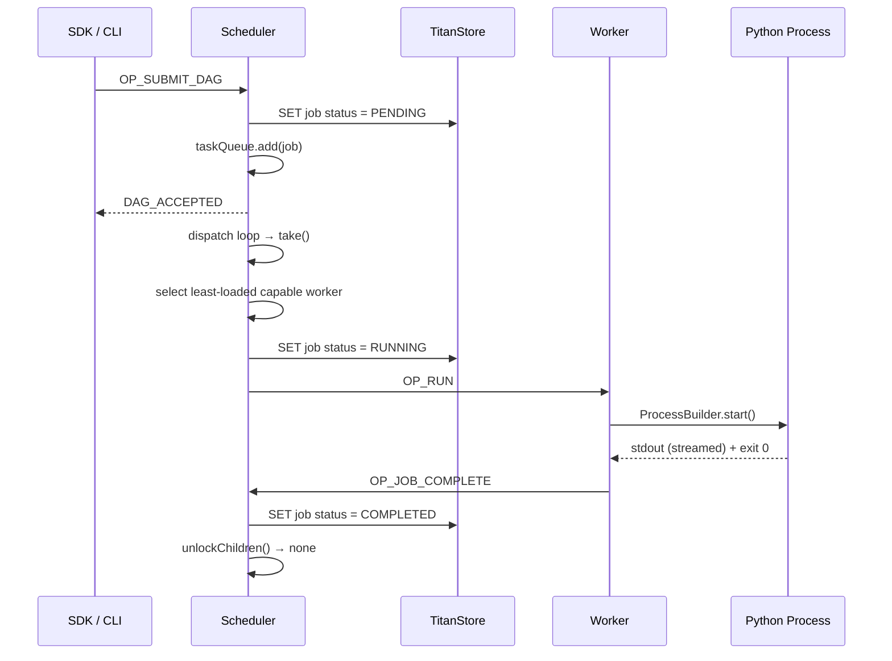
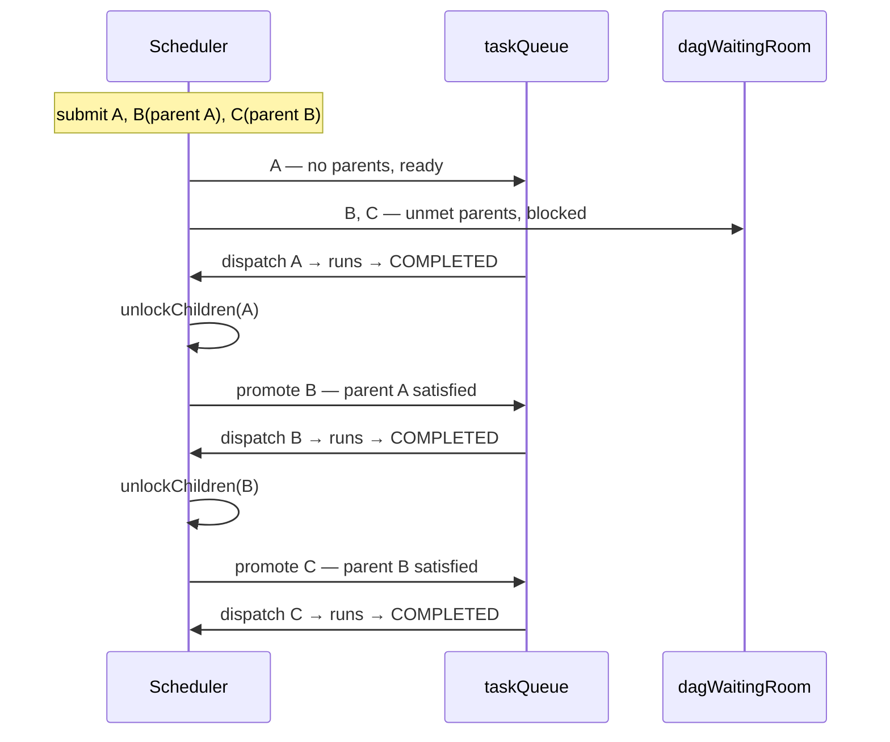
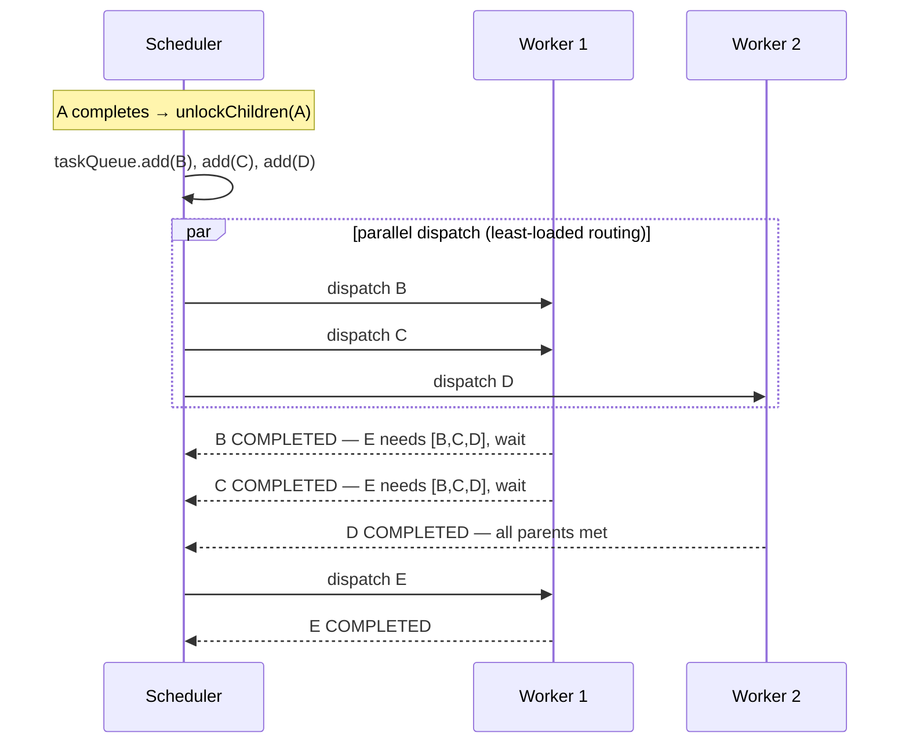

# 🔀 Execution Flows

How the engine actually moves a job from *submitted* to *done*. This page is the conceptual, systems-level view; for the exhaustive line-by-line code traces (file → method → next), see the [Developer Guide → Code Flow by Scenario](../contributing-dev-guide.md#code-flow-by-scenario).

## The dispatch model

Every flow below is built from four moving parts in the Master:

- **`taskQueue`** — a blocking queue of jobs that are *ready to run* (all dependencies met).
- **`dagWaitingRoom`** — jobs *blocked* on unfinished parents. They never enter the active loop until unblocked.
- **`runDispatchLoop()`** — a thread blocked on `taskQueue.take()`; when a job appears it selects a worker and dispatches.
- **`unlockChildren()`** — called when a job completes; it scans the waiting room and promotes any job whose parents are now all satisfied into `taskQueue`.
- **`reconcileFinishedParents()`** — called when a job is *admitted*; it marks any dependency that has already reached `COMPLETED`.

This separation is the heart of Titan's scheduler: **readiness is event-driven, not polled.** A blocked job costs nothing until a parent-completion event unlocks it.

### Why readiness is event-driven *and* reconciled

A purely event-driven design is not sufficient on its own, and assuming it was caused a real bug.

`unlockChildren()` only sees children that are in the waiting room **at the instant a parent finishes**. But a DAG's jobs are admitted one at a time, so a child near the end of a large payload is registered *after* its parents have already started running. Any parent that completes during that admission window notifies nobody: the scan finds no child, and the event is gone.

With a wide fan-in this is not a rare edge case. A 700-parent sink lost 46 completions this way and waited forever on work that had already finished.

So admission looks **backwards** as well: when a job enters the waiting room, `reconcileFinishedParents()` checks each dependency's recorded state and marks the ones already `COMPLETED`. The check runs again immediately after insertion, to close the gap between the scan and the `put`, and whichever caller wins the `remove()` is the one that queues the job — so it is queued exactly once.

The rule to carry into any similar code: **an edge-triggered notification needs a reconciliation step for listeners that were not yet registered when the edge fired.**

See `docs/BUGFIX_DAG_DEPENDENCY_LOSS.md` in the repository for the full postmortem.

---

## Flow 1 — Single job (the happy path)

The simplest trace: one job, submitted, dispatched, completed.

The submission is **acknowledged immediately** (`DAG_ACCEPTED`) — dispatch happens asynchronously on the loop, so a slow cluster never blocks the submitting client.

---

## Flow 2 — Dependency resolution (A → B → C)

A chain. `B` waits for `A`, `C` waits for `B`. This shows the waiting-room / unlock mechanism that makes DAGs work.

Only jobs with **zero unmet dependencies** ever reach `taskQueue`. Everything else sits inertly in the waiting room until a completion event promotes it — no busy-waiting, no dependency polling.

---

## Flow 3 — Fan-out and fan-in (A → [B, C, D] → E)

Parallel branches with a collector that must wait for **all** of them. This is where capability routing and incremental fan-in show up.

Fan-in is **incremental**: each branch completion re-checks the collector's parent set. `E` is promoted only on the completion event that satisfies its *last* outstanding parent — the Master never scans or polls to discover that the branches are done.

---

## Where the other flows live

The Developer Guide covers the full set with code-level traces:

| Flow | Covered in |
|---|---|
| Single job · DAG chain · fan-out/fan-in | *this page* (conceptual) + [Dev Guide](../contributing-dev-guide.md#code-flow-by-scenario) (code) |
| Service deployment (long-running, auto-restart) | [Dev Guide — Scenario 4](../contributing-dev-guide.md#scenario-4-service-deployment-long-running) |
| HITL gate (pause for human approval) | [Dev Guide — Scenario 5](../contributing-dev-guide.md#scenario-5-hitl-gate-pause-for-human-approval) |
| Job failure, retry & dead-letter · worker crash recovery | [Fault Tolerance & Recovery](fault-tolerance.md) |
| Cancel with cascade | [Dev Guide — Scenario 7](../contributing-dev-guide.md#scenario-7-cancel-with-cascade) |
| MCP submission (natural language) | [Dev Guide — Scenario 9](../contributing-dev-guide.md#scenario-9-mcp-submission-natural-language) |
