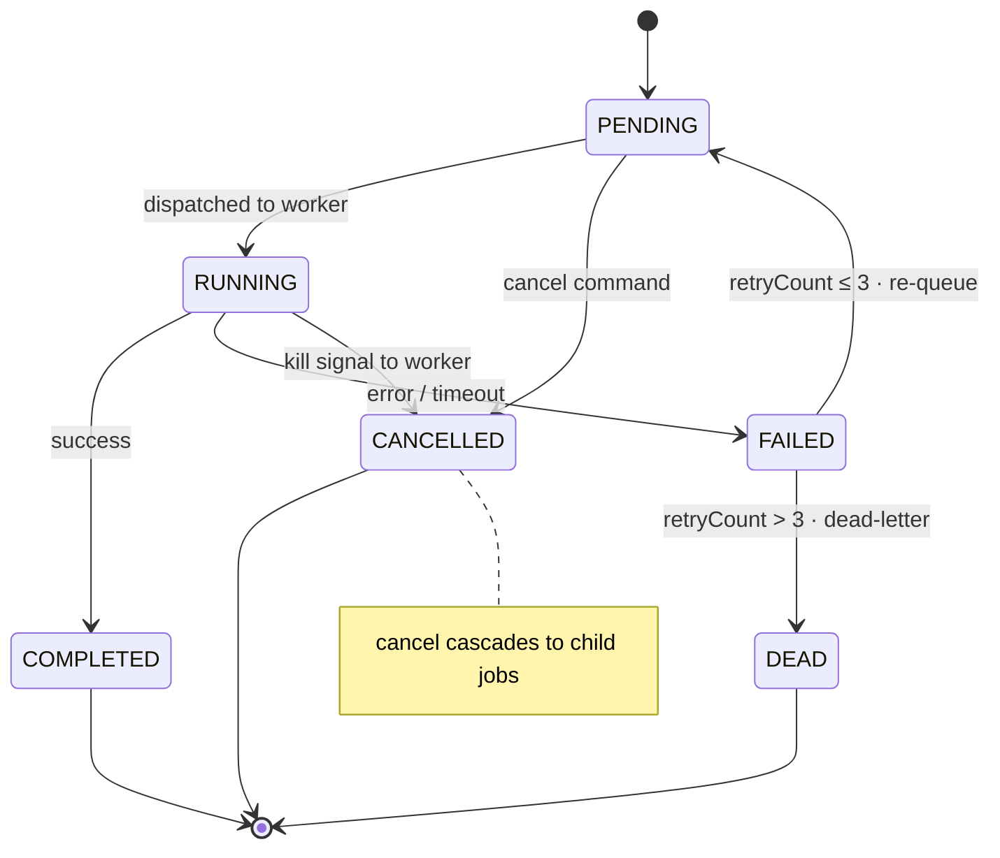

# 🛡️ Fault Tolerance & Recovery

Titan is built on the assumption that workers, jobs, and the Master itself *will* fail. Failure handling is not an add-on layer — it is wired directly through the scheduler core. Every mechanism below is implemented in the v1 engine.

## The Job Lifecycle

Every job moves through a six-state machine. Failure is a first-class transition, not an exception path — a failed job either loops back for another attempt or lands in the dead-letter queue.

## Worker Failure — Detection & Self-Healing

- **Heartbeat failure detector.** The Master runs a dedicated `HeartBeatExecutor` that dials every registered worker every **10s** (`titan.worker.heartbeat.interval`). A worker that fails to answer a single heartbeat is marked `DEAD` and removed from the registry — detection is on the next beat, not after a "last seen" timeout. *(The Master initiates the heartbeat — it dials the worker, not the reverse.)*
- **In-flight job recovery.** A job enters `runningJobs` at dispatch and leaves it when its completion callback arrives. If the worker dies first that callback never comes, so declaring the worker dead is not enough — the work it was holding has to be recovered explicitly. `recoverJobsFrom(deadWorker)` closes each stranded span as `FAILED` with the reason recorded, then hands the job to `handleJobFailure`, so bounded retries and the dead-letter queue apply exactly as for any other failure. A worker dying is not a special kind of failure; it is a failure whose evidence arrives late.
- **Orphan reconciliation (safety net).** A worker can also leave the registry by other routes — reclaimed by the scaler, decommissioned on command. Rather than hooking every exit, the metrics sampler checks the invariant directly once a second: *no job may be counted running on a worker that is not in the fleet.* Anything violating it for longer than `titan.scheduler.orphan.grace.ms` (30s, so a worker mid-registration or a callback in flight is not mistaken for a corpse) is recovered the same way. Both paths run off the dispatch thread.
- **Observable invariant.** The gap this protects against is visible in the metrics: `queue` carries both `running` (jobs the Master believes are in flight) and `occupied` (slots the live workers actually report). `running > occupied` means work has been orphaned, and the Cluster page surfaces it as *"N job(s) counted running with no live slot"*.
- **Push-based re-registration.** Workers re-register with the Master every 30s, so a worker that was marked dead — or that came up after a Master restart — rejoins the pool automatically, with no operator action or static configuration.

## Job Failure — Retry, Fail-Fast & Dead-Letter

- **Bounded retry.** On failure, `handleJobFailure` increments the job's retry count and re-queues it. A job is retried while `retryCount ≤ 3` and marked `DEAD` once it exceeds that — i.e. **up to 3 retries (4 attempts total)** before it is quarantined, rather than retrying forever.
- **Dead-Letter Queue (DLQ) & poison pills.** Jobs that exhaust their retries — "poison pills" that would otherwise crash-loop the cluster (syntax errors, missing libraries) — are quarantined in a dedicated DLQ. Their logs and state are preserved for inspection, and their dependent children are cancelled so the rest of the DAG is not stalled.
- **Fail-fast for deployment errors.** Port-conflict (`"ALREADY in use"`), duplicate-service-ID, unreachable-after-start (`"never became reachable"`) and rejected-deployment failures skip the retry loop entirely — the job is marked `FAILED` immediately rather than burning 3 retries on a deterministic error. A service that never bound its port will not bind on a retry, so retrying would only multiply the readiness window. Auto-scaler worker-spawn jobs (`WRK-`) are similarly abandoned on failure so the scaler can retry on a fresh port.
- **Service readiness is a failure mode, not a race.** A service deploy completes only once the Master can open a TCP connection to the service's port. If the port never answers within the readiness window (10 × 2s by default), the deploy fails rather than reporting a success that downstream nodes would act on. The probe runs on a dedicated pool, so a slow-booting service does not stall dispatch for the rest of the cluster.
- **Reliable completion callbacks.** When a worker reports job completion back to the Master (the worker→Master callback path), it retries up to **5 times with exponential backoff (1s → 2s → 4s → 8s)**, so a transient network blip does not silently lose a finished result. *(This backoff applies to the completion callback, not to Master→worker dispatch, which re-queues immediately.)*

## Timeouts & Backpressure

- **Execution timeouts.** Every running process is bounded by a timeout; on expiry the entire process tree is forcibly terminated (`destroyForcibly`) and the job is failed, rather than a hung script permanently occupying a worker slot.
- **RPC read timeouts.** All Master↔worker socket reads use a 30s timeout, so a stuck peer surfaces as a detectable failure instead of a permanent block.
- **Saturation backpressure.** If every capable worker is saturated when a job is popped from the queue, the job is re-queued rather than dropped or force-dispatched — natural backpressure that holds work until capacity frees up.

## Master Failure — Durability & Restart Recovery

- **AOF durability.** Every critical state transition (job dispatched, node locked, worker registered) is appended to TitanStore's on-disk Append-Only File.
- **Orphaned-job recovery.** On startup the Master calls `recoverState()`, which scans TitanStore for jobs that were active but never reached a terminal state and re-queues them into the correct queue (waiting room vs. active) based on their persisted status and scheduled time. This is distinct from raw AOF replay: it specifically rescues *in-flight* work so a DAG resumes across a Master restart instead of stranding.

!!! info "Honest scope: durability, not yet high availability"
    These mechanisms give Titan **durability** — no committed state or in-flight job is lost across a crash — and **self-healing** for worker failure. What v1 does **not** yet provide is **availability *during* a Master outage**: while the Master is down, workers cannot receive new instructions until it reboots and replays state. Zero-downtime failover via Raft leader election is a v2.0 roadmap item (see [Limitations](design.md#6-limitations-design-constraints)). In short: the gap is availability-during-failure, not data loss.

---

For step-by-step code traces of these paths — worker crash and recovery, failure with retry and dead-letter, cancel with cascade — see the [Developer Guide → Code Flow by Scenario](../contributing-dev-guide.md#code-flow-by-scenario).
