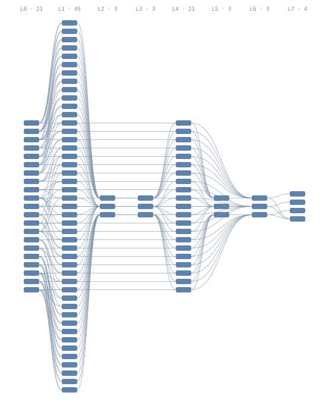
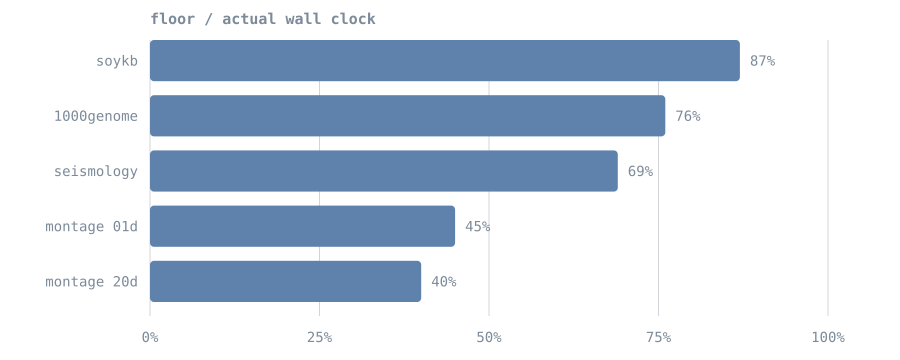
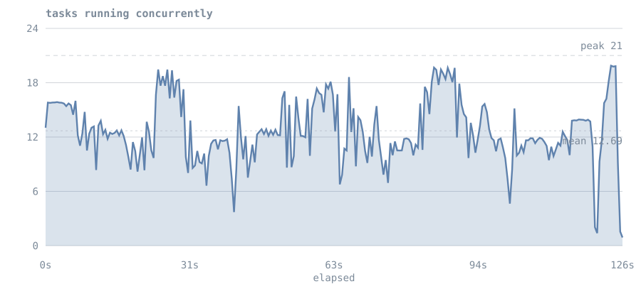
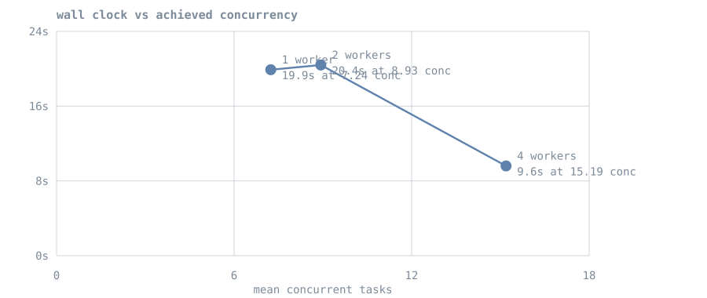

# Validation & Benchmarks

Titan is validated against **published workflow instances from [WfCommons](https://wfcommons.org/)**, not
benchmarks written for it. These are DAGs recorded from real production scientific workflows
(astronomy, genomics, seismology, agriculture), distributed in a documented schema called WfFormat.

The reason this matters: an instance carries its own ground truth. It states exactly which tasks
exist and which depends on which, so *"every task ran once"* and *"no child started before its
parent finished"* become checkable facts rather than claims. It also defines its own performance
floors, so efficiency can be reported without comparing against another system.

!!! info "Which environment these numbers come from"
    Everything on this page is a **native single-host run**: the Master, workers and TitanStore all
    on one 14-core machine. This environment is right for correctness and for the *shape* of
    overheads, and wrong for anything about fleet scaling or absolute throughput.

    **Multi-node cloud results are measured separately** and reported on
    [Multi-VM Cloud Setup](../deployment/cloud.md). Where the two disagree, the cloud numbers are
    the ones to quote for capacity, and the numbers here are the ones to quote for correctness.

---

## Correctness

The strongest result, and the one that does not depend on the hardware at all. For every
parent-child edge in the real workflow, the child's span must start no earlier than the parent's
span ends.

| Workflow | Tasks | Completed | Dependency edges verified | Order violations |
|---|---|---|---|---|
| montage 2mass-20d | **9,805** | 9,805 / 9,805 | 11,631 | **0** |
| seismology | 701 | 701 / 701 | 700 | **0** |
| soykb | 156 | 156 / 156 | 354 | **0** |
| montage 2mass-01d | 103 | 103 / 103 | 231 | **0** |
| 1000genome | 52 | 52 / 52 | 76 | **0** |
| **total** | **10,817** | **10,817 / 10,817** | **12,992** | **0** |

The largest instance published by WfCommons is montage 2mass-20d: 9,805 tasks, 24,027 edges, and a
single level **6,285 tasks wide**. It completes with every task run and no ordering violation.

!!! note "Why 11,631 edges rather than 24,027"
    Edge verification reads recorded spans, and the Master keeps the most recent 5,000 in memory
    (`titan.metrics.spans.max`). A 9,805-task run overflows that, so roughly half the edges were
    checkable from the live ring. Raise the cap, or verify against the persisted span files, to
    check all of them.

Causal ordering is a property of the scheduler, not of the machine, so this table transfers to any
deployment.

### Shapes covered

Topology is deliberately varied, because a scheduler can be correct on one shape and broken on
another.

| Workflow | Tasks | Depth | Widest level | Character |
|---|---|---|---|---|
| montage 2mass-20d | 9,805 | 8 | **6,285** | the largest instance published |
| seismology | 701 | 2 | 700 | flat and extremely wide |
| soykb | 156 | **11** | 100 | deep and dependency-bound |
| montage 2mass-01d | 103 | 8 | 45 | densest edges per node |
| 1000genome | 52 | 3 | 28 | small and shallow |

### What one of these actually looks like

The smallest Montage instance, drawn to scale. Each block is a task, each curve a dependency, and
each column a level of the graph. This is the 103-task variant; the 9,805-task one has the same
shape with levels up to 6,285 wide, which is why the larger instances are described in numbers
rather than pictures.

<figure markdown>
  { width="100%" }
  <figcaption>Montage 2mass-01d &mdash; 103 tasks, 231 edges, 8 levels, widest level 45.
  Column labels show each level and its task count.</figcaption>
</figure>

Any pipeline's graph can be exported from the DAG Visualizer as **SVG**, **Mermaid** or
**Graphviz DOT**. Mermaid suits graphs under a few hundred nodes and pastes into
mermaid.live or a Markdown fence; DOT is the one that scales to thousands via
`dot -Tsvg` or `sfdp`.

## A bug this found

The seismology instance, 700 independent roots feeding one sink, exposed a **silent, permanent
dependency-loss bug**. The sink never ran: it sat blocked reporting `654/700 parents done` while
all 700 parents were `COMPLETED` in the store. No error, no retry, no log line.

Completion notification was purely edge-triggered, and a DAG's jobs are admitted one at a time. So
the roots began executing while the sink was still being registered, and every completion landing
in that window was delivered to a child that did not exist yet. Nothing reconciled afterwards.

Every existing test used narrow DAGs, where admission finishes long before any task can complete,
so the window never opened. The fix makes admission look backwards at parents that already
finished. Verified on the shape that exposed it (701/701) and on a 6,285-wide level (9,805/9,805).

Full postmortem: [`docs/BUGFIX_DAG_DEPENDENCY_LOSS.md`](https://github.com/ramn51/titan-orchestrator/blob/main/docs/BUGFIX_DAG_DEPENDENCY_LOSS.md).
Corrected semantics: [Execution Flows](execution-flows.md#why-readiness-is-event-driven-and-reconciled).

---

## Performance

!!! warning "Read the environment note before quoting these"
    Single host: Master, workers and the store share 14 cores. Task durations are replayed from
    each instance's recorded runtimes rather than being the original computation.

Each instance defines its own floor. The critical path is the wall time with infinite slots; total
work divided by slot count is the wall time with no dependencies at all. The larger of the two is
the best any scheduler could achieve on that fleet.

| Workflow | Wall clock | Floor | Efficiency | Achieved speed-up |
|---|---|---|---|---|
| montage 2mass-20d (9,805 tasks) | 125.9 s | 49.7 s | **40%** | 12.7 of 20 slots busy on average |
| soykb | 18.2 s | 15.9 s | **87%** | 2.7x of 3.1x possible |
| 1000genome | 13.4 s | 10.2 s | **76%** | 10.3x of 13.5x |
| seismology | 26.1 s | 18.1 s | **69%** | 13.9x of 72.1x |
| montage | 47.2 s | 21.1 s | **45%** | 7.7x of 17.2x |

<figure markdown>
  { width="100%" }
</figure>

The deeper and narrower a workflow, the closer Titan runs to its floor: soykb spends its time on a
genuine critical path rather than on scheduling. Seismology's 72x theoretical maximum is
unreachable on 20 slots by definition; against the *achievable* floor it reaches 69%.

The 9,805-task run scores lowest, at 40%, and that number is the interesting one. It held a mean of
12.7 of 20 slots busy with a peak of 21, so the fleet was never idle for long, yet the run still
took 125.9 s against a 49.7 s floor. With ~114 ms median task duration the per-task worker overhead
is a large fraction of each task, and 9,805 of them is where that accumulates. This is a **worker**
result, not a scheduler one.

### Where a run's wall clock actually goes

Efficiency is a single number and cannot say *why* a run was slow. Occupancy over time can: it
shows how many tasks were executing at each moment, so a fleet starved by dependencies looks
different from a fleet that was busy the whole time.

<figure markdown>
  { width="100%" }
  <figcaption>The 9,805-task run. The fleet is busy throughout, but sits nearer 12.7 than its peak
  of 21, and the autoscaler's extra worker is visible as the later climb.</figcaption>
</figure>

That splits the wall clock into causes:

| | |
|---|---|
| 47.4 s | the work itself, spread across 21 slots |
| +28.7 s | per-task overhead — 603 s of slot time over 9,809 tasks, 62 ms each |
| +49.8 s | fleet not staying full — mean 12.7 against peak 21 |
| **125.9 s** | **total** |

So the largest single loss is not overhead, it is the fleet not remaining saturated. Generate this
for any run with `python titan_test_suite/wf_occupancy.py <run-fragment> --intended <seconds>`.

### Does adding slots help

Measured, on one workflow at three fleet sizes:

<figure markdown>
  { width="100%" }
</figure>

| Workers | Configured slots | Observed peak | Mean concurrency | Wall |
|---|---|---|---|---|
| 1 | 4 | 9 | 7.24 | 19.9 s |
| 2 | 12 | 15 | 8.93 | 20.4 s |
| 4 | 16 | 16 | **15.19** | **9.6 s** |

Wall clock tracks **achieved** concurrency, not configured slots. Going from one worker to two
barely moved either (7.24 to 8.93) and the wall clock did not improve; reaching 15.19 halved it.
Total slot-seconds stay roughly constant at 144 to 182 across all three, which is the consistency
check that the model holds.

!!! warning "This sweep is confounded"
    Titan's autoscaler adds workers whenever demand exceeds capacity, and it did so in every arm:
    the "1 worker" run reached 9 concurrent tasks. The numbers describe achieved concurrency, not a
    controlled slot count. A clean sweep needs a way to pin the fleet, which Titan does not
    currently expose.

### Overhead, separated

A single throughput figure cannot distinguish "the scheduler is slow" from "process spawn is slow",
so the two are measured apart.

| Overhead | p50 | What it is |
|---|---|---|
| Per-task, worker side | **47 – 103 ms** | process spawn plus protocol. Stable across every shape, because it does not depend on the graph. |
| Dependency release, uncontended | **3 ms** | parent's completion to child's start, measured when slots were free. |

!!! danger "Dependency release is only meaningful below saturation"
    That metric measures parent-ends to child-starts, which **includes waiting for a free slot**.
    Montage records a p50 of 8,057 ms, but its levels are 45 tasks wide on 20 slots, so children
    genuinely queue. That figure is slot contention, not scheduler latency. Only the uncontended
    measurement describes the scheduler.

---

## Engine footprint

Measured on the same host, with the cluster idle after the runs above.

| | Master | Worker |
|---|---|---|
| Resident memory | 340 MB (live heap **97 MB**) | **40 MB** |
| Threads | 39 | 36 |
| Classes loaded | 1,556 | — |
| Cold start to accepting connections | **62 ms** (median 116 ms of 3) | — |

| Artifact | |
|---|---|
| Distributable JAR | **131 KB**, 47 classes |
| Runtime dependencies outside the JDK | **none** |

The Master's resident figure is dominated by the JVM's default heap reservation on a large host
(`-XX:InitialHeapSize` was 576 MB here); the live heap is 97 MB while holding 5,000 spans and the
full execution history. Set `-Xmx` to size it for the deployment.

!!! note "On the zero-dependency claim"
    `gson` is declared in `pom.xml` but is not imported anywhere under `src/main`, and no
    third-party classes are packaged in the JAR. The runtime is genuinely JDK-only; the stale
    declaration should be removed so the claim is verifiable by inspection rather than by grep.

---

## Reproducing this

Any WfFormat instance works. Instances are at
[github.com/wfcommons/WfInstances](https://github.com/wfcommons/WfInstances).

```bash
# fetch an instance
curl -sfL -o montage.json \
  https://raw.githubusercontent.com/wfcommons/WfInstances/main/pegasus/montage/montage-chameleon-2mass-01d-001.json

# inspect its shape without touching the cluster
python titan_test_suite/wfformat_to_titan.py montage.json

# run it and derive correctness + performance
python titan_test_suite/wf_bench_runner.py montage.json --scale 0.2
```

Useful flags:

| Flag | Effect |
|---|---|
| `--scale F` | multiply recorded runtimes, to compress a multi-hour workflow |
| `--mode cpu` | burn CPU instead of sleeping, to exercise worker saturation |
| `--limit N` | keep N tasks, breadth-first from the roots, edges preserved |
| `--json` | machine-readable output for scripting |

The converter handles WfFormat 1.6 (`workflow.specification` plus `workflow.execution`) and the
older flat layouts, sanitises task IDs that would otherwise break Titan's pipe-delimited wire
format, and rejects cyclic instances rather than hanging on them.

### What this does not test

Replaying an instance reproduces its **task graph and timings**, not its computation. Each task
becomes a generated script that occupies a slot for the recorded duration. That makes this a
genuine test of the scheduler, and not a test of data processing, file staging or I/O.

WfCommons also does not currently publish ML or agentic workflow instances, so Titan's agentic,
HITL and MCP paths are covered by its own suites rather than by this corpus.
