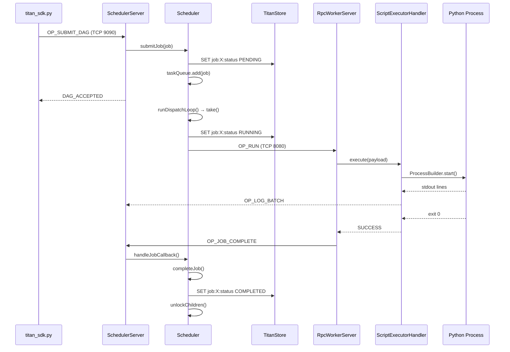
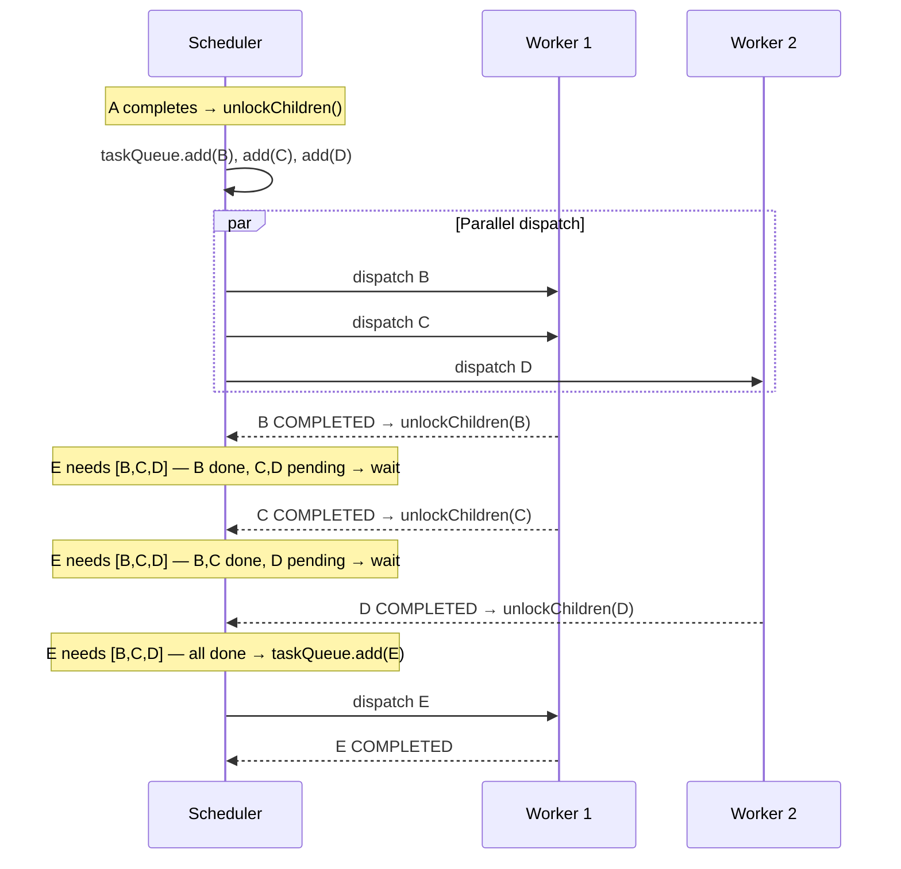
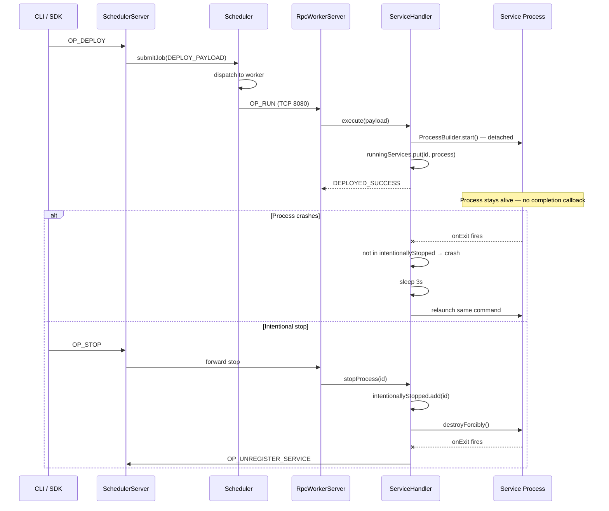
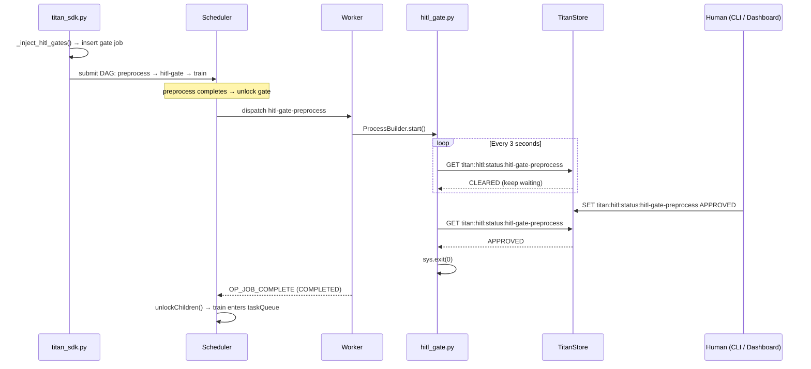
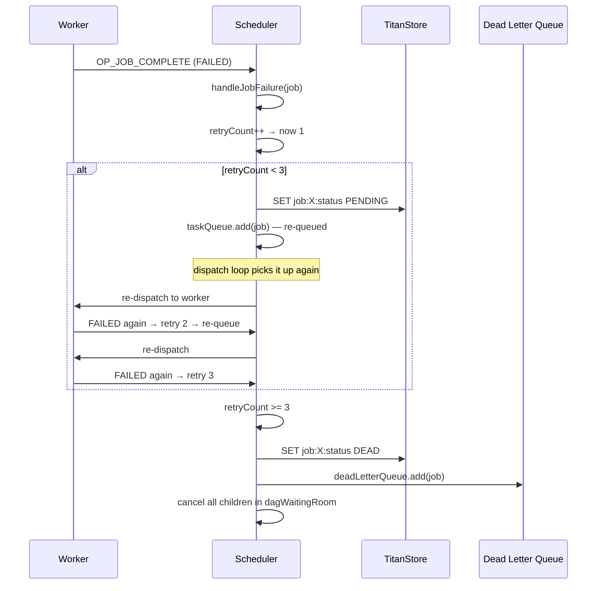
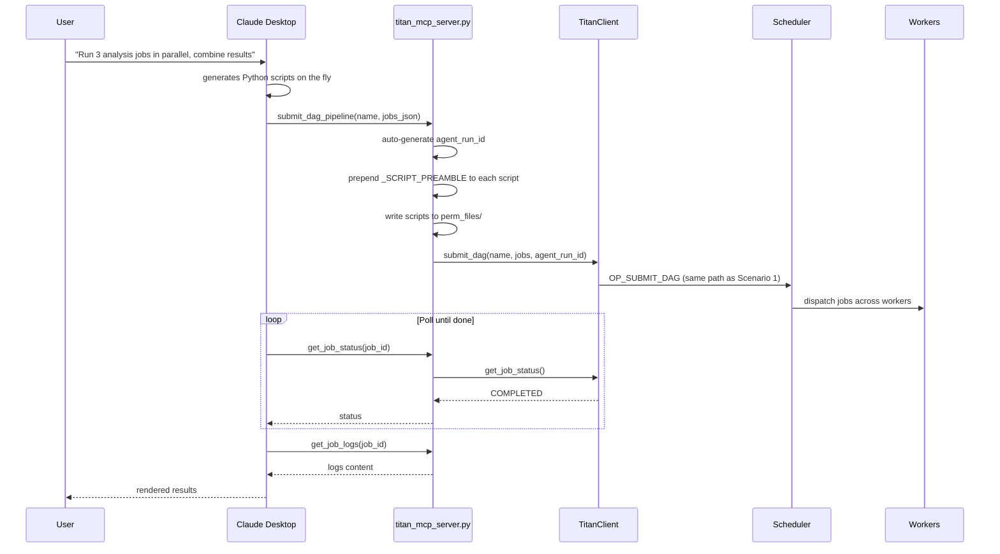

# Developer Guide — Building on Titan

This guide is for developers who want to understand the codebase, add features, or build new capabilities (like SAGA, new execution drivers, or custom schedulers) on top of Titan. It covers the code layout, execution model, extension points, and how the pieces fit together.

If you're looking for setup instructions and PR process, see [Contributing](contributing.md).

---

## Codebase Map

```
titan-orchestrator/
├── src/main/java/titan/           ← Core engine (Java 17+)
│   ├── scheduler/
│   │   ├── Scheduler.java         ← The brain: DAG resolution, dispatch loop,
│   │   │                             state persistence, auto-scaling, HITL
│   │   ├── Job.java               ← Job model: state machine, metadata, DAG edges
│   │   ├── Worker.java            ← Worker model: load, capabilities, heartbeat
│   │   ├── WorkerRegistry.java    ← Tracks workers, capability matching
│   │   ├── TaskExecution.java     ← Execution record (worker assignment, timing)
│   │   └── ScheduledJob.java      ← DelayQueue wrapper for timed execution
│   │
│   ├── network/
│   │   ├── TitanProtocol.java     ← Wire format: 8-byte header + payload
│   │   ├── SchedulerServer.java   ← Master TCP server: routes opcodes to Scheduler
│   │   ├── RpcWorkerServer.java   ← Worker TCP server: receives jobs, runs them
│   │   ├── RpcClient.java         ← Client-side TCP connector
│   │   └── LogBatcher.java        ← Buffers stdout lines before streaming to Master
│   │
│   ├── tasks/
│   │   ├── ScriptExecutorHandler  ← Spawns job scripts as child processes
│   │   ├── ServiceHandler.java    ← Deploys long-running services, auto-restart
│   │   ├── ProcessRegistry.java   ← Tracks live child processes for cleanup
│   │   ├── FileHandler.java       ← File transfer between Master and workers
│   │   └── TaskHandler.java       ← Handler interface (implement this for new types)
│   │
│   ├── storage/
│   │   └── TitanJRedisAdapter.java ← Redis-protocol client to TitanStore
│   │
│   ├── filesys/
│   │   ├── AssetManager.java      ← Manages perm_files/ (persistent scripts)
│   │   ├── WorkspaceManager.java  ← Per-job workspace isolation
│   │   └── ZipUtils.java          ← File transfer compression
│   │
│   ├── Main.java                  ← Entry point: SCHEDULER or WORKER mode
│   ├── TitanCLI.java             ← Interactive CLI (status, logs, approve, store)
│   ├── TitanMaster.java          ← Master bootstrap
│   └── TitanWorker.java          ← Worker bootstrap
│
├── titan_sdk/                     ← Python SDK
│   ├── titan_sdk.py              ← TitanClient, TitanJob, HITL injection, KV ops
│   ├── titan_cli.py              ← Python CLI entry point
│   ├── titan_mcp_server.py       ← MCP server for Claude Desktop / Cursor
│   └── titan_yaml_parser.py      ← YAML pipeline parser
│
├── perm_files/                    ← Persistent file storage on Master
│   ├── server_dashboard.py       ← Flask dashboard (routes + API)
│   ├── templates/                ← Dashboard HTML templates
│   ├── TitanStore.jar            ← AOF-backed KV store (separate repo)
│   ├── Worker.jar                ← Worker binary (copy of engine JAR)
│   └── hitl_gate.py              ← HITL gate polling script
│
├── titan_test_suite/              ← All examples and tests
│   └── examples/
│       ├── agents_examples/      ← Multi-agent pipelines (research, code gen, etc.)
│       ├── dynamic_dag_custom/   ← Dynamic DAG, ETL, GPU routing examples
│       ├── hitl_example/         ← HITL demo
│       └── titan_ci/             ← Titan running CI on itself
│
└── titan-docs/                    ← MkDocs documentation site
```

---

## Execution Model

Understanding these four loops is enough to work on any part of Titan.

### 1. Dispatch loop (Scheduler.java)

The Master's main loop. Blocks on `taskQueue.take()`, finds a capable worker, sends the job.

```
taskQueue.take() → selectBestWorker() → send to worker via TCP → wait for callback
```

All jobs flow through this single loop regardless of how they were submitted (SDK, CLI, YAML, MCP, Constructor). The queue is a `PriorityBlockingQueue` — higher priority jobs are dispatched first.

### 2. DAG resolution (Scheduler.java)

When a job with dependencies is submitted, it enters `dagWaitingRoom` instead of `taskQueue`. When a parent completes, `unlockChildren()` scans the waiting room and moves children whose dependencies are all met into `taskQueue`.

```
submitJob() → has parents? → dagWaitingRoom
completeJob() → unlockChildren() → all parents done? → taskQueue
```

### 3. Job execution (RpcWorkerServer.java → ScriptExecutorHandler.java)

The worker receives a job via TCP, spawns a child process (`ProcessBuilder`), captures stdout via `LogBatcher`, and sends `OP_JOB_COMPLETE` back to the Master when the process exits.

```
receive OP_RUN → ScriptExecutorHandler.execute()
  → ProcessBuilder("python", script.py).start()
  → stream stdout to LogBatcher → OP_LOG_BATCH to Master
  → process exits → OP_JOB_COMPLETE callback to Master
```

### 4. State persistence (TitanJRedisAdapter.java → TitanStore)

Every state transition is written to TitanStore via the RESP protocol. The adapter's `execute()` is `synchronized` — all writes are serialized. TitanStore appends every write to an AOF file. On Master restart, `recoverState()` reads back all job states and re-queues incomplete jobs.

```
safeRedisSet("job:X:status", "RUNNING") → TitanJRedisAdapter.execute()
  → RESP SET command → TitanStore → AOF append
```

---

## Threading Model

| Component | Pool type | Size | What it handles |
|---|---|---|---|
| **SchedulerServer** | `CachedThreadPool` | Unbounded | One thread per TCP connection (SDK, CLI, worker callbacks) |
| **Scheduler dispatch** | Single thread | 1 | The `runDispatchLoop()` — all dispatch decisions are single-threaded |
| **Worker connection handler** | `CachedThreadPool` | Unbounded | Incoming TCP from Master |
| **Worker job execution** | `FixedThreadPool` | **4** (`MAX_THREADS`) | Concurrent job slots — rejects when full |
| **TitanJRedisAdapter** | `synchronized` | Effectively 1 | All TitanStore access serialized through one lock |

Key implication: the dispatch loop is single-threaded, so it processes one job at a time from the queue. This is simple and safe but means dispatch throughput is bounded by the time to find a worker + send the job.

---

## Wire Protocol (TITAN_PROTO)

Every message between Master, workers, and clients uses the same format:

```
[ Version (1 byte) | OpCode (1 byte) | Flags (1 byte) | Spare (1 byte) | Length (4 bytes) ] + [ Payload ]
```

8-byte fixed header + UTF-8 payload. Defined in `TitanProtocol.java`.

Key opcodes:

| OpCode | Hex | Direction | Purpose |
|---|---|---|---|
| `OP_SUBMIT_DAG` | 0x04 | Client → Master | Submit a multi-job DAG |
| `OP_RUN` | 0x06 | Master → Worker | Execute a script |
| `OP_DEPLOY` | 0x05 | Master → Worker | Deploy a long-running service |
| `OP_JOB_COMPLETE` | 0x12 | Worker → Master | Job finished (status + result) |
| `OP_GET_JOB_STATUS` | 0x55 | Client → Master | Query job state |
| `OP_GET_LOGS` | 0x16 | Client → Master | Fetch job stdout/stderr |
| `OP_KV_SET` / `OP_KV_GET` | 0x60/0x61 | Client → Master | TitanStore read/write |
| `OP_CANCEL_JOB` | 0x56 | Client → Master | Cancel job + cascade children |
| `OP_LOG_BATCH` | 0x17 | Worker → Master | Streamed stdout lines |

Full list in `TitanProtocol.java`. To add a new opcode: define it there, handle it in `SchedulerServer.clientHandler()`, and add the SDK method in `titan_sdk.py`.

---

## Current Scheduling Model

The dispatch logic in `Scheduler.selectBestWorker()` is intentionally basic in v1:

```java
// Simplified view of current logic
for (Worker worker : availableWorkers) {
    if (worker.isSaturated()) continue;
    if (worker.getCurrentLoad() < minLoad) {
        minLoad = worker.getCurrentLoad();
        bestWorker = worker;
    }
}
```

It picks the worker with the lowest `currentLoad` counter. If a job has `preferredWorkerId` set (affinity), it tries that worker first.

What the current scheduler **does not** consider:

| Signal | Status |
|---|---|
| Worker queue depth (jobs waiting locally) | Not tracked |
| Completion velocity (fast vs slow workers) | Not tracked |
| Network latency to worker | Not measured |
| Resource utilization (CPU/memory) | Not monitored |
| Tie-breaking (two workers at same load) | First in iteration order wins |

This is a known gap. Resource-aware scheduling (factoring in actual CPU/memory usage and completion rates) is planned for a future update. If you're building on the dispatch logic, be aware that `currentLoad` is an approximation — it's incremented on dispatch and decremented on callback, not based on real worker utilization.

If you want to improve the scheduler, `selectBestWorker()` in `Scheduler.java` is the single method to change. The `Worker` model already has fields for `currentLoad`, `capabilities`, `idleDuration`, and `port` — add more fields if your policy needs them (e.g., `avgCompletionTime`, `cpuUsage`).

---

## Extension Points

### Adding a new job type

Implement `TaskHandler`:

```java
public class MyHandler implements TaskHandler {
    @Override
    public String execute(String payload) {
        // payload format: "arg1|arg2|..."
        // do work
        return "SUCCESS";
    }
}
```

Register it in `RpcWorkerServer.addTaskHandler()`:

```java
taskHanlderMap.put("MY_TYPE", new MyHandler(this));
```

Submit jobs with that type by setting the payload prefix to `MY_TYPE|...`.

### Adding a new opcode

1. Define in `TitanProtocol.java`: `public static final byte OP_MY_THING = 0x70;`
2. Handle in `SchedulerServer.clientHandler()`:
   ```java
   case TitanProtocol.OP_MY_THING:
       return scheduler.myMethod(payload);
   ```
3. Add SDK method in `titan_sdk.py`:
   ```python
   def my_method(self, arg):
       return self._send_request(0x70, arg)
   ```
4. Optionally add CLI command in `TitanCLI.java`

### Adding a new dashboard page

1. Create `perm_files/templates/my_page.html`
2. Add route in `server_dashboard.py`:
   ```python
   @app.route('/my-page')
   def my_page():
       return render_template('my_page.html', data=compute_data())
   ```

### Adding a new scheduling policy

The dispatch decision lives in `Scheduler.selectBestWorker()`. Currently it does least-connection with affinity override. To add a new policy (round-robin, weighted, response-time-aware), modify this method. The `Worker` model tracks `currentLoad`, `capabilities`, `idleDuration`, and `port` — add more fields if your policy needs them.

---

## SDK Internals

The [SDK Reference](reference/sdk.md) covers the public API. This section covers what happens under the hood.

**Connection model.** `TitanClient._send_request(opcode, payload)` opens a fresh TCP socket to the Master for every call, sends the 8-byte TITAN_PROTO header + payload, reads the response, and closes the socket. There's no persistent connection or connection pool. This is simple but means high-frequency SDK calls (e.g., polling `get_job_status` in a tight loop) pay the TCP handshake cost every time.

```
_send_request(opcode, payload)
  └─ Socket(TITAN_HOST, TITAN_PORT)       ← new connection
  └─ TitanProtocol.send(out, opcode, payload)
  └─ TitanProtocol.read(in) → response
  └─ socket.close()                       ← connection closed
```

**HITL injection.** When you set `hitl_message` on a `TitanJob`, the SDK rewires the DAG before submission. `_inject_hitl_gates(jobs)` does this:

1. Finds every job with `hitl_message` set
2. Creates a gate job (`hitl-gate-{job_id}`) that runs `hitl_gate.py` with the gate ID and message as args
3. Rewires all children of the original job to depend on the gate instead
4. Clears any stale decision in TitanStore (`store_put("titan:hitl:status:{gate_id}", "CLEARED")`)

The engine never knows about HITL — it just sees a regular DAG with an extra script job in the middle.

**Manifest file.** On every `submit_dag()` call, the SDK writes `.titan_dag_manifest.json` in the project root. This file maps DAG names to their job IDs and metadata. The dashboard reads this file to discover DAGs and group them in the sidebar. Without the manifest, DAGs are discovered from worker stats only (slower, less metadata).

**YAML submission.** `submit_yaml(path)` parses a YAML file into `TitanJob` objects using `titan_yaml_parser.py`, then calls `submit_dag()` with the result. The YAML parser handles `depends_on` fields, requirement tags, priority, and HITL message fields.

---

## State Machine — Job Lifecycle

```
PENDING → RUNNING → COMPLETED
                  → FAILED → (retry < 3) → PENDING  (re-queued)
                           → (retry >= 3) → DEAD     (dead letter queue)
PENDING → CANCELLED (via cancel command, cascades to children)
RUNNING → CANCELLED (kill signal sent to worker)
```

States are stored in TitanStore as `job:{id}:status`. The `Job.java` class has an enum `Status` with these values.

---

## Code Flow by Scenario

Each trace below shows the exact path through the codebase, file by file, method by method. Follow these when debugging or extending a specific flow.

---

### Scenario 1: Single script job (SDK submit)

The simplest path. User submits one job, it runs on a worker, completes.



```
titan_sdk.py         TitanClient.submit_dag(name, [job])
                       └─ _inject_hitl_gates(jobs)        ← checks for HITL, none here
                       └─ _build_dag_payload(name, jobs)   ← serializes to "job_id|file|req|parents"
                       └─ _send_request(OP_SUBMIT_DAG, payload)
                       └─ _write_dag_manifest()            ← writes .titan_dag_manifest.json for dashboard
                              │
                              ▼  TCP port 9090
SchedulerServer.java clientHandler(socket)
                       └─ TitanProtocol.read(in)           ← parse 8-byte header + payload
                       └─ case OP_SUBMIT_DAG:
                            └─ scheduler.submitDAG(payload) ← parses pipe-delimited jobs
                              │
                              ▼
Scheduler.java       submitJob(job)
                       └─ safeRedisSet("job:X:status", "PENDING")
                       └─ safeRedisSet("job:X:payload", ...)
                       └─ no parents → taskQueue.add(job)
                              │
                              ▼
                     runDispatchLoop()                      ← blocked on taskQueue.take()
                       └─ taskQueue.take() → got job
                       └─ selectBestWorker(job, workers)
                            └─ WorkerRegistry.getWorkersByCapability("GENERAL")
                            └─ iterate, find lowest currentLoad
                       └─ safeRedisSet("job:X:status", "RUNNING")
                       └─ executeJobRequest(job, worker)    ← TCP to worker
                              │
                              ▼  TCP port 8080
RpcWorkerServer.java processCommand(payload)
                       └─ taskType = "RUN_SCRIPT"
                       └─ ScriptExecutorHandler.execute(payload)
                              │
                              ▼
ScriptExecutorHandler  ProcessBuilder("python", script.py).start()
                       └─ thread: read stdout line by line
                            └─ LogBatcher.addLog(line)
                            └─ LogBatcher flushes → OP_LOG_BATCH → SchedulerServer
                       └─ process.waitFor() → exit code 0
                       └─ return "SUCCESS"
                              │
                              ▼
RpcWorkerServer.java sendCallback(OP_JOB_COMPLETE, "job-X|COMPLETED|result")
                              │
                              ▼  TCP port 9090
SchedulerServer.java case OP_JOB_COMPLETE:
                       └─ scheduler.handleJobCallback(payload)
                              │
                              ▼
Scheduler.java       handleJobCallback(payload)
                       └─ parse jobId, status, result
                       └─ completeJob(job, result, record)
                            └─ safeRedisSet("job:X:status", "COMPLETED")
                            └─ safeRedisSrem("system:active_jobs", jobId)
                            └─ unlockChildren(jobId)       ← no children, nothing to unlock
```

---

### Scenario 2: DAG with dependencies (A → B → C)

Three jobs in a chain. B waits for A, C waits for B.

```
titan_sdk.py         submit_dag("pipeline", [A, B(parents=[A]), C(parents=[B])])
                              │
                              ▼
Scheduler.java       submitJob(A) → no parents → taskQueue.add(A)
                     submitJob(B) → has parent A → dagWaitingRoom.put(B)
                     submitJob(C) → has parent B → dagWaitingRoom.put(C)
                              │
                              ▼
                     runDispatchLoop() picks A → dispatches to worker
                     ... A executes and completes ...
                              │
                              ▼
                     completeJob(A)
                       └─ unlockChildren("A")
                            └─ scan dagWaitingRoom
                            └─ B has parent A → A is done → all parents met
                            └─ taskQueue.add(B)            ← B is now dispatchable
                            └─ C has parent B → B not done → stays in waiting room
                              │
                              ▼
                     runDispatchLoop() picks B → dispatches to worker
                     ... B executes and completes ...
                              │
                              ▼
                     completeJob(B)
                       └─ unlockChildren("B")
                            └─ C has parent B → B is done → all parents met
                            └─ taskQueue.add(C)
                              │
                              ▼
                     runDispatchLoop() picks C → dispatches → completes
```

---

### Scenario 3: Fan-out with fan-in (A → [B,C,D] → E)

Parallel execution with a collector that waits for all branches.



```
Scheduler.java       submitJob(A) → taskQueue
                     submitJob(B) → parent A → dagWaitingRoom
                     submitJob(C) → parent A → dagWaitingRoom
                     submitJob(D) → parent A → dagWaitingRoom
                     submitJob(E) → parents [B,C,D] → dagWaitingRoom
                              │
                              ▼
                     A completes → unlockChildren("A")
                       └─ B, C, D all have parent A met → taskQueue.add(B), add(C), add(D)
                       └─ E has parents [B,C,D] → none done yet → stays
                              │
                              ▼
                     runDispatchLoop() picks B → worker 1
                     runDispatchLoop() picks C → worker 1 (or worker 2 if available)
                     runDispatchLoop() picks D → worker 2 (least loaded)
                     ← B, C, D executing in parallel across workers →
                              │
                              ▼
                     B completes → unlockChildren("B")
                       └─ E: parent B done, but C and D still pending → stays
                     C completes → unlockChildren("C")
                       └─ E: parents B,C done, D still pending → stays
                     D completes → unlockChildren("D")
                       └─ E: parents B,C,D all done → taskQueue.add(E)
                              │
                              ▼
                     runDispatchLoop() picks E → dispatches → completes
```

---

### Scenario 4: Service deployment (long-running)

A service is deployed and stays alive. Different path from script jobs.



```
titan_sdk.py         submit with DEPLOY_PAYLOAD type
        or
TitanCLI.java        "deploy log_viewer.py 9991"
                              │
                              ▼
SchedulerServer.java case OP_DEPLOY:
                       └─ scheduler.submitJob(job)  ← payload starts with "DEPLOY_PAYLOAD"
                              │
                              ▼
Scheduler.java       runDispatchLoop() picks job
                       └─ dispatches to worker
                              │
                              ▼  TCP port 8080
RpcWorkerServer.java processCommand(payload)
                       └─ taskType = "DEPLOY_PAYLOAD" or "START_SERVICE"
                       └─ ServiceHandler.execute(payload)
                              │
                              ▼
ServiceHandler.java  startProcess(filename, serviceId, port)
                       └─ if .jar → ProcessBuilder("java", "-jar", file, port)
                       └─ if .py  → launchDetachedProcess("python", file)
                              │
                              ▼
                     launchDetachedProcess(serviceId, dir, command)
                       └─ ProcessBuilder.start()
                       └─ thread: stdout → LogBatcher → stream to Master
                       └─ runningServices.put(serviceId, process)
                       └─ ProcessRegistry.register(serviceId, pid)
                       └─ process.onExit().thenRun(() → {
                            if intentionallyStopped → notify Master, done
                            else → crash detected → sleep 3s → relaunch same command
                          })
                       └─ return "DEPLOYED_SUCCESS"
                              │
                              ▼
                     ← process stays alive, no OP_JOB_COMPLETE callback →
                     ← service appears in dashboard under worker's Running Services →
```

Stopping a service:

```
TitanCLI.java        "stop service-id"
                              │
                              ▼
SchedulerServer.java case OP_STOP → forward to worker
                              │
                              ▼
ServiceHandler.java  stopProcess(serviceId)
                       └─ intentionallyStopped.add(serviceId)  ← prevents auto-restart
                       └─ process.destroyForcibly()
                       └─ onExit fires → sees intentionallyStopped → notifyMasterOfServiceStop()
```

---

### Scenario 5: HITL gate (pause for human approval)

A DAG with a human checkpoint mid-execution.



```
titan_sdk.py         submit_dag("pipeline", [
                       TitanJob("preprocess", ..., hitl_message="Review before training"),
                       TitanJob("train", ..., parents=["preprocess"])
                     ])
                       └─ _inject_hitl_gates(jobs)
                            └─ detects hitl_message on "preprocess"
                            └─ creates gate job: "hitl-gate-preprocess"
                            └─ rewires: train.parents = ["hitl-gate-preprocess"]
                            └─ store_put("titan:hitl:status:hitl-gate-preprocess", "CLEARED")
                              │
                              ▼
                     Final DAG: preprocess → hitl-gate-preprocess → train
                              │
                              ▼
Scheduler.java       preprocess runs and completes
                       └─ unlockChildren → hitl-gate-preprocess enters taskQueue
                              │
                              ▼
                     hitl-gate-preprocess dispatched to worker
                              │
                              ▼
Worker runs:         perm_files/hitl_gate.py
                       └─ args: "hitl-gate-preprocess 172800 Review before training"
                       └─ store_put("titan:hitl:queue", gate_id)   ← dashboard polls this
                       └─ loop:
                            store_get("titan:hitl:status:hitl-gate-preprocess")
                            if "APPROVED" → sys.exit(0)           ← job COMPLETED
                            if "REJECTED" → sys.exit(1)           ← job FAILED
                            else → sleep 3s, keep polling
                              │
                              ▼  (meanwhile, human reviews)
Dashboard            /api/hitl/pending → shows pending gates
        or
TitanCLI.java        "approve hitl-gate-preprocess"
                       └─ OP_KV_SET: "titan:hitl:status:hitl-gate-preprocess|APPROVED"
                              │
                              ▼
hitl_gate.py         next poll sees "APPROVED" → sys.exit(0)
                              │
                              ▼
                     OP_JOB_COMPLETE: hitl-gate-preprocess COMPLETED
                       └─ unlockChildren → train enters taskQueue → dispatches → runs
```

If rejected: gate exits 1 → job FAILED → train stays in dagWaitingRoom forever (parent never completed).

---

### Scenario 6: Job failure with retry

A job fails, gets retried up to 3 times, then goes to dead letter queue.



```
ScriptExecutorHandler  process exits with code 1 (or crashes)
                       └─ return "FAILED: ..."
                              │
                              ▼
RpcWorkerServer.java sendCallback(OP_JOB_COMPLETE, "job-X|FAILED|error message")
                              │
                              ▼
Scheduler.java       handleJobCallback(payload)
                       └─ statusStr = "FAILED"
                       └─ handleJobFailure(job)
                            └─ job.incrementRetry()
                            └─ if retryCount < 3:
                                 job.setStatus(PENDING)
                                 safeRedisSet("job:X:status", "PENDING")
                                 taskQueue.add(job)            ← re-queued for another attempt
                            └─ if retryCount >= 3:
                                 safeRedisSet("job:X:status", "DEAD")
                                 deadLetterQueue.add(job)      ← no more retries
                                 cancel all children in dagWaitingRoom
```

---

### Scenario 7: Cancel with cascade

User cancels a running job. All downstream descendants are cancelled too.

```
TitanCLI.java        "cancel parent-job"
                              │
                              ▼
SchedulerServer.java case OP_CANCEL_JOB:
                       └─ scheduler.cancelJob("DAG-parent-job")
                              │
                              ▼
Scheduler.java       cancelJob(jobId)
                       └─ check: is it in taskQueue? → remove, mark CANCELLED
                       └─ check: is it in dagWaitingRoom? → remove, mark CANCELLED
                       └─ check: is it running on a worker?
                            └─ yes → send kill signal to worker
                            └─ worker kills the process
                       └─ safeRedisSet("job:X:status", "CANCELLED")
                       └─ cascade: find all jobs in dagWaitingRoom whose ancestors include X
                            └─ for each descendant:
                                 safeRedisSet("job:child:status", "CANCELLED")
                                 remove from dagWaitingRoom
```

---

### Scenario 8: Worker crash and recovery

A worker dies while running a job. Master detects and reschedules.

```
Worker process       killed (kill -9, OOM, hardware failure)
                              │
                              ▼
Scheduler.java       reconcileClusters() runs periodically
                       └─ checks heartbeat timestamps for all registered workers
                       └─ worker hasn't sent heartbeat in > threshold
                       └─ removes worker from WorkerRegistry
                       └─ any jobs assigned to that worker:
                            └─ handleJobFailure(job) → re-queues with retry increment
                              │
                              ▼
RpcWorkerServer.java (on the worker side, if worker restarts)
                       └─ reRegister loop fires every 30s
                       └─ sends OP_REGISTER to Master
                       └─ Master re-adds to WorkerRegistry
                       └─ worker is available for dispatch again
```

---

### Scenario 9: MCP submission (natural language)

Claude Desktop or Cursor submits a DAG through the MCP server.



```
Claude Desktop       user types: "Run three analysis jobs in parallel, combine results"
                       └─ Claude generates job scripts on the fly
                       └─ calls MCP tool: submit_dag_pipeline(dag_name, jobs_json)
                              │
                              ▼  MCP stdio protocol
titan_mcp_server.py  submit_dag_pipeline handler
                       └─ generates agent_run_id (auto: "mcp-{name}-{uuid}")
                       └─ for each job: prepend _SCRIPT_PREAMBLE (sys.path fix)
                       └─ write scripts to perm_files/
                       └─ TitanClient().submit_dag(name, jobs, agent_run_id=run_id)
                              │
                              ▼
titan_sdk.py         submit_dag() → same path as Scenario 1
                       └─ manifest includes agent_run_id → appears in Agent Runs tab
                              │
                              ▼
                     ← jobs execute across workers, logs stream back →
                              │
                              ▼
Claude Desktop       calls get_job_status, get_job_logs to poll
                       └─ reads results, renders response to user
```

---

## Common Gotchas

**JAR mismatch.** After rebuilding with `mvn package`, the running Master and Worker still use the old JAR. Restart the cluster or verify the PID matches the new process.

**Worker.jar is a copy.** `perm_files/Worker.jar` is a copy of the engine JAR used when deploying workers remotely. After a rebuild: `cp target/titan-orchestrator-1.0-SNAPSHOT.jar perm_files/Worker.jar`.

**TitanStore must start before Master.** The Master connects to TitanStore on startup. If TitanStore isn't running, the Master falls back to in-memory mode (no persistence, no recovery). `titan-dev.sh up` handles the order correctly.

**Dashboard template changes need restart.** Flask doesn't auto-reload templates in production mode. Kill and restart the dashboard process after editing templates.

**DAG- prefix.** All job IDs submitted via `submit_dag()` are prefixed with `DAG-` by the SDK. The CLI auto-adds this prefix for `status`, `logs`, and `cancel` commands, but raw `OP_GET_JOB_STATUS` calls need it explicitly.

**HITL gates are just scripts.** `hitl_gate.py` is a regular job that polls `titan:hitl:status:{gate_id}` in TitanStore. Approving a gate from the CLI (`approve hitl-gate-X`) simply writes `APPROVED` to that key. The gate script sees it on its next poll and exits 0.

---

## Key Methods Reference

If you're tracing a bug or adding a feature, these are the methods you'll spend the most time in:

| Method | File | What it does |
|---|---|---|
| `runDispatchLoop()` | Scheduler.java | Main loop — takes from queue, finds worker, dispatches |
| `selectBestWorker()` | Scheduler.java | Least-loaded worker selection with affinity |
| `submitJob()` | Scheduler.java | Persists job state, routes to queue or waiting room |
| `completeJob()` | Scheduler.java | Marks complete, unlocks children, updates history |
| `handleJobFailure()` | Scheduler.java | Retry or dead-letter decision |
| `handleJobCallback()` | Scheduler.java | Receives worker completion/failure callbacks |
| `unlockChildren()` | Scheduler.java | Moves dependency-met jobs from waiting room to queue |
| `cancelJob()` | Scheduler.java | Cancel + cascade to all descendants |
| `clientHandler()` | SchedulerServer.java | Opcode routing — the switch statement |
| `processCommand()` | RpcWorkerServer.java | Worker-side command dispatch |
| `execute()` | ScriptExecutorHandler.java | Process spawn, stdout capture, exit handling |
| `launchDetachedProcess()` | ServiceHandler.java | Service deploy with auto-restart |
| `submit_dag()` | titan_sdk.py | SDK entry point — HITL injection, manifest write |
| `discover_dags_from_stats()` | server_dashboard.py | Dashboard DAG discovery from Master stats |
