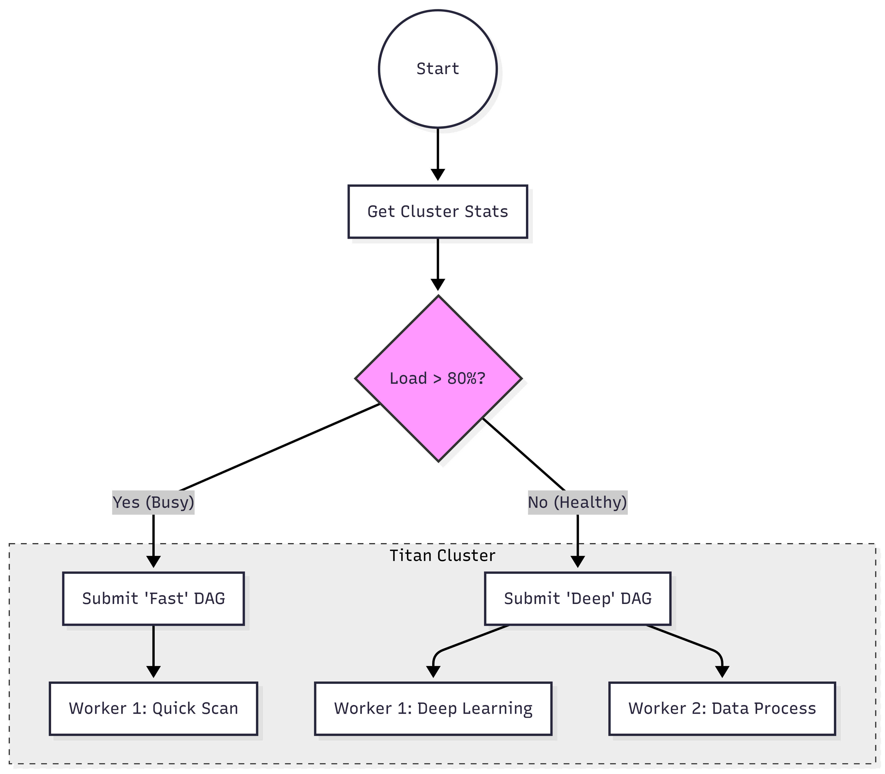

# 🐍 Programmatic & Agentic Workflows

While YAML is excellent for static, predictable pipelines, modern infrastructure often requires dynamic decision-making. 

The **Titan Python SDK** allows you to break out of static configurations and use standard Python code to generate execution graphs programmatically. This enables everything from simple conditional logic to fully autonomous AI agents that generate their own execution paths at runtime.

To execute the scripts if you have installed the sdk globally with `pip install -e .` then, you can simply run it as `python <script_name>.py`

For direct examples to run check out these:

**For Agentic:**

`titan_test_suite/examples/agents_example/code_healer_agent.py`
`titan_test_suite/examples/agents_exampels/doc_generator_agent/tools/doc_dispatcher.py`

**For Deterministic:**

`titan_test_suite/examples/dynamic_dag_custom/dynamic_dag_switch`
`titan_test_suite/examples/worker_skill_based_test/gpu_project_test`

---

## 1. Defining DAGs Programmatically (The Basics)

Using the SDK, you construct units of work using the `TitanJob` class and define their dependencies (`parents`). When you submit them as a list, Titan's Master node automatically resolves the DAG and distributes the workload.

```python
from titan_sdk import TitanClient, TitanJob

client = TitanClient(host="localhost", port=9090)

# 1. Define the Root Task
task_a = TitanJob(
    job_id="extract_data",
    filename="etl/extract.py",
    priority=5
)

# 2. Define a Dependent Task
task_b = TitanJob(
    job_id="train_model",
    filename="ml/train.py",
    requirement="GPU",
    parents=["extract_data"] # <--- Defines the dependency
)

# 3. Submit them as a unified DAG
client.submit_dag("nightly_pipeline", [task_a, task_b])
print("DAG Submitted Successfully!")
```


## 2. Dynamic Logic (Mode 1.5)
_Best for_: __Conditional logic, real-time load balancing, and dynamic infrastructure.__

Because you are using pure Python, you can use standard if/else logic to decide which execution graph to build based on real-time cluster stats, database queries, or external API calls.

The "Logic Switch"
In this scenario, our script checks the current traffic load. If traffic is high, it submits a single, lightweight task. If traffic is low, it dynamically generates a massive parallel "Deep Analysis" DAG.




```python
from titan_sdk import TitanClient, TitanJob

client = TitanClient()
traffic_load = get_current_traffic() # Your custom monitoring logic

if traffic_load > 80:
    print("[HIGH] High Traffic. Switching to lightweight 'FAST' pipeline.")
    fast_job = TitanJob(job_id="fast_scan", filename="fast_path.py")
    client.submit_job(fast_job)
else:
    print("[LOW] Normal Traffic. Generating distributed 'DEEP' analysis DAG.")
    # Programmatically generate 10 parallel tasks
    deep_tasks = [
        TitanJob(job_id=f"deep_{i}", filename="deep_path.py") 
        for i in range(10)
    ]
    client.submit_dag("DEEP_PIPELINE", deep_tasks)
```

## 3. Agentic Workflows & LLMs (Mode 2)
_Best for_: __AI Agents, Self-Healing loops, and recursive execution.__

In this mode, Titan acts as the physical execution substrate for Software Agents. Because Titan is completely decoupled, an LLM (like GPT-4 or Gemini) can evaluate the output of a previous task and dynamically formulate a brand new TitanJob to execute.

The task graph itself is generated dynamically during execution.

The "Self-Healing" Loop
Imagine an agent that monitors a distributed job. It fetches the remote execution logs, and if it detects a critical failure, it programmatically creates a new "Patch" job to remediate the issue on the fly.


```python
from titan_sdk import TitanClient, TitanJob

client = TitanClient()
job_id = "flaky_training_run"

# 1. Fetch remote execution logs via Titan's protocol
logs = client.fetch_logs(job_id)

# 2. AI/Logic Evaluation
if "Segfault" in logs or "OutOfMemory" in logs:
    print(f"[ERROR] CRITICAL ERROR in {job_id}. Agent is deploying a patch...")
    
    # Programmatically create a new job to fix the issue
    fix_job = TitanJob(
        job_id=f"{job_id}_fix", 
        filename="scripts/safe_mode_patch.py",
        requirement="GENERAL"
    )
    
    # Dispatch the new task to the cluster
    client.submit_job(fix_job)
else:
    print("[SUCCESS] Run healthy. Agent sequence complete.")
```

## 4. Stateful Agents (Using TitanStore for Memory)
*Best for: Recursive agents, distributed web scrapers, and global state tracking.*

When an autonomous agent decides to respawn itself or dispatch sub-agents across different physical nodes, it loses its local Python variables. To maintain a "train of thought" across the cluster, agents can use Titan's built-in `TitanStore` as a shared global memory.

### The "Recursive Agent" Pattern
In this example, an autonomous agent tries to execute a fragile network task. If it fails, it increments a global counter in TitanStore and spawns a clone of itself to try again. If it fails 3 times, it realizes the system is down and escalates to a human instead of infinite-looping.

**File: `autonomous_agent.py`**
```python
from titan_sdk import TitanClient, TitanJob
import random

client = TitanClient()

# 1. Agent wakes up and checks its global memory
# (Defaults to 0 if this is the first time running)
current_attempts = int(client.store_get("agent_retry_count") or 0)

print(f"[INFO] Agent Booting... (Attempt {current_attempts + 1} of 3)")

if current_attempts >= 3:
    print("[ESCALATION] Task failed 3 times. Halting recursion and alerting human.")
    client.store_put("agent_retry_count", "0") # Reset for future runs
    exit(1)

# 2. Attempt the fragile task (e.g., calling an unstable API)
api_success = random.choice([True, False])

if api_success:
    print("[SUCCESS] Task completed! Agent terminating.")
    client.store_put("agent_retry_count", "0") # Reset memory
else:
    print("[WARNING] Task failed. Agent logging failure and respawning...")
    
    # 3. Update global memory so the NEXT clone knows what happened
    client.store_put("agent_retry_count", str(current_attempts + 1))
    
    # 4. Agent dynamically spawns a clone of itself to try again!
    retry_job = TitanJob(
        job_id=f"agent_retry_{current_attempts + 1}", 
        filename="autonomous_agent.py"
    )
    client.submit_job(retry_job)
```

**Why this is powerful:**
You only need to submit autonomous_agent.py to the cluster once. From that point on, the agent manages its own lifecycle, hops between available hardware nodes using Titan's scheduler, and uses the distributed store to remember its past failures until the job succeeds.


