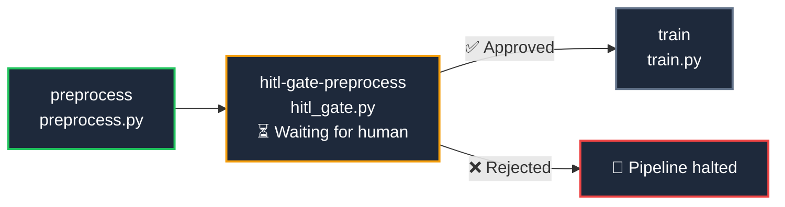
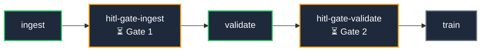

# 🧑‍💼 Human-in-the-Loop (HITL) Pipelines

Some pipelines should not run fully automatically. A data scientist may want to review a preprocessing report before expensive training begins. A compliance officer may need to sign off before a deployment goes live. HITL gates give you a **pause point inside a DAG** where a human decision — Approve or Reject — controls whether execution continues.

---

## How It Works

When a `TitanJob` is submitted with `hitl_message` set, the SDK automatically injects a lightweight checkpoint job (`hitl_gate.py`) immediately after it in the DAG. Downstream jobs are re-wired to depend on the gate instead of the original job. No changes to the scheduler or engine are needed.



The gate script runs on a worker just like any other job. It registers itself in TitanStore, then **polls every 5 seconds** for a decision written by a human through the Titan Dashboard. When a decision arrives it exits cleanly — exit 0 for Approved, exit 1 for Rejected — and the scheduler acts on that exit code normally.

---

## Quick Start

```python
from titan_sdk.titan_sdk import TitanClient, TitanJob

client = TitanClient()

# Stage 1 — any job that needs a human review before the next stage runs
preprocess = TitanJob(
    job_id       = "preprocess",
    filename     = "scripts/preprocess.py",
    hitl_message = "Data looks good? Approve to start training.",
)

# Stage 2 — depends on preprocess; the SDK automatically re-wires this
#            to depend on the injected gate instead.
train = TitanJob(
    job_id   = "train",
    filename = "scripts/train.py",
    parents  = ["preprocess"],
)

client.submit_dag("ml-pipeline", [preprocess, train])
```

That is the complete user-facing API. You do not reference `hitl_gate.py` directly.

The `submit_dag` call prints what the SDK injected:

```
[SDK] HITL gate injected: preprocess → hitl-gate-preprocess
[SDK] Submitting DAG: ml-pipeline
```

---

## Approving or Rejecting via the Dashboard

Open **DAG Pipelines** (`/dags`) and select the pipeline.

Once `preprocess` completes and the gate starts running, an **amber banner** appears at the top of the pipeline detail panel:

```
⏳  Awaiting Human Approval
    "Data looks good? Approve to start training."
    [ ✅ Approve ]  [ ❌ Reject ]
```

The gate node itself is also highlighted amber in the graph while it is waiting.

| Action | What happens |
|--------|-------------|
| **Approve** | Gate exits 0 → Scheduler marks COMPLETED → downstream jobs unlock and run → gate node turns green |
| **Reject** | Gate exits 1 → Scheduler marks FAILED → after retries it becomes DEAD → gate node turns red, downstream jobs stay blue (waiting) |

---

## Setting a Timeout

By default a gate will wait up to **48 hours** before auto-failing. Override this per job with `max_wait_seconds`:

```python
preprocess = TitanJob(
    job_id           = "preprocess",
    filename         = "scripts/preprocess.py",
    hitl_message     = "Approve before deploying to production.",
    max_wait_seconds = 4 * 3600,   # 4-hour SLA; fail if nobody responds
)
```

When the deadline is reached the gate writes `TIMEOUT` to TitanStore, logs a clear message, and exits 1 — the pipeline fails just like a manual rejection. This prevents zombie gate processes from holding workers indefinitely.

The timeout is printed in the job logs:

```
[HITL]  Timeout : 4h (14400s)
[HITL] Still waiting... (status: WAITING, 14387s remaining)
[HITL] Still waiting... (status: WAITING, 14382s remaining)
...
[HITL] Timed out after 4h — no decision received. Failing pipeline.
```

---

## Multiple Gates in One Pipeline

You can add a gate after any job. Each gate is independent and must be approved separately.

```python
ingest = TitanJob(
    job_id       = "ingest",
    filename     = "scripts/ingest.py",
    hitl_message = "Raw data ingested. Approve to run validation.",
)

validate = TitanJob(
    job_id       = "validate",
    filename     = "scripts/validate.py",
    parents      = ["ingest"],
    hitl_message = "Validation complete. Approve to start training.",
    max_wait_seconds = 2 * 3600,
)

train = TitanJob(
    job_id   = "train",
    filename = "scripts/train.py",
    parents  = ["validate"],
)

client.submit_dag("full-pipeline", [ingest, validate, train])
```

The SDK injects two gates and the DAG becomes:



---

## Redeploying After a Rejection

The **Redeploy** button in the pipeline view resubmits the full DAG. Before resubmission, the dashboard automatically clears any stale `REJECTED` or `TIMEOUT` status in TitanStore so the gate starts fresh as `WAITING` instead of auto-failing on the first retry.

You can also resubmit from Python by running your script again — the SDK sets the status to `CLEARED` for every gate it injects, for the same reason.

---

## TitanJob Parameters Reference

| Parameter | Type | Default | Description |
|:----------|:-----|:--------|:------------|
| `hitl_message` | `str` | `None` | When set, the SDK injects a HITL gate after this job. The string is shown to the operator in the Dashboard banner. |
| `max_wait_seconds` | `int` | `172800` (48 h) | How long the gate waits for a human decision before auto-failing. Applies per gate. |

---

## Under the Hood

!!! note "For contributors and advanced users"

    **KV schema** — The gate uses four TitanStore keys per checkpoint:

    | Key | Values |
    |-----|--------|
    | `titan:hitl:queue` | Set of all registered gate IDs |
    | `titan:hitl:status:<gate_id>` | `WAITING` · `APPROVED` · `REJECTED` · `TIMEOUT` · `CLEARED` |
    | `titan:hitl:message:<gate_id>` | Human-readable message string |
    | `titan:hitl:ts:<gate_id>` | Registration epoch timestamp (ms) |

    **Why polling instead of Pub/Sub** — The Titan Master has no proxy opcode for Redis `PUBLISH`/`SUBSCRIBE`. All SDK and dashboard communication goes through the Titan binary protocol on port 9090. KV polling at 5-second intervals is sufficient for human-speed decisions and requires no changes to the core engine or protocol.

    **Retry safety** — The scheduler retries failed jobs up to 3 times. On each retry, `hitl_gate.py` checks the current status before registering. If the status is already `APPROVED` or `REJECTED`, it exits immediately with the same code without resetting the decision to `WAITING`.

    **Gate injection** — `TitanClient._inject_hitl_gates()` runs inside `submit_dag` before the payload is serialised. It locates `perm_files/hitl_gate.py` relative to the SDK, creates a `TitanJob` wrapping it, and rewrites `parents` for all downstream jobs that referenced the original job.

---

## Running the Included Demo

A complete working example is included in the test suite:

```
titan_test_suite/examples/hitl_example/run_hitl_demo.py
```

Make sure the cluster is running, then:

```bash
python titan_test_suite/examples/hitl_example/run_hitl_demo.py
```

Open `http://localhost:5000/dags`, wait for the amber banner, and click **Approve** or **Reject**.
