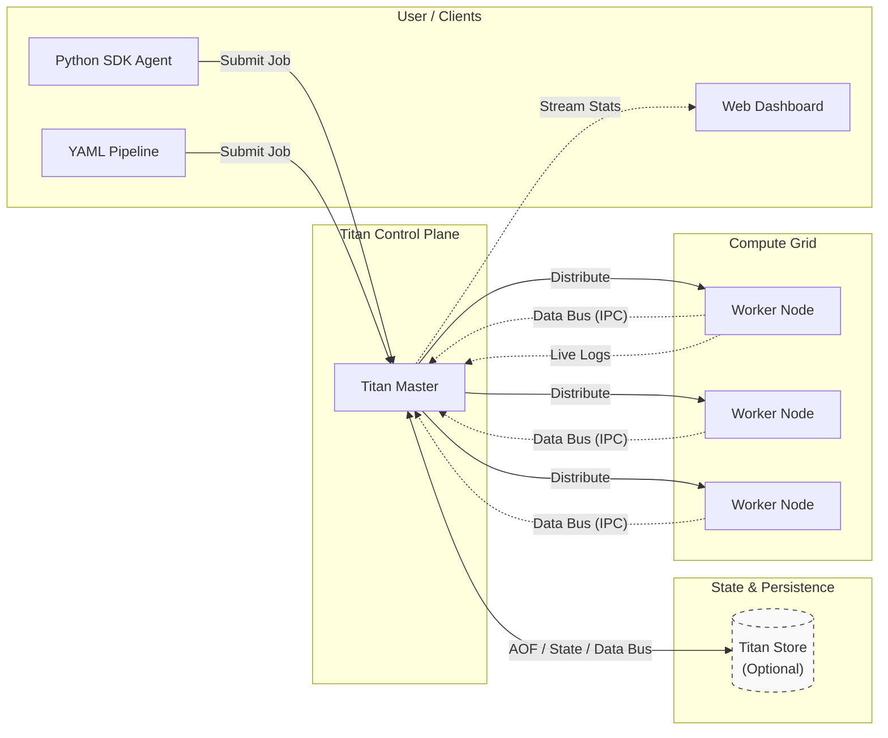

# 🛰️ Titan Orchestrator

**Titan** is a lightweight distributed execution runtime designed to bridge the gap between Logical DAG Orchestrators (e.g., Airflow/Dagster), Dynamic Agent Runtimes (LLM-driven systems), and Service Schedulers (Micro-PaaS for long-running APIs).

Traditional workflow engines are responsible for deciding *task order*. Titan is responsible for deciding:

* **Where it runs:** Enforcing data locality and node affinity.
* **How it dynamically scales:** Real-time load detection for auto-scaling up and graceful descale.
* **How execution survives failure:** Zero-loss state recovery via the TitanStore AOF.
* **Which hardware executes which task:** Capability-based GPU vs. CPU routing.

All within a single zero-dependency binary.

---

## 📈 The Capability Spectrum

Titan is designed to grow with your system's complexity:

1. **Level 1: Distributed Cron (The "Scheduler")**
   Run Python scripts on a remote machine in a specified sequence or distributed in parallel. 
2. **Level 2: Service Orchestrator (The "Platform")**
   Deploy long-running API servers and keep them alive, restarting them automatically on crash.
3. **Level 3: Agentic Execution Runtime (The "Autonomous Mode")**
   Programmatically construct execution graphs at runtime where software agents spawn downstream compute tasks conditionally based on LLM decisions or system states.

## 📊 Built-In Dashboard
Titan includes a lightweight Python Flask dashboard to visualize cluster health, monitor worker load, and stream stdout/stderr from distributed jobs in real-time.

### Live Log streaming

Monitor remote worker execution directly from the control plane UI in real-time.

## 🧩 Included Examples

The repository includes a comprehensive `titan_test_suite/` with ready-to-run examples demonstrating Titan's full range of capabilities:
The examples are added as folders for each category,

* **Static YAML Pipelines:** Templates for basic Diamond Patterns, massive parallel Fan-outs, and strict hardware-aware routing (e.g., forcing tasks to `GPU` nodes).
* **Dynamic Logic Switches:** Python SDK scripts that simulate measuring system traffic and dynamically spawn entirely different DAGs on the fly.
* **Autonomous Agents:** A recursive, self-healing agent that tracks its own retry attempts globally via TitanStore and spawns clones across the cluster until a fragile task succeeds.
* **Dagster Integration:** A complete hybrid pipeline where Dagster manages the UI and data lineage, while Titan handles the physical distributed compute and log streaming.

> **💡 Built with Titan:** The official JavaDocs for the Titan Core Engine were completely generated, zipped, and distributed using Titan itself as the execution runtime!

---

[🚀 Quickstart: Run your first distributed task in 5 minutes](getting-started.md){ .md-button .md-button--primary }
[🧠 Read the Architecture Deep Dive](architecture/design.md){ .md-button }