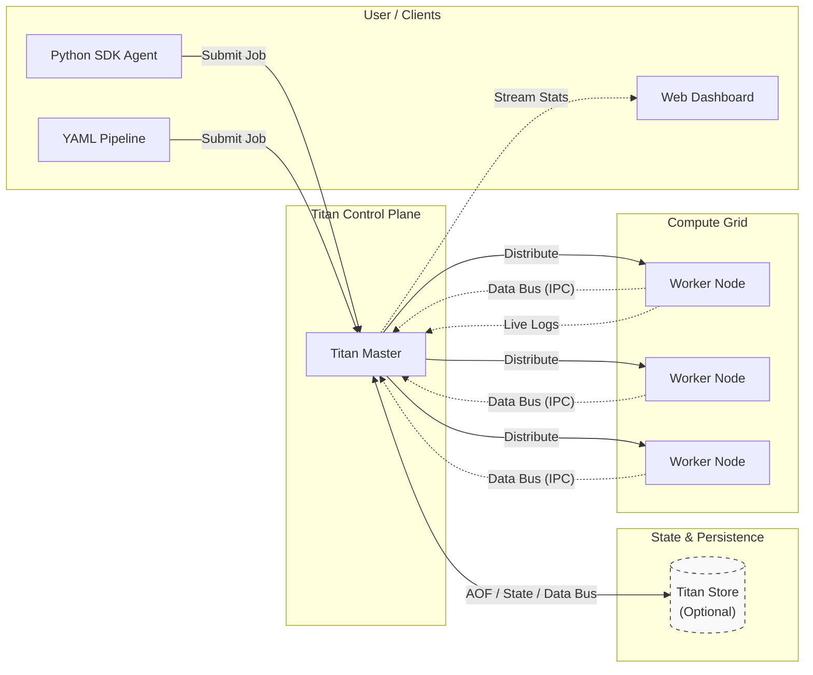

  

# Titan Orchestrator

 

**Titan is a lightweight distributed execution runtime with execution control as a first-class concern.**

It allows you to deploy standalone services, execute individual batch jobs, or dynamically mutate complex task graphs across heterogeneous compute nodes all while handling routing, scaling, and failure recovery at runtime.

!!! tip "Ready to dive in?" 
    Skip the reading and jump straight into the code. Follow our **[5-Minute Quickstart](getting-started.md)** to run your first distributed task, or view the **[Python SDK Reference](reference/sdk.md)**.

---

## What Titan Supports

### 1. Standalone Jobs & Static Workflows

You don't need a complex pipeline to use Titan. Using the CLI or the Python SDK, you can execute:

- **Single standalone jobs:** Fire off a quick script or batch process.
- **Long-running services:** Host a web server or API with automatic port management.
- **Static DAGs:** Run traditional YAML-defined or programmatically defined dependency graphs.

Titan starts as a simple remote execution runtime and scales into a distributed, dependency-aware compute substrate capable of static, dynamic, and reactive execution graphs without requiring heavy external orchestration layers.

### 2. Dynamic DAG Mutation

Titan supports runtime graph modification.

Tasks can:

- Inspect logs
- React to intermediate outputs
- Expand downstream work
- Reroute execution to different capability nodes

This enables adaptive workflows such as:

- Conditional task routing
- Retry with alternative compute
- Runtime fan-out / fan-in patterns
- Feedback-driven execution loops

Graph mutation can be driven by rule engines, system logic, or external planners (e.g., LLMs).

Titan itself remains planner-agnostic.

---

### 3. Distributed Execution Substrate

Titan internally manages:

- Worker discovery
- Capability-aware routing (CPU / GPU / custom tags)
- Process-level scaling
- Node failure detection
- Execution state recovery

It can function as a lightweight distributed cluster runtime — conceptually similar to systems like HashiCorp Nomad — but purpose-built for DAG workloads.

---

### 4. Batch + Service Workloads

Titan can run:

- Short-lived scripts
- CPU-heavy compute jobs
- Long-running services
- Deployable payloads with port management

This allows Titan to orchestrate both compute workflows and service-style tasks within the same runtime.

---

## Architecture Overview

Titan focuses on execution correctness, runtime control, and distributed coordination — not UI layers or heavy orchestration frameworks.

Titan consists of:

- **Control Plane** – DAG management and scheduling
- **Workers** – Capability-tagged execution nodes
- **Optional Persistence Layer** – Optional Persistence Layer (TitanStore) – An embedded, durable execution state recovery system requiring no external database.

> Note: Titan is fully functional without TitanStore. If disabled or excluded, core execution and routing still work flawlessly, though you will not have state recovery or SDK-driven KV operations.

Execution flow:

1. DAG is defined (static or dynamic)
2. Scheduler resolves dependencies
3. Tasks are routed based on declared capabilities
4. Workers execute payloads
5. Logs and state are collected
6. Graph may continue or mutate

---

## The Capability Spectrum

Titan is designed to grow with your system's complexity:

1. **Level 1: Distributed Cron (The "Scheduler")**
   Act as a simple remote task runner via the CLI/SDK to execute Python scripts on a remote machine in a specified sequence or distributed in parallel.
2. **Level 2: Service Orchestrator (The "Platform")**
   Deploy long-running API servers and keep them alive, restarting them automatically on crash.
3. **Level 3: Agentic Execution Runtime (The "Autonomous Mode")**
   Programmatically construct execution graphs at runtime where software agents spawn downstream compute tasks conditionally based on LLM decisions or system states.

## Built-In Dashboard
Titan includes a lightweight Python Flask dashboard to visualize cluster health, monitor worker load, and stream stdout/stderr from distributed jobs in real-time.
> For the dashboard you will need Flask as external dependency (The core engine has zero dependencies, this is an extension)

### Live Log streaming

Monitor remote worker execution directly from the control plane UI in real-time.

## Demo in Action:

### 1. Control Plane: Dynamic DAG Execution
*Watch Titan resolve dependencies and execute a multi-stage workflow where the path is decided at runtime.*

<video autoplay loop muted playsinline width="100%">
  <source src="https://github.com/user-attachments/assets/5731c0b8-d392-4890-a3c5-f7e9cf611d65" type="video/mp4">
  Your browser does not support the video tag.
</video>

### 2. Elasticity: Reactive Auto-Scaling
*Watch the cluster detect load, spawn a new Worker process automatically, and distribute tasks.*

<video autoplay loop muted playsinline width="100%">
  <source src="https://github.com/user-attachments/assets/3f7d41df-654a-45d9-a49e-85978fad9172" type="video/mp4">
  Your browser does not support the video tag.
</video>

  
<b>🎬 View More Scenarios (GPU Routing, Fanout, Full Scale Cycle)</b>

   
  
  GPU Affinity Routing

  <video src="https://github.com/user-attachments/assets/9a1abc1c-d01f-4998-8c74-30409113ec85" controls="controls" style="max-width: 100%;"></video>

  Parallel Execution (Fanout)
  <video src="https://github.com/user-attachments/assets/812fd793-eab4-499e-9364-f1d3ccbbcc59" controls="controls" style="max-width: 100%;"></video>

  Full Load Cycle (Scale Up & Descale)
  <video src="https://github.com/user-attachments/assets/49afd1c6-bed3-444b-8d12-adff07832d8b" controls="controls" style="max-width: 100%;"></video>

## Included Examples

The repository includes a comprehensive `titan_test_suite/` with ready-to-run examples demonstrating Titan's full range of capabilities:
The examples are added as folders for each category,

* **MapReduce Data Processing:** A complete Python SDK implementation demonstrating how to fan-out data processing to parallel mappers and fan-in the results to a final reducer job. ([View the code on GitHub](https://github.com/ramn51/titan-orchestrator/blob/master/perm_files/pytests/static_dag_tests/map_reduce_test.py))
* **Static YAML Pipelines:** Templates for basic Diamond Patterns, massive parallel Fan-outs, and strict hardware-aware routing (e.g., forcing tasks to `GPU` nodes).
* **Dynamic Logic Switches:** Python SDK scripts that simulate measuring system traffic and dynamically spawn entirely different DAGs on the fly.
* **Autonomous Agents:** A recursive, self-healing agent that tracks its own retry attempts globally via TitanStore and spawns clones across the cluster until a fragile task succeeds.
* **Dagster Integration:** A complete hybrid pipeline where Dagster manages the UI and data lineage, while Titan handles the physical distributed compute and log streaming.

> **💡 Built with Titan:** The official JavaDocs for the Titan Core Engine were completely generated, zipped, and distributed using Titan itself as the execution runtime!
[View the code on GitHub](https://github.com/ramn51/titan-orchestrator/blob/master/titan_test_suite/examples/agents_examples/doc_generator_agent/tools/doc_dispatcher.py)

---

## API & Reference

Looking for specific commands, methods, or internal engine documentation? Jump straight to our reference guides:

* **[Python SDK Reference](reference/sdk.md):** Complete API guide for `TitanClient`, `TitanJob`, and building autonomous agent workflows.
* **[CLI Commands](reference/cli.md):** Learn how to spin up the Master, boot Worker nodes, and submit standalone jobs directly from your terminal.
* **[Java Core Engine](javadocs/docs/index.html):** Deep dive into the internal Java classes (`Scheduler`, `RpcWorkerServer`, etc.). *Fun fact: These JavaDocs were generated and distributed using Titan itself!*

---

## Roadmap to v2.0

Titan is actively evolving. Here are the major architectural milestones planned for upcoming releases. If you are looking for a high-impact way to contribute, these are our top priorities:

- [ ] **Distributed Consensus:** Implement Raft or Paxos for Leader Election to remove the Master node as a Single Point of Failure (SPOF).
- [ ] **Security & Auth:** Implement mTLS (Mutual TLS) for encrypted, authenticated cluster communication.
- [ ] **Containerized Execution:** Add support for Docker execution drivers to provide true filesystem isolation (currently utilizing Process-Level isolation).
- [ ] **Cluster Autoscaler Webhooks:** Allow Titan to trigger external APIs (e.g., Azure VM Scale Sets, AWS EC2) to provision bare-metal compute automatically when queues saturate.
- [ ] **Human-in-the-Loop (HIL):** Add the capability to pause DAG execution states and wait for external manual approval via Webhooks or the UI.

---

## Project Status & Contributing

Titan is a custom-built, experimental runtime engineered from first principles by a single developer. While it successfully handles complex distributed execution loops and agentic workflows, it is currently in **v1.0 Research Status**. 

Because distributed systems are inherently complex, you may encounter edge cases or network timeouts in non-standard environments. If you find a bug, break the orchestrator, or want to help harden the core engine, contributions are highly encouraged!

[🐛 Report an Issue](https://github.com/ramn51/titan-orchestrator/issues){ .md-button } [🤝 How to Contribute](contributing.md){ .md-button }

---

[🚀 Quickstart: Run your first distributed task in 5 minutes](getting-started.md){ .md-button .md-button--primary }
[🧠 Read the Architecture Deep Dive](architecture/design.md){ .md-button }