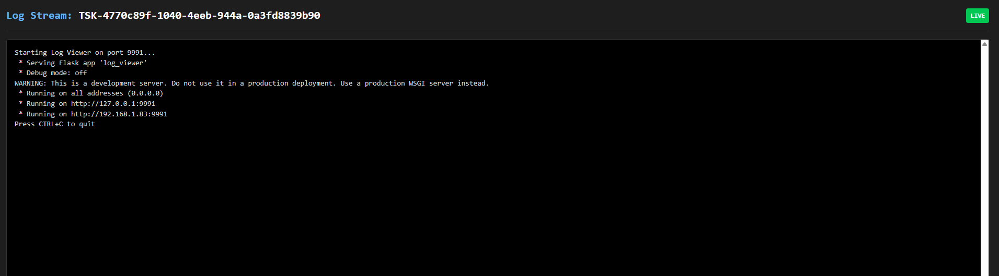

  

# Titan Orchestrator

  

**A self-hosted distributed runtime for DAGs, services, and agentic workflows — shipped as a single zero-dependency JAR. Define jobs in YAML or Python, and Titan handles capability routing and dependency execution across your cluster — from a nightly ETL pipeline to a multi-agent LLM workflow.**

!!! tip "Ready to dive in?" 
    Skip the reading and jump straight into the code. Follow our **[5-Minute Quickstart](getting-started.md)** to run your first distributed task, or view the **[Python SDK Reference](reference/sdk.md)**.

### Live Pipeline Visibility — DAG Pipelines View

Every pipeline submitted to the cluster — via CLI, SDK, YAML, or the visual Constructor — is automatically rendered as a live dependency graph with real-time execution status per node.

---

## Architecture Overview

Titan consists of three components:

- **Control Plane (Master)** — DAG scheduling, dependency resolution, and capability routing
- **Workers** — Capability-tagged execution nodes that self-register on startup
- **TitanStore (Optional)** — Embedded AOF-backed persistence for crash recovery and shared agent state. No external database required.

> Titan is fully functional without TitanStore — core execution and routing work without it, but you lose state recovery and SDK-driven KV operations.

[🧠 Architecture Deep Dive](architecture/design.md){ .md-button }

---

!!! question "Wondering how Titan compares to Airflow, Dagster, Ray, or Temporal?"
    See the full breakdown — honest scoring, capability tiers, and a "when NOT to use Titan" section.

    [⚖️ How Titan Compares](comparison.md){ .md-button }

---

## The Capability Spectrum

Titan is designed to grow with your system's complexity:

1. **Level 1: Distributed Cron (The "Scheduler")**
   Execute Python scripts on remote machines in sequence or in parallel. Use the CLI or SDK to dispatch batch jobs, ETL pipelines, or any script-based workload across the cluster.

2. **Level 2: Service Orchestrator (The "Platform")**
   Deploy long-running API servers and keep them alive, restarting them automatically on crash. Port management is handled by Titan.

    !!! tip "Levels 1 + 2 work together"
        A common pattern: deploy an LLM inference server or a data API as a permanent service (Level 2), then run batch scripts as jobs (Level 1) that call that service. Both run inside the same Titan cluster — the service stays alive while jobs come and go around it.

3. **Level 3: Agentic Execution Runtime (The "Autonomous Mode")**
   Programmatically construct execution graphs at runtime where software agents spawn downstream compute tasks conditionally based on LLM decisions or system states.

    !!! tip "All three levels work together"
        Level 3 doesn't replace the others — it orchestrates them. An agent can keep an LLM inference server running as a permanent service (Level 2), dispatch batch analysis jobs that call it (Level 1), and dynamically spawn further tasks based on what those jobs return — all within a single cluster. Titan manages the services, the jobs, and the agent's execution graph in one runtime.

## Built-In Dashboard
Titan includes a lightweight Python Flask dashboard to visualize cluster health, monitor worker load, and stream stdout/stderr from distributed jobs in real-time.

The dashboard ships with three views:

- **DAG Visualizer** — live graph of any running or completed pipeline with real-time status, logs, HITL approval, and workspace file downloads
- **DAG Constructor** — browser-based drag-and-drop builder for designing and deploying pipelines without writing code
- **Agent Runs** — groups multi-stage agent invocations into a single timeline row so you can track a full agent loop at a glance instead of hunting through individual DAG entries

> For the dashboard you will need Flask as external dependency (The core engine has zero dependencies, this is an extension)

### DAG Visualizer

Every pipeline appears here as a live dependency graph — regardless of how it was submitted (CLI, SDK, YAML, or Constructor). Node colors update in real-time as jobs move through `PENDING → RUNNING → COMPLETED / FAILED`.

For agentic workflows, the graph grows as the agent submits new work. Use the **[Agent Runs](visualizer/agent-runs.md)** view for the high-level timeline across all stages — then click into any stage to drill down into its node graph and live logs here.

### Visual DAG Constructor

Build and deploy pipelines without writing any code. Drag nodes onto the canvas, draw edges to define dependencies, configure each job's script, requirements, and priority — then hit **Deploy** to submit directly to the cluster.

The Constructor also auto-generates the equivalent **Python SDK** and **YAML** definitions, which you can copy for reuse in automated pipelines.

!!! note "Prerequisite"
    The Deploy button submits jobs by reading script files from the Master's `perm_files` directory. Ensure the script files you reference in the Constructor have been created and staged to `perm_files` before deploying.

### Live Log streaming

Monitor remote worker execution directly from the control plane UI in real-time.

## Demos

### 1. Visual DAG Constructor
*Build a pipeline by dragging nodes and drawing edges — then deploy directly to the cluster with one click.*

<video autoplay loop muted playsinline controls width="100%">
  <source src="https://github.com/user-attachments/assets/4f63abbc-e5e9-435e-83cb-bafe6eb9883e" type="video/mp4">
  Your browser does not support the video tag.
</video>

### 2. Human-in-the-Loop (HITL) Gate
*A DAG pauses at a checkpoint and waits for a human Approve/Reject before downstream jobs resume.*

<video autoplay loop muted playsinline controls width="100%">
  <source src="https://github.com/user-attachments/assets/bbdb6772-a9ee-4094-85b4-0516a0543c62" type="video/mp4">
  Your browser does not support the video tag.
</video>

### 3. HITL on a Complex Graph
*HITL gate mid-execution on a multi-branch pipeline — shows how the visualizer reflects the paused state.*

<video autoplay loop muted playsinline controls width="100%">
  <source src="https://github.com/user-attachments/assets/724e3f3d-1d75-407e-a0c2-cd43f2939ad5" type="video/mp4">
  Your browser does not support the video tag.
</video>

### 4. Agentic AI Workflow
*A multi-stage agent loop — each stage is a separate DAG submission, grouped into a single timeline in the Agent Runs view.*

<video autoplay loop muted playsinline controls width="100%">
  <source src="https://github.com/user-attachments/assets/d6c40a50-9afc-45f6-abfc-b50c94324363" type="video/mp4">
  Your browser does not support the video tag.
</video>

  
<b>View More: Dynamic DAG Execution, Reactive Scaling, GPU Routing, Fanout</b>

   

  **Control Plane: Dynamic DAG Execution**
  <video src="https://github.com/user-attachments/assets/5731c0b8-d392-4890-a3c5-f7e9cf611d65" controls="controls" style="max-width: 100%;"></video>

  **Reactive Worker Scaling**
  <video src="https://github.com/user-attachments/assets/3f7d41df-654a-45d9-a49e-85978fad9172" controls="controls" style="max-width: 100%;"></video>

  **GPU Affinity Routing**
  <video src="https://github.com/user-attachments/assets/9a1abc1c-d01f-4998-8c74-30409113ec85" controls="controls" style="max-width: 100%;"></video>

  **Parallel Execution (Fanout)**
  <video src="https://github.com/user-attachments/assets/812fd793-eab4-499e-9364-f1d3ccbbcc59" controls="controls" style="max-width: 100%;"></video>

  **Full Load Cycle (Scale Up & Descale)**
  <video src="https://github.com/user-attachments/assets/49afd1c6-bed3-444b-8d12-adff07832d8b" controls="controls" style="max-width: 100%;"></video>

## Examples

The `titan_test_suite/` directory has ready-to-run examples for every capability tier:

| Example | What it shows |
|---|---|
| [Build Your First Agent (10 min)](examples/quickstart-agent.md) | Writer → Critic loop — simplest agentic pattern in ~60 lines |
| [Human-in-the-Loop Pipeline](examples/hitl.md) | ML pipeline that pauses for human Approve/Reject before training |
| [Multi-Agent Research Pipeline](examples/research-pipeline.md) | Parallel agents + HITL gate + synthesis fan-in |
| [Static YAML Pipelines](examples/yaml.md) | Diamond patterns, GPU routing, parallel fan-out |

[💡 View All Examples](examples/agentic.md){ .md-button }

---

## Deployment

Titan runs locally out of the box. When you're ready to move to the cloud:

| Setup | When to use |
|---|---|
| [Multi-VM Cloud Setup](deployment/cloud.md) | Permanent cluster on GCP / AWS / Azure — Master on a VM, workers on VMs |
| [Remote GPU Worker via SSH Tunnel](deployment/remote-gpu-worker.md) | Keep your local machine as the Master, tunnel a remote GPU (RunPod, cloud VM) as a worker — no open ports needed |

---

## API & Reference

* **[Python SDK Reference](reference/sdk.md)** — `TitanClient`, `TitanJob`, TitanStore, artifacts, and agent patterns
* **[CLI Commands](reference/cli.md)** — Spin up Master, boot Workers, submit jobs from the terminal
* **[Java Core Engine](javadocs/docs/index.html)** — Internal class docs (`Scheduler`, `RpcWorkerServer`, etc.)

---

## Roadmap to v2.0

- [x] **Visual DAG Constructor:** Browser-based drag-and-drop DAG editor with YAML/SDK code generation and one-click deploy.
- [ ] **Distributed Consensus:** Implement Raft or Paxos for Leader Election to remove the Master node as a Single Point of Failure (SPOF).
- [ ] **Security & Auth:** Implement mTLS (Mutual TLS) for encrypted, authenticated cluster communication.
- [ ] **Containerized Execution:** Add support for Docker execution drivers to provide true filesystem isolation (currently utilizing Process-Level isolation).
- [ ] **Cluster Autoscaler Webhooks:** Allow Titan to trigger external APIs (e.g., Azure VM Scale Sets, AWS EC2) to provision bare-metal compute automatically when queues saturate.
- [x] **Human-in-the-Loop (HITL):** Pause DAG execution and wait for human Approve/Reject via the Dashboard. Supports per-gate timeouts and automatic gate injection via the SDK. See [HITL Pipelines](examples/hitl.md).

---

## Project Status & Contributing

Titan is a custom-built, experimental runtime engineered from first principles by a single developer. While it successfully handles complex distributed execution loops and agentic workflows, it is currently in **v1.0 Research Status**. 

Because distributed systems are inherently complex, you may encounter edge cases or network timeouts in non-standard environments. If you find a bug, break the orchestrator, or want to help harden the core engine, contributions are highly encouraged!

[🐛 Report an Issue](https://github.com/ramn51/titan-orchestrator/issues){ .md-button } [🤝 How to Contribute](contributing.md){ .md-button }

---

[🚀 Quickstart: Run your first distributed task in 5 minutes](getting-started.md){ .md-button .md-button--primary }
[🧠 Read the Architecture Deep Dive](architecture/design.md){ .md-button }