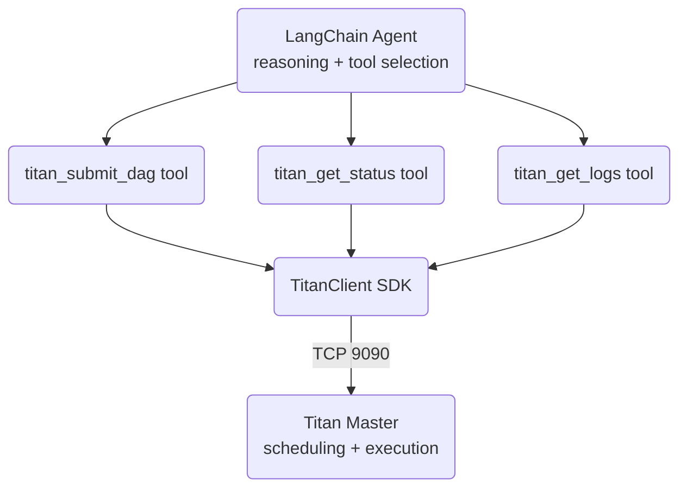

# LangChain Integration

Titan and LangChain operate at different layers — they are complementary, not alternatives.

- **LangChain / LangGraph** — the agent reasoning layer. Handles prompt chaining, memory, tool selection, and multi-step agent logic.
- **Titan** — the execution substrate. Handles where code runs, job scheduling, DAG dependencies, parallelism, HITL gates, and persistent state.

A LangChain agent can use Titan as its execution backend by wrapping the Titan SDK as a LangChain tool. No MCP involved — the agent calls `TitanClient` directly.



---

## When to Use LangChain + Titan vs MCP + Titan

| | LangChain + Titan | Claude Desktop + MCP |
|---|---|---|
| Agent framework | LangChain / LangGraph / CrewAI | Claude (any MCP client) |
| How it talks to Titan | TitanClient SDK directly | MCP server (stdio) |
| Use case | Programmatic agent pipelines, automated workflows | Interactive use, natural language queries |
| Requires MCP | No | Yes |
| Model flexibility | Any LLM LangChain supports | MCP-compatible clients only |

Use **LangChain + Titan** when you're building automated pipelines in code where a human isn't driving the conversation. Use **MCP** when you want to control Titan interactively from Claude Desktop or Cursor.

---

## Trying It Out

A self-contained validation script is included at `examples/langchain_titan.py`. It has two modes:

**Without LangChain installed** — validates all five Titan tool functions directly (no LLM involved). Submits a 2-job DAG with a TitanStore handoff, polls status, reads logs. Useful to confirm the tool wrappers and your cluster work correctly before adding an LLM.

**With LangChain installed** — runs a minimal agent loop on top of the same tools. Auto-detects Anthropic or OpenAI provider.

```bash
# Titan only (no extra installs needed)
python examples/langchain_titan.py

# With LangChain agent support (optional)
pip install langchain-core langchain-anthropic   # or langchain-openai
python examples/langchain_titan.py
```

LangChain is **not a dependency of Titan**. The SDK works standalone. LangChain is only needed if you want the agent wrapper layer.

---

## Wrapping Titan as a LangChain Tool

!!! note "Import path depends on LangChain version"
    `from langchain_core.tools import tool` for v0.2+. Use `from langchain.tools import tool` for older installs.

### Install (optional)

```bash
pip install langchain-core
# plus one of:
pip install langchain-anthropic   # for Claude
pip install langchain-openai      # for GPT
```

### Core tool wrappers

```python
import json
from langchain_core.tools import tool  # langchain.tools for older versions
from titan_sdk.titan_sdk import TitanClient, TitanJob


def _make_client() -> TitanClient:
    return TitanClient()


@tool
def titan_submit_dag(dag_name: str, jobs_json: str) -> str:
    """Submit a multi-job DAG pipeline to Titan for distributed execution.

    jobs_json is a JSON array where each element has:
      job_id, script_content, parents (list of job_ids), requirement (GENERAL or GPU)

    Returns the master's acknowledgement string.
    """
    job_defs = json.loads(jobs_json)
    client = _make_client()

    import tempfile, os
    jobs = []
    with tempfile.TemporaryDirectory() as tmpdir:
        for jd in job_defs:
            path = os.path.join(tmpdir, f"{jd['job_id']}.py")
            with open(path, "w") as f:
                f.write(jd.get("script_content", "pass"))
            jobs.append(TitanJob(
                job_id=jd["job_id"],
                filename=path,
                requirement=jd.get("requirement", "GENERAL"),
                parents=jd.get("parents", []),
            ))
        result = client.submit_dag(dag_name, jobs)
    return str(result)


@tool
def titan_get_status(job_id: str) -> str:
    """Get the current status of a Titan job (PENDING/RUNNING/COMPLETED/FAILED).

    Automatically handles the DAG- prefix — pass the raw job_id.
    """
    client = _make_client()
    prefixed = job_id if job_id.startswith("DAG-") else f"DAG-{job_id}"
    return client.get_job_status(prefixed)


@tool
def titan_get_logs(job_id: str) -> str:
    """Fetch stdout/stderr logs for a completed or running Titan job."""
    client = _make_client()
    prefixed = job_id if job_id.startswith("DAG-") else f"DAG-{job_id}"
    return client.fetch_logs(prefixed)


@tool
def titan_store_put(key: str, value: str) -> str:
    """Write a value to TitanStore — shared KV accessible across jobs and agents."""
    client = _make_client()
    return client.store_put(key, value)


@tool
def titan_store_get(key: str) -> str:
    """Read a value from TitanStore."""
    client = _make_client()
    return client.store_get(key)
```

### Binding tools to an agent

```python
from langchain_core.prompts import ChatPromptTemplate
from langchain_openai import ChatOpenAI   # or ChatAnthropic, ChatGoogleGenerativeAI, etc.

tools = [
    titan_submit_dag,
    titan_get_status,
    titan_get_logs,
    titan_store_put,
    titan_store_get,
]

llm = ChatOpenAI(model="gpt-4o").bind_tools(tools)

prompt = ChatPromptTemplate.from_messages([
    ("system", "You are an agent that runs distributed compute jobs on a Titan cluster."),
    ("human", "{input}"),
])

chain = prompt | llm
```

---

## Example Agent Interaction

With the tools bound, the agent can drive Titan pipelines in natural language — the same way Claude Desktop does via MCP, but fully programmatic:

```python
response = chain.invoke({
    "input": (
        "Submit a 2-job pipeline: job1 prints system info, "
        "job2 reads the result from TitanStore and summarises it."
    )
})
```

The agent will call `titan_submit_dag`, then poll `titan_get_status`, then call `titan_get_logs` — exactly the same pattern as the MCP flow, but without the MCP layer.

---

## Using LangGraph for Multi-Step Titan Workflows

For pipelines where the next step depends on job output, LangGraph's stateful graph maps cleanly onto Titan's DAG model:

```python
from langgraph.graph import StateGraph, END
from typing import TypedDict

class PipelineState(TypedDict):
    dag_name: str
    job_id: str
    status: str
    logs: str

def submit_node(state: PipelineState) -> PipelineState:
    result = titan_submit_dag.invoke({
        "dag_name": state["dag_name"],
        "jobs_json": '[{"job_id": "step1", "script_content": "print(42)"}]'
    })
    return {**state, "job_id": "step1"}

def poll_node(state: PipelineState) -> PipelineState:
    status = titan_get_status.invoke({"job_id": state["job_id"]})
    return {**state, "status": status}

def should_continue(state: PipelineState) -> str:
    if state["status"] == "COMPLETED":
        return "fetch_logs"
    elif state["status"] in ("FAILED", "DEAD"):
        return END
    return "poll"  # loop back

graph = StateGraph(PipelineState)
graph.add_node("submit", submit_node)
graph.add_node("poll", poll_node)
graph.add_node("fetch_logs", lambda s: {**s, "logs": titan_get_logs.invoke({"job_id": s["job_id"]})})
graph.set_entry_point("submit")
graph.add_edge("submit", "poll")
graph.add_conditional_edges("poll", should_continue)
graph.add_edge("fetch_logs", END)
```

---

## MCP vs Direct SDK — Which to Use

If you're already in a LangChain/LangGraph codebase, calling `TitanClient` directly (as shown above) is simpler and more efficient than going through MCP. MCP adds a process boundary and stdio transport that isn't needed when you control the agent code directly.

Use MCP when the agent is an external client (Claude Desktop, Cursor) that you can't modify. Use the SDK directly when you own the agent code.
