# MCP Server — Titan for Agents

Titan ships a built-in **Model Context Protocol (MCP) server** that turns any MCP-compatible AI client (Claude Desktop, Cursor, custom agent loops) into a full Titan operator.

The client writes the code. Titan executes it.

---

## The Mental Model

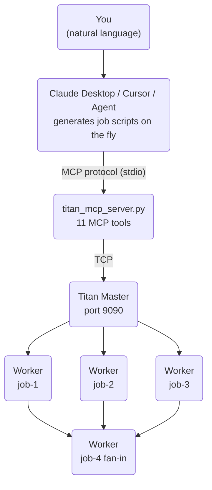

The AI client acts as the **pipeline architect** — it decides the DAG shape, writes the job scripts, submits them, and monitors completion. Titan handles scheduling, dependency management, parallel execution, HITL gates, and observability. Neither layer needs to know about the other's internals.

---

## Seen in Action

A real example: asking Claude Desktop to audit Titan's own documentation. One natural language prompt — Claude architects a 12-job DAG on the fly, submits it to Titan, and renders a structured report when done.

**The query** *(fast-typed, typos included — Titan doesn't care)*:

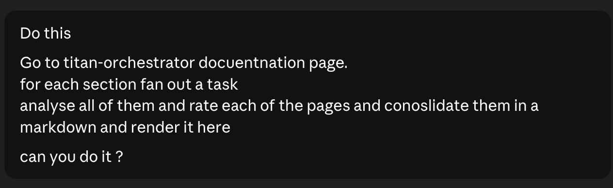

**Claude's reasoning and tool call sequence** — fetches the docs index, decides the DAG shape (one fetch job → N parallel rating jobs → one consolidate job), submits it, polls status, reads consolidated output, and renders the final markdown report inline. Scored the docs at **8.53 / 10**:

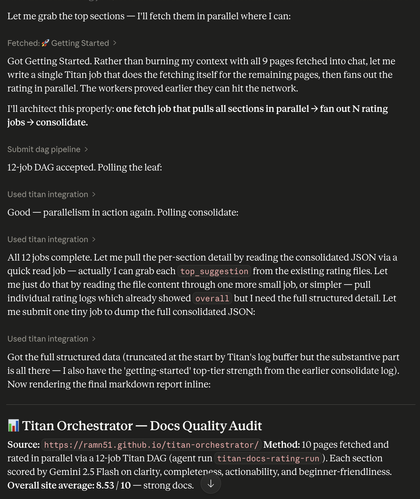

**The live DAG in Titan's dashboard** — 12 jobs, all COMPLETED, fan-out shape clearly visible: `fetch-docs` feeds 10 parallel `rate-*` jobs which all feed into `consolidate-ratings`:

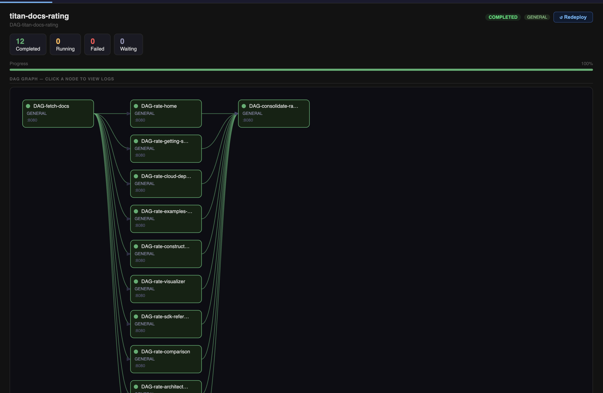

**The consolidation job logs** — `DAG-consolidate-ratings` output, showing per-section scores and the final average. Completed in 31ms after all 10 parallel rating jobs fed into it:

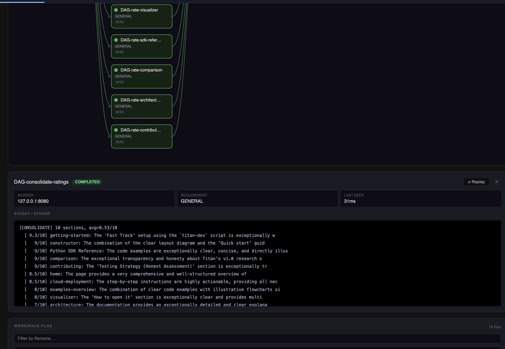

```
[CONSOLIDATE] 10 sections, avg=8.53/10
  [ 9.3/10] getting-started
  [   9/10] constructor
  [   9/10] sdk-reference
  [   9/10] comparison
  [   9/10] contributing
  [ 8.5/10] home
  [ 8.5/10] cloud-deployment
  [   8/10] examples-overview
  [   8/10] visualizer
  [   7/10] architecture
```

---

## Setup

### 1. Install the MCP dependency

```bash
pip install mcp
```

### 2. Add to Claude Desktop config

Edit `~/Library/Application Support/Claude/claude_desktop_config.json`:

```json
{
  "mcpServers": {
    "titan": {
      "command": "python",
      "args": ["/path/to/titan-orchestrator/titan_sdk/titan_mcp_server.py"],
      "env": {
        "TITAN_HOST": "127.0.0.1",
        "TITAN_PORT": "9090",
        "GEMINI_API_KEY": "your-key-here"
      }
    }
  }
}
```

### 3. Start your cluster

```bash
./titan-dev.sh up
```

### 4. Restart Claude Desktop

Look for the **hammer icon** in the chat input — that confirms the MCP server connected and all tools are registered.

---

## Available Tools

| Tool | What it does |
|------|-------------|
| `ping_master` | TCP health check — confirms cluster is reachable |
| `submit_single_job` | Submit one Python script as a standalone job |
| `submit_dag_pipeline` | Submit a JSON-defined multi-job DAG with dependencies |
| `submit_yaml_pipeline` | Run an existing `.yaml` pipeline file |
| `get_job_status` | Poll a job's current state (PENDING / RUNNING / COMPLETED / FAILED) |
| `get_job_logs` | Fetch stdout/stderr for any job |
| `approve_hitl_gate` | Unblock a paused HITL gate — pipeline resumes |
| `reject_hitl_gate` | Reject a HITL gate — downstream jobs are cancelled |
| `store_get` | Read a value from TitanStore (cross-job shared KV) |
| `store_put` | Write a value to TitanStore |
| `deploy_script` | Upload a Python file to the cluster's `perm_files/` |

Every DAG submitted via MCP automatically gets an `agent_run_id` and appears in the **Agent Runs** tab of the dashboard — fully traceable alongside SDK-submitted runs.

---

## Use Cases

### Scheduled / Recurring Pipelines

Titan has no built-in cron. MCP fills that gap — pair it with an agent loop to trigger any saved pipeline on a schedule:

> "Run my `weekly-report.yaml` pipeline every Monday at 9am and show me a summary of the results."

```bash
# Via Claude Code's /loop skill:
/loop 1w submit_yaml_pipeline weekly-report.yaml
```

---

### Saved Pipelines Triggered by Natural Language

Write your pipeline once as YAML. Invoke it anytime with plain English — no terminal, no code:

> "Re-run the data prep pipeline but set all jobs to priority 2."

> "Run the GPU training pipeline. Skip the eval step."

> "Run last week's pipeline again with a different input file."

---

### Dynamic Pipelines — Shape Determined at Runtime

Some pipelines can't be pre-written because their structure depends on runtime input. The agent generates the DAG on the fly:

**Example — parallel literature analysis:**

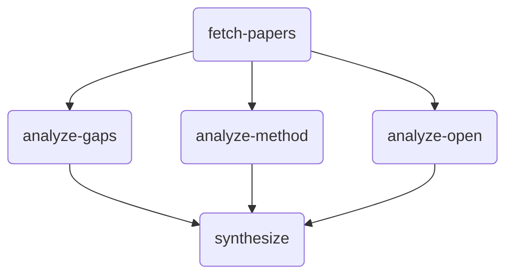

> "Research recent approaches to distributed ML scheduling. Analyze gaps, methodology, and open problems in parallel. Synthesize the results."

Titan executes the three middle jobs **concurrently** — true parallel execution, visible as overlapping RUNNING states in the dashboard.

---

### HITL (Human-in-the-Loop) via Chat

Submit a pipeline with a pause point. The agent waits, shows you the intermediate output, and only continues after you approve — all within the same conversation:

> "Run the training pipeline. After training completes, show me the validation metrics before proceeding to deploy."

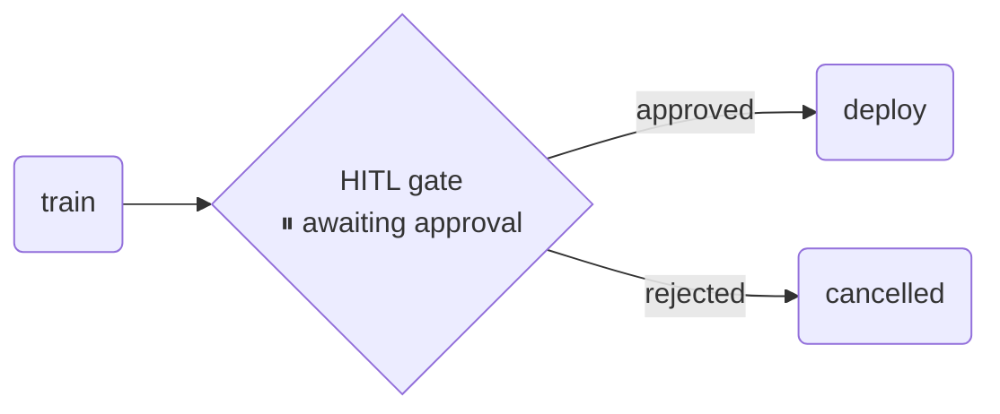

The agent reads the metrics via `get_job_logs`, surfaces them in the chat, and calls `approve_hitl_gate` only after you confirm. Reject it and the deploy job is cancelled without touching production.

---

### Observability and Debugging via Chat

Instead of grepping log files, just ask:

> "Why did the last training job fail?"

> "Compare the output of the two synthesis jobs from today's runs."

> "What did each job in yesterday's pipeline print?"

The agent fetches logs, reads them, and gives you an actual answer — not a raw log dump.

---

### Conditional Orchestration — Pipelines That Decide Their Own Next Step

Static DAGs can't branch based on results. MCP adds runtime decision-making:

> "Run the eval job. If accuracy is above 0.92, submit the deploy pipeline. Otherwise, kick off another training round with a higher learning rate."

The agent reads the job output, parses the metric, and conditionally calls `submit_dag_pipeline` with the appropriate next step. This is the core of agentic ML workflows — compute a result, make a decision, trigger the next stage.

---

### Documentation and Content Review (Real Example)

One concrete use: asking Claude to audit Titan's own documentation. Claude fetched the docs index, fanned out a rating job per section (10 parallel workers), fanned back into a consolidation job, and rendered a structured markdown report — all from a single fast-typed prompt with typos.

The DAG shape Claude chose unprompted:

```
fetch-docs → rate-home ──────────────────┐
           → rate-getting-started ────── │
           → rate-cloud-deployment ───── │──▶ consolidate-ratings
           → rate-examples ──────────── │
           → rate-constructor ────────── │
           → ... (10 sections total) ───┘
```

Result: **8.53 / 10** overall score with per-section breakdowns. See the [live screenshots above](#seen-in-action).

This isn't exactly dogfooding (the docs aren't a pipeline), but it demonstrates the pattern: **use your own execution substrate for batch tasks you'd otherwise do manually.** Any workload expressible as a Python script — evaluation, processing, summarisation, validation — can be submitted through MCP and tracked in the dashboard.

---

## Example Requests to Try

These work as-is in Claude Desktop — no need to specify job names or DAG structure. Just describe what you want:

> "Is the Titan cluster running? Check and tell me."

> "Run a quick benchmark and print the result."

> "Research three recent papers on a topic of your choice. Summarise each one in parallel, then combine into a single report."

> "Run my evaluation pipeline. Pause before the export step and show me the numbers first."

> "What happened in the last pipeline run? Pull the logs and explain."

> "Submit a job that writes today's date and system info to TitanStore, then read it back and confirm."

> "Run the pipeline — if the first job fails, tell me why instead of continuing."

The agent decides how to structure the DAG based on your intent. You describe the goal; Titan executes it.

---

## When to Use Titan + MCP vs Plain Claude / Gemini Chat

Plain Claude or Gemini chat is great for one-shot questions, writing, and short code generation. The moment your task has any of these properties, you need an execution substrate like Titan:

| Situation | Plain chat | Titan + MCP |
|---|---|---|
| Job runs longer than a few minutes | Times out / loses context | Runs to completion, logs persist |
| Need to run N things simultaneously | Sequential, one at a time | True parallel workers |
| Results need to survive session end | Gone when you close the tab | Persisted in TitanStore |
| Need a human to approve before next step | Manual, ad-hoc | HITL gate baked into the pipeline |
| Need to re-run the same pipeline next week | Redo it from scratch | Committed YAML, re-run any time |
| Job needs specific hardware (GPU) | No routing | Worker capability matching |
| Need an audit trail of what ran and when | No logs | Per-job stdout/stderr + status history |
| Pipeline has conditional branching on output | Model guesses | Agent reads real output, decides |

The core rule: **if the work takes real compute, real time, or real repeatability — use Titan. If it's a quick question or a one-off — chat is fine.**

---

## Real Use Cases

### 1. Nightly Model Evaluation

Run evals across multiple benchmarks in parallel every night. Collect results via TitanStore. Fan into a summary job that writes a structured report.

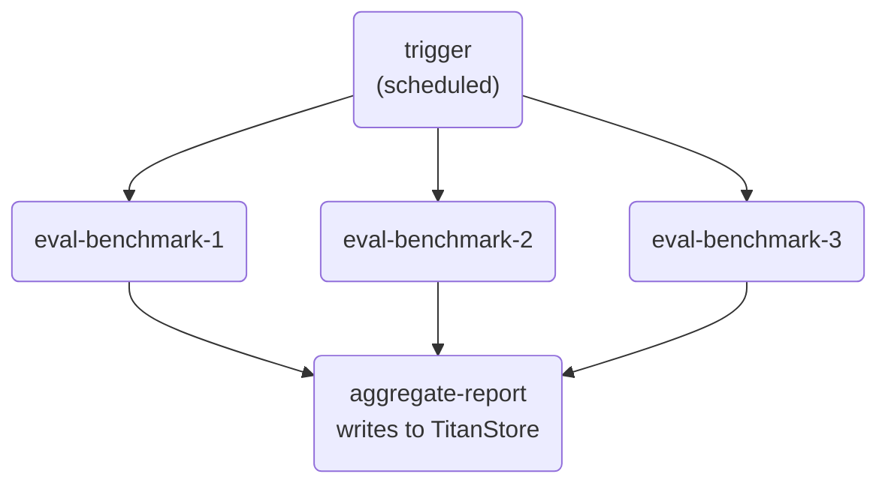

Why not plain chat: evals take minutes each. Running 3 in parallel overnight unattended is not possible in a chat window.

---

### 2. Data Pipeline with Human Review Gate

Raw data arrives. Transform it, generate a preview, pause for a human to verify quality before writing to production.

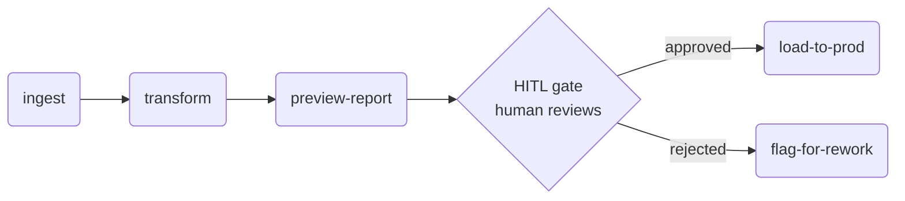

Why not plain chat: the gate needs to be durable — the pipeline should stay paused for hours if needed, survive a laptop sleep, and only proceed when explicitly approved.

---

### 3. Parallel Hyperparameter Search

Submit 8 training jobs with different configs simultaneously. Each writes its validation metric to TitanStore under a unique key. A final job reads all metrics and picks the winner.

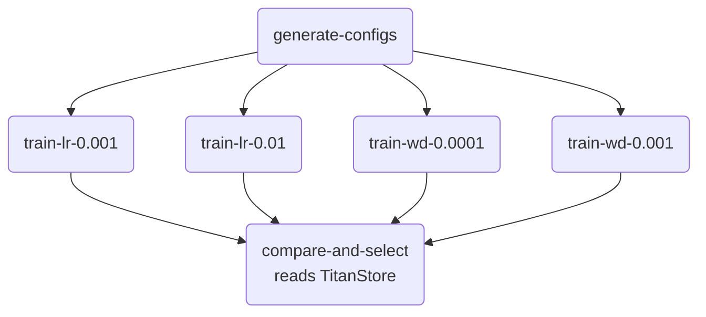

Why not plain chat: you need actual compute running in parallel. Chat generates config suggestions but can't execute 8 training runs simultaneously and collect results.

---

### 4. Scheduled Weekly Report

A pipeline that pulls data, processes it, and writes a summary — runs every Monday without anyone triggering it.

> "Run `weekly-summary.yaml` every Monday at 9am. If any job fails, show me the logs."

Why not plain chat: there's no persistent scheduler in a chat session. Once you close it, nothing runs.

---

### 5. Batch Document Processing

Process 50 PDFs in parallel — extract structured data from each, write results to TitanStore, aggregate into a single dataset.

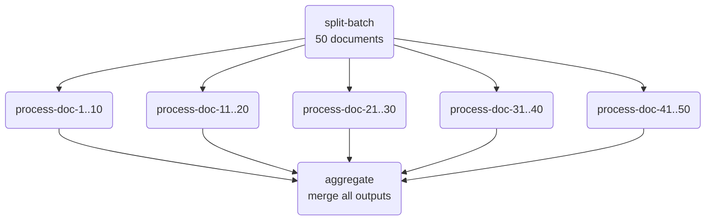

Why not plain chat: 50 documents exceed context window limits. Processing them sequentially in chat is slow and lossy. Titan fans them out across workers in parallel.

---

### 6. ML Deployment Pipeline with Gated Rollout

Train → evaluate → if metrics pass threshold, deploy to staging → human approves → deploy to production.

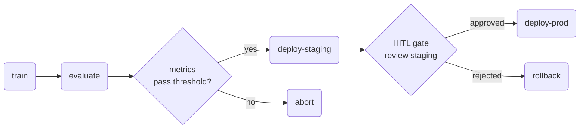

Why not plain chat: the pipeline needs to run unattended for the compute-heavy steps (train/eval), then pause durably for human review of staging, then continue. Chat can't hold state across that span.

---

### 7. Multi-Model Comparison

Run the same prompt or task through different model configurations in parallel. Collect outputs. Have a final job score and rank them.

Why not plain chat: you'd have to run each manually, copy-paste results, and compare by eye. Titan fans out the calls, collects outputs into TitanStore, and the aggregation job produces a structured comparison.

---

### 8. CI for Your Own Pipelines

When you commit changes to a pipeline YAML, automatically trigger a test run against a known input with expected output. Gate merges behind a passing test.

Why not plain chat: CI needs to be triggered automatically, run unattended, and produce a pass/fail signal. That's an execution substrate, not a chat session.

---

## What MCP Unlocks vs Direct SDK Use

| Capability | Direct SDK / YAML | MCP + Agent |
|---|---|---|
| Run a predefined pipeline | Yes | Yes |
| Adjust pipeline at runtime | No — static DAG | Yes — agent rewrites scripts |
| Natural language invocation | No | Yes |
| Conditional next-step logic | No | Yes |
| Scheduling / cron | No | Yes (via agent loop) |
| HITL approval in chat | No | Yes |
| Debugging via conversation | No | Yes |
| Auditability (Agent Runs tab) | Partial | Full — every run tagged |

---

## Design Notes

MCP is a well-established protocol for connecting AI models to external tools — it's the same mechanism used by many AI coding assistants and agent frameworks to call APIs, run code, and interact with external systems. Titan implements it as a thin server layer: 11 tools exposed over stdio, no state held in the server itself. Everything persists in Titan Master, TitanStore, and the dashboard manifest.

Key properties of the Titan MCP server:

- **Stateless bridge** — the MCP server holds no state. It translates tool calls into Titan SDK calls and returns results. All persistence is in the cluster.
- **Auto-tagged runs** — every DAG submitted via MCP gets a unique `agent_run_id`, so agent-submitted work is always distinguishable from SDK-submitted work in the dashboard.
- **Project-root anchored** — the server always runs from the project root regardless of where the AI client launches it, so workspace paths and manifest writes resolve correctly.
- **Works alongside existing pipelines** — MCP is one ingress path into Titan. Your existing YAML pipelines, SDK scripts, and Constructor-built DAGs all continue to work unchanged.

---

## Architecture

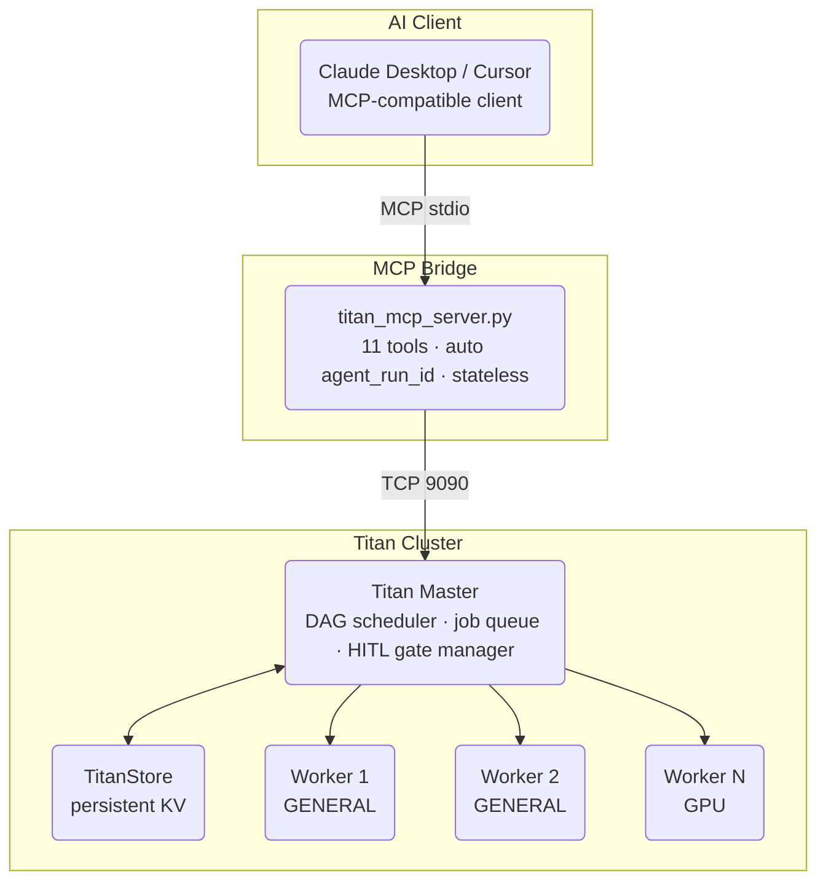
