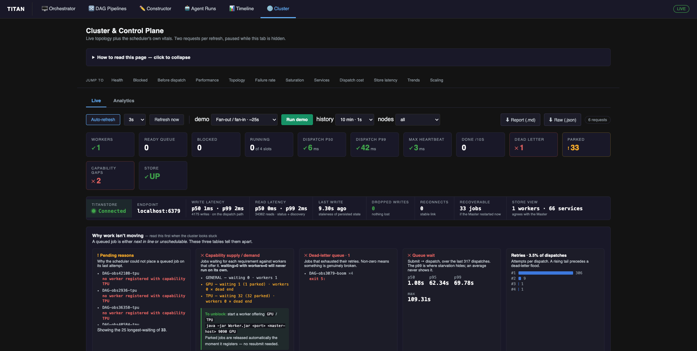
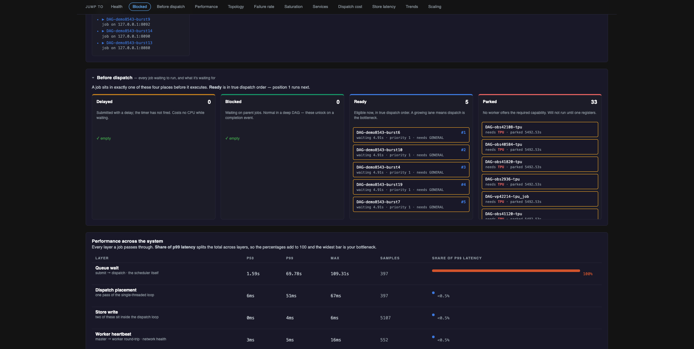
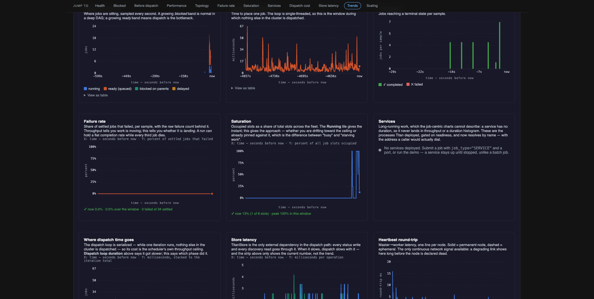
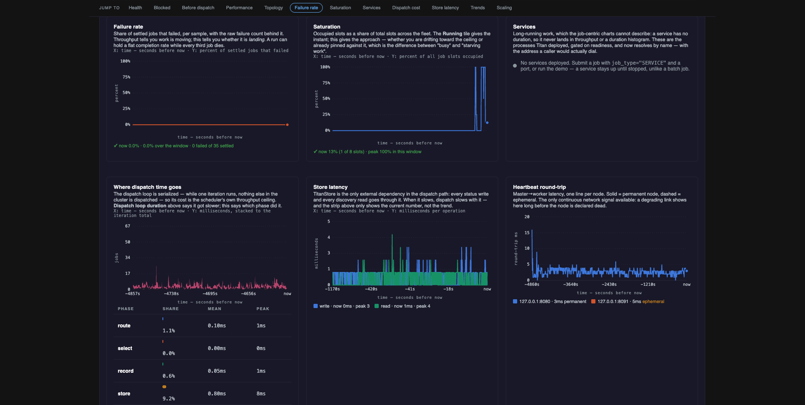
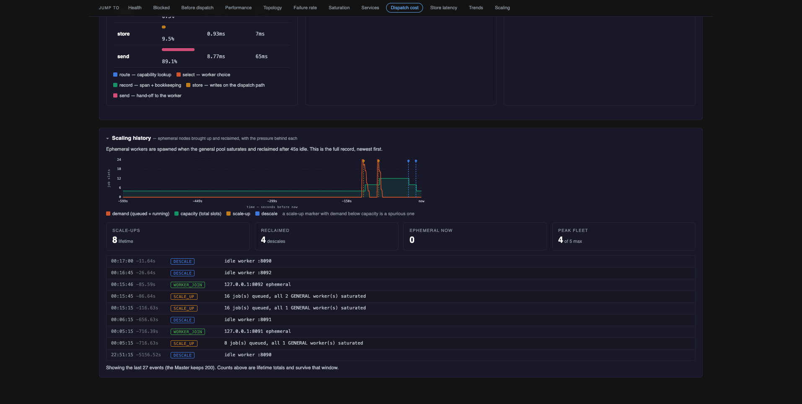
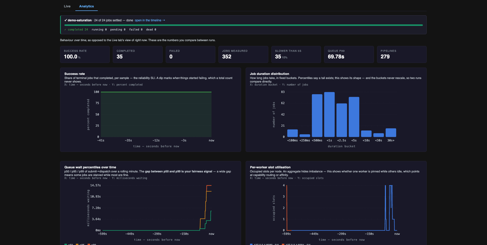

# Cluster & Control Plane

The **Cluster** tab of the dashboard.

The scheduler's own state and vitals: which workers exist, what is queued and why, how long
dispatch is taking, and how the store and services are behaving. The DAG pages describe your
pipelines; this page describes the system running them.

Two sub-tabs: **Live** for current state, **Analytics** for trends. Each refresh makes two
requests, and polling pauses while the browser tab is hidden.

## Status colours

| | Applied when |
|---|---|
| Green **✓** | Workers present, jobs running, throughput moving, dead-letter queue empty, nothing parked, no capability gaps, store connected |
| Amber **!** | Jobs parked, store dropping writes, dispatch or heartbeat in the middle band, a pending reason recorded |
| Red **✕** | Zero workers, ready queue with nothing running, dead-letter queue non-empty, capability dead end, store down |

Values with no particular meaning stay white. Every coloured value also carries a `✓ ! ✕` glyph, so
the state is readable without relying on colour.

`Ready queue` is deliberately uncoloured, because a deep queue is normal under load. It turns red only
when there is queued work and nothing running.

## Live

### Diagnostics

| Panel | Shows | Inference |
|---|---|---|
| Pending reasons | Why the scheduler could not place a queued job on its last attempt | `no worker registered with capability X` needs a new worker; `all are at capacity` needs more slots |
| Capability supply / demand | Jobs waiting per requirement against workers offering it | `waiting > 0, workers = 0` is a dead end, and the job cannot run until a matching worker registers. The panel prints the command |
| Dead-letter queue | Jobs that exhausted their retries, with each reason | Non-zero means something is failing repeatably, not just slowly |
| Queue wait | p50 / p95 / p99 / max, submit to dispatch | A high p99 against a low p50 means a few jobs are being starved |
| Retries | Distribution by attempt number, and the retry rate | A rising rate with flat failures means jobs are succeeding on retry |

### Pre-dispatch board

| Lane | Meaning | Action |
|---|---|---|
| Delayed | Submitted with a delay; the timer has not fired | None |
| Blocked | Waiting on parent jobs | None, normal in a DAG |
| Ready | In the priority queue, waiting for a slot | Add capacity, or wait |
| Parked | No worker offers the required capability | Start a matching worker; parked jobs are released automatically when one registers |

### Topology

A graph of the Master and every registered worker. Solid outline = permanent, dashed = ephemeral,
and the ring shows slot occupancy. Clicking a node opens a detail panel with its capability, slots,
running jobs, hosted services, heartbeat history and host vitals.

**Host vitals** (`host cpu`, `host mem`, `load avg`) come from the worker's heartbeat. They are
independent of slot occupancy, which makes three readings distinguishable:

| Slots | Host CPU | Meaning |
|---|---|---|
| Full | Low | Jobs are holding slots without using the machine, so capacity could be raised |
| Full | High | The node is genuinely at its limit |
| Free | High | Admitting more work here will slow what is already running |

A worker that cannot report them, or one built before the heartbeat carried them, shows `n/a`
rather than zero.

### Charts

| Chart | X | Y | Inference |
|---|---|---|---|
| Queue composition | time | jobs | Stacked running / ready / blocked / delayed, the board over time |
| Dispatch loop duration | time | ms | The serialized section's total. Rising means the scheduler itself is slowing |
| Where dispatch time goes | time | ms, stacked | Splits each iteration into route, select, record, store, send. A share table below gives percentage, mean and peak per phase |
| Throughput | time | jobs per sample | Completed and failed per sample |
| Failure rate | time | % of settled jobs | Throughput can stay flat while the failure share climbs |
| Saturation | time | % of slots occupied | Whether the pool is approaching its ceiling or already at it |
| Store latency | time | ms | Read and write plotted separately; writes sit on the dispatch path, reads on status polling |
| Heartbeat round-trip | time | ms per node | A degrading link shows here before a node is declared dead |

!!! note "Saturation uses occupied slots, not `running`"
    `runningJobs` holds a job until its completion callback arrives, so a job whose worker was
    reclaimed mid-flight can still be counted there. Saturation is computed from the live workers'
    own counters instead. When the two diverge the legend says
    `N job(s) counted running with no live slot`.

### Services

One row per live service: dialable address, uptime, host node, deploy attempts, and state. Services
appear nowhere else on the dashboard, because a service has no duration and so never lands in a
throughput or duration chart.

- A deploy job reading `COMPLETED` is normal. A `SERVICE` job finishes once readiness passes; the
  process it started keeps running. The *Service* and *Deploy job* columns are separate facts.
- `Deploys` counts deploy attempts, not process restarts. A crash-looping service is restarted by
  its worker, which does not report that to the Master.
- Autoscaler-spawned workers use the same deploy path and are excluded here; they appear in
  Topology.

!!! warning "Liveness is checked once, at deploy"
    Readiness is probed when the service is deployed and never re-probed. "Live" means the Master
    still has it registered. Treat this as a roster rather than a health check.

### Store strip and scaling history

The store strip shows endpoint, operation and read counts, p50/p99 latencies, **dropped writes**,
reconnects, and whether the store's view of the fleet matches the Master's. Dropped writes are the
meaningful outage signal, because the store fails open, so the error count stays at zero.

Scaling history lists every scale-up, descale, worker join and worker loss with the reason recorded
at the time. Scale-up requires queued work *and* a saturated general pool.

## Analytics

| Chart | X | Y | Inference |
|---|---|---|---|
| Success rate | time | % completed | Reliability trend |
| Job duration distribution | duration bucket | jobs | Whether the workload is one cluster or several |
| Queue wait percentiles | time | ms | Whether starvation is appearing in the tail |
| Per-worker slot utilisation | time | occupied slots per node | One pinned node while others idle points at capability routing or affinity |
| Does priority actually work? | declared priority | ms waited | Whether the priority queue is reordering |
| Pipeline duration trend | run | seconds | Whether the same DAG is getting slower |

### Priority panel

Bars are median queue wait per priority band; the dashed line is p95. The verdict beneath is
computed from those numbers in the page.

Two constraints on the measurement:

- Only dispatches that waited ≥250ms are counted. A job placed into a free slot waits near zero
  regardless of priority, and including those flattens every band.
- Fewer than three contended samples in a band reports "not enough data" instead of a verdict.

A matching median with a shorter p95 in the high band still indicates priority is working, because it
means those jobs were not caught behind the backlog.

### Pipeline duration trend

Wall clock per completed run, grouped by pipeline. Runs are separated by the manifest's `run_ts`,
one stamp per submission, not by a time gap, since back-to-back runs would otherwise merge. It reads
persisted span history, so runs from before the last Master restart still count. The five
most-run pipelines are plotted; the table lists all of them and scrolls.

## Demo runner

Submits a preset workflow and shows its progress, with a link to that run's timeline.

| Preset | ~Time | Exercises |
|---|---|---|
| Fan-out / fan-in | 25s | Parallelism, blocked lane, critical path |
| Saturation burst | 45s | Queue wait, starvation, scaling pressure |
| Failures and retries | 60s | Retry spans, dead-letter queue, failure reasons |
| Capability dead end | 10s | Parked lane, pending reasons, capability gap |
| Priority test | 30s | Priority ordering under saturation |
| Deep chain | 30s | Graph depth, dependency-release latency |
| Deploy a service | 30s | Services panel, readiness gating, address discovery |

!!! danger "The only endpoint that changes cluster state"
    The dashboard has no authentication. The request carries a preset name and nothing else: no
    script, no job spec. The preset scripts are written by the dashboard itself, and only one run
    is allowed at a time. Set `TITAN_DASHBOARD_DEMO=0` to disable it. Every other route is
    read-only.

## Signal reference

All fields come from `OP_STATS_JSON` with a `metrics` discriminator, sampled once a second into
bounded ring buffers at three resolutions (1s / 10s / 100s, selected by the **history** control).

| Field | Shape |
|---|---|
| `queue` | `[ts, ready, blocked, running, delayed, workers, slots, occupied]` |
| `dispatch` | `[ts, ms]` |
| `dispatch_phases` | `[ts, route, select, record, store, send]` |
| `throughput` | `[ts, completed, failed]` |
| `wait_percentiles` | `[ts, p50, p95, p99]` |
| `store_latency`, `store_read_latency` | `[ts, ms]` |
| `worker_load` | `{host:port → [ts, load, maxCap]}` |
| `worker_load_live` | Keys of `worker_load` still registered |
| `services` | `id, host, port, worker, worker_permanent, since, uptime_ms, deploy_attempts, status` |
| `capability` | `cap, waiting, parked, workers` |
| `parked` | `total, by_capability, deadline_ms` |
| `dlq` | `depth, jobs[]` |
| `retries` | `dispatches, rate, histogram[]` |
| `scaling` | `scale_ups, descales, ephemeral_now, peak_workers, max_workers` |
| `store` | Connection, endpoint, op and read counts, latencies, dropped writes, reconnects, drift |

Per-worker host vitals are on the worker objects in the plain stats payload:
`host_cpu_pct`, `host_mem_pct`, `host_load_x100`, each `-1` when the worker did not report them.

!!! warning "Capacity comes from `queue`, not from summing `worker_load`"
    A departed worker's `worker_load` and `heartbeat` series are retained for
    `titan.metrics.worker.grace.ms` (120s) before being dropped, so during that window the map
    still contains nodes that have left the fleet. The `slots` field in `queue` is sampled from the
    registry each tick and is the authoritative total.
