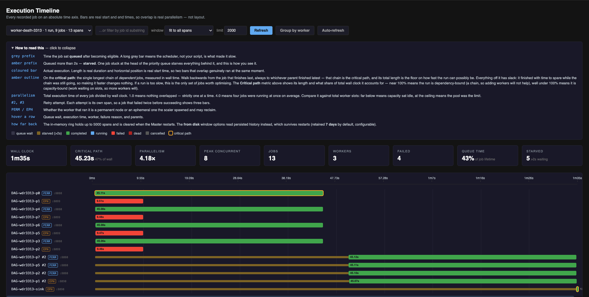

# Execution Timeline

The **Timeline** tab of the dashboard.

Every recorded job dispatch on an absolute time axis. A bar's horizontal position is its real start
time and its length is its real duration, so two bars that overlap ran at the same moment.

Use it to see where a run's wall clock went: how long jobs waited before starting, what ran in
parallel, which chain of dependencies set the total, and why anything failed.

## Spans

One row is one **span**: a single dispatch attempt of a single job. A job retried twice draws three
rows, labelled `#2` and `#3`.

Each span records:

| Field | Meaning |
|---|---|
| `enqueued_at` | When the job became eligible to run |
| `started_at` / `ended_at` | When the dispatch loop handed it to a worker, and when it finished |
| `queue_wait_ms` | `started_at − enqueued_at` |
| `duration_ms` | Execution time |
| `worker`, `host`, `worker_permanent` | Which node ran it, and whether that node was permanent |
| `attempt` | 1-based attempt number |
| `priority` | The job's declared priority |
| `parents` | Declared parent job IDs |
| `status`, `reason` | Final state and a short failure reason |

### Bar anatomy

| Element | Meaning |
|---|---|
| Grey prefix | Time spent queued after becoming eligible |
| Amber prefix | Queued more than 2s |
| Coloured bar | Execution, coloured by final status |
| Amber outline | On the critical path |
| `PERM` / `EPH` | Permanent worker, or an ephemeral one the scaler spawned |

Hovering a row shows queue wait, execution time, worker, failure reason and parents.

## Metrics

| Metric | Definition | Inference |
|---|---|---|
| Wall clock | First span start to last span end | n/a |
| Critical path | Longest chain of dependent jobs by wall time, plus its share of wall clock | Share near 100% → the run is dependency-bound, more workers will not help. Well under 100% → capacity-bound, more workers will |
| Parallelism | Total execution time ÷ wall clock | `1.0` = nothing overlapped. `4.0` = four jobs at once on average. Compare against total slots |
| Peak concurrent | Most spans in flight at any instant | Below the slot count means capacity sat idle |
| Jobs / Workers | Spans drawn, and distinct workers involved | n/a |
| Failed | Spans ending `FAILED` or `DEAD` | Listed individually below the chart |
| Queue time | Share of total job lifetime spent waiting | High share → the scheduler, not the scripts, accounts for most of the elapsed time |
| Starved | Spans that waited more than 2s | Non-zero under light load is worth investigating |

The critical path is computed by walking back from the job that finished last, always to whichever
parent finished latest. Jobs off that chain have slack, and shortening them does not change the wall
clock.

## Failures

The failures block always renders, including when empty. Each entry gives the job ID, attempt
number, worker, and a short reason: the exit code plus the last meaningful line of a traceback.

Three reason formats appear, and they mean different things:

| Reason | Meaning |
|---|---|
| `exit 5: ValueError: …` | The script failed |
| `Deployment Failed: … port 9972 never became reachable` | A service started but never bound its port |
| `Worker unreachable: … accepted no reply` | Transport failure: the job never ran |

## Controls

| Control | Behaviour |
|---|---|
| Pipeline picker | Filters to one pipeline. The name is resolved to its job IDs through the manifest |
| Job ID filter | Free-text substring match on job ID |
| Window | Clips the time range. Bars scale to the window, so a narrow window makes short jobs visible |
| Limit | Maximum spans fetched, capped at 5000 |
| Group by worker | Regroups rows by the node that ran them |
| Auto-refresh | Polls while the tab is visible, pauses when hidden |

## Retention

Spans live in two places:

| Source | Capacity | Survives a Master restart | Window options |
|---|---|---|---|
| In-memory ring | `titan.metrics.spans.max` (5000) | No | `fit to all spans`, `last 1 min` … `last 1 hour` |
| JSONL on disk | `titan.spans.retain.days` (7), at `titan_spans/spans-YYYY-MM-DD.jsonl` | Yes | `last 24 h · from disk`, `last 7 days · from disk` |

The status pill reads `· in memory` or `· from disk`. Disk history is sorted by start time before
the limit is applied, because the file is append-ordered by completion. When the Master holds more
spans than were fetched, a truncation notice appears.

### Pipelines with no spans

The picker is built from `.titan_dag_manifest.json`, which records every submission indefinitely.
Spans do not last that long, so each entry is labelled with what is available:

| Label | Meaning |
|---|---|
| `· 33 spans` | Available in memory |
| `· 30 spans (disk only)` | Ran before the current Master started, so use a **from disk** window |
| `· no spans on record` | Never dispatched (a parked job has no span), or predates span persistence |

Selecting an entry with nothing to draw explains which case applies rather than rendering an empty
chart. Job IDs are unique per run, so repeated runs never overwrite one another.
